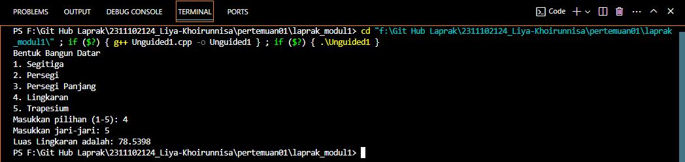
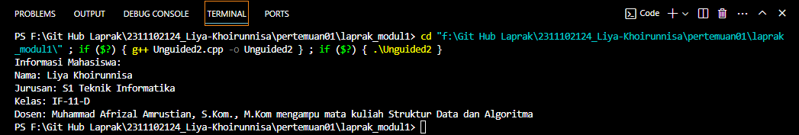
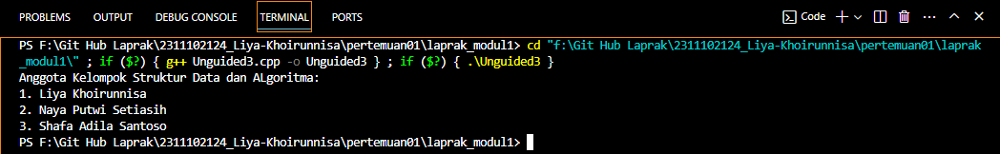

# <h1 align="center">Laporan Praktikum Modul Tipe Data</h1>
<p align="center">Liya Khoirunnisa - 2311102124</p>

## Dasar Teori

Tipe data merupakan sebuah jenis nilai yang ditampung dalam variabel yang nilainya sudah ditentukan sebelumnya. Tipe data ini wajib ada ketika ingin membuat sebuah program agar memiliki nilai yang jelas dan spesifik. Adapun beberapa tipe data dalam c++ :
1.	Tipe data primitif<br/>
Tipe data primitif adalah tipe data yang sudah dibuat oleh sistem dan tidak diturunkan dari tipe data lain. Contoh tipe data primitif:
-	Int  adalah tipe data untuk menyimpan bilangan bulat dengan ukuran default 4 byte.
-	Float adalah tipe data untuk menyimpan bilangan desimal dengan ukuran default 4 byte.
-	Char adalah tipe data untuk menyimpan huruf atau karakter dengan ukuran default 2 byte.
-	Boolean adalah tipe data untuk menyimpan nilai True/False dengan ukuran default 1 byte.
2.	Tipe data Abstrak<br/>
Tipe data abstrak adalah kelas/tipe untuk objek yang perilakunya ditentukan oleh satu set nilai dan satu set operasi. Tipe data ini dibentuk oleh programmer sendiri untuk memudahkan pemrograman dan memberikan fleksbilitas. Contohnya untuk menyederhanakan proses pemecahan masalah kita menggabungkan struktur data dengan operasinya.
3.	Tipe data koleksi<br/>
Tipe data koleksi adalah jenis tipe data yang digunakan untuk menghimpun kumpulan data atau data yang berjumlah lebih dari satu.
-	Array : Array adalah tipe data terstruktur yang dapat diterapkan pada suatu variabel yang dapat menyimpan banyak data dengan tipe     data sejenis. Array berfungsi untuk mempermudah dalam penyimpanan data. Array hanya dapat berisi sesuai jumlah kapasitas yang sudah dideklarasikan, jika indeks array diakses melebihi kapasitas, maka akan terjadi error.
-	Vektor : Standard Library C++ menyediakan container untuk menyimpan informasi, seperti std::vektor. Vektor menggantikan konsep array dengan mekanisme yang lebih fleksibel dan aman. Vektor otomatis mengalokasikan cukup memori untuk menampung elemen elemennya. Vektor bersifat dinamis artinya elemen dapat berubah pada saat runtime. Semua elemen dalam vektor harus bertipe data sama. 
-	Map : Map mirip dengan array tetapi menggunakan menggunakan tipe data selain int sebagai indeks, yang disebut "key".

## Guided 

### 1. Tipe Data Primitif

```C++
#include <iostream>
#include <iomanip>

using namespace std;

//Tipe data primitif Liya Khoirunnisa

int main() {
    char op;
    float num1, num2;

    cout << "Enter operator (+, -, *, /): ";
    cin >> op;

    cout << "Enter two operands: ";
    cin >> num1 >> num2;

    switch (op) {
    case '+':
        cout << "Result: " << num1 + num2;
        break;
    case '-':
        cout << "Result: " << num1 - num2;
        break;
    case '*':
        cout << "Result: " << num1 * num2;
        break;
    case '/':
        if (num2 != 0) {
            cout << "Result: " << fixed << setprecision(2) << num1 / num2;
        } else {
        cout << "Error! Division by zero is not allowed.";
        }
        break;
    default:
        cout << "Error! Operator is not correct";
    }
    return 0;
}
```
Kode di atas adalah sebuah program kalkulator sederhana yang memungkinkan pengguna untuk memilih operasi aritmatika dan pengguna diminta untuk memasukkan operator yang diinginkan dan diminta untuk memasukkan 2 bilangan untuk dihitung. Pada program di atas, terdapat dua tipe data primitif, yaitu char dan float. Tipe data char digunakan untuk menyimpan operator yang dimasukkan pengguna. Tipe data float digunakan untuk menyimpan 2 bilangan yang dimasukkan pengguna.

### 2. Tipe Data Abstrak

```C++
#include <stdio.h>
#include <string.h>

//Struct
struct Mahasiswa
{
    char name[50];
    char address[100];
    int age;
};

//Tipe data abstrak Liya Khoirunnisa

int main() {
    //Menggunakan struct
    struct Mahasiswa mhs1, mhs2;

    //Mengisi nilai ke struct
    strcpy(mhs1.name, "Dian");
    strcpy(mhs1.address, "Mataram");
    mhs1.age = 22;
    strcpy(mhs2.name, "Bambang");
    strcpy(mhs2.address, "Surabaya");
    mhs2.age = 23;

    //Mencetak isi struct
    printf("## Mahasiswa 1 ##\n");
    printf("Nama: %s\n", mhs1.name);
    printf("Alamat: %s\n", mhs1.address);
    printf("Umur: %d\n", mhs1.age);
    printf ("\n");
    printf("## Mahasiswa 2 ##\n");
    printf("Nama: %s\n", mhs2.name);
    printf("Alamat: %s\n", mhs2.address);
    printf("Umur: %d\n", mhs2.age);

    return 0;
}
```
Kode di atas digunakan untuk mencetak isi dari dari struct mahasiswa. Terdapat sebuah struct mahasiswa yang terdiri dari array name bertipe data char dengan ukuran 50, array address bertipe data char dengan ukuran 100, dan variabel age bertipe data int. Di dalam fungsi main, inisialisasi dan deklarasi objek mhs1 dan mhs2 pada struct mahasiswa dengan nilai tertentu. Kemudian nilai dicetak ke layar. Pada program di atas, terdapat tipe data abstrak yaitu struct.

### 3. Tipe Data Koleksi

```C++
#include <iostream>
#include <array>
using namespace std;

// Tipe data koleksi Liya Khoirunnisa

int main() {
    // Deklarasi dan inisialisasi array
    int nilai[5];
    nilai[0] = 23;
    nilai[1] = 50;
    nilai[2] = 34;
    nilai[3] = 78;
    nilai[4] = 90;

    // Mencetak array dengan tab
    cout << "Isi array pertama : " << nilai[0] << endl;
    cout << "Isi array kedua : " << nilai[1] << endl;
    cout << "Isi array ketiga : " << nilai[2] << endl;
    cout << "Isi array keempat : " << nilai[3] << endl;
    cout << "Isi array kelima : " << nilai[4] << endl;
    
    return 0;
}
```
Kode di atas digunakan untuk mencetak isi dari array. Terdapat library <array> yang memudahkan pengelolaan array. Terdapat array yang menampung 5 nilai yang sudah diinisialisai, yaitu nilai 23, 50, 34, 78, 90 . Kemudian cetak isi array ke layar dengan memanggil setiap indeks array. Pada program di atas, terdapat tipe data koleksi yaitu array.

## Unguided 

### 1. Buatlah program menggunakan tipe data primitif minimal dua fungsi dan bebas. Menampilkan program, jelaskan program tersebut dan ambil kesimpulan dari materi tipe data primitif!

```C++
/*oleh Liya Khoirunnisa - 2311102124*/
#include <iostream>
#include <cmath> // Library untuk mengakses fungsi M_PI dan pow()

using namespace std;

int pilihan_2124; // Tipe data primitif int untuk menyimpan pilihan menu pilihan_2124

// Fungsi untuk menampilkan menu pilihan bangun datar yang akan dihitung
void tampilanMenu_2124() {
    cout << "Bentuk Bangun Datar\n";
    cout << "1. Segitiga\n";
    cout << "2. Persegi\n";
    cout << "3. Persegi Panjang\n";
    cout << "4. Lingkaran\n";
    cout << "5. Trapesium\n";
    cout << "Masukkan pilihan (1-5): ";
    cin >> pilihan_2124;
}

// Fungsi untuk menghitung luas segitiga
float hitungLuasSegitiga_2124(float alas_2124, float tinggi_2124){
    return 0.5 * alas_2124 * tinggi_2124; // Mengembalikan nilai luas segitiga
}

// Fungsi untuk menghitung persegi
float hitungLuasPersegi_2124(float sisi_2124){
    return sisi_2124 * sisi_2124; // mengembalikan nilai luas persegi
}

// Fungsi untuk menghitung luas persegi panjang
float hitungLuasPersegiPanjang_2124(float panjang_2124, float lebar_2124){
    return panjang_2124 * lebar_2124; // Mengembalikan nilai luas persegi panjang 
}

// Fungsi untuk menghitung lingkaran
float hitungLuasLingkaran_2124(float jariJari_2124){
    return M_PI * pow(jariJari_2124, 2); // Mengembalikan nilai luas lingkaran
}

// Fungsi untuk menghitung luas luas trapesium
float hitungLuasTrapesium_2124(float tinggi_2124, float alas1_2124, float alas2_2124){
    return 0.5 * tinggi_2124 * (alas1_2124 + alas2_2124); // Mengembalikan nilai luas trapesium
}

int main() {
    float alas_2124, alas1_2124, alas2_2124, tinggi_2124, jariJari_2124, panjang_2124, lebar_2124, sisi_2124; // Tipe data primitif float untuk variabel yang diperlukan
        tampilanMenu_2124(); // Memanggil fungsi untuk menampilkan menu bangun datar
        
        // Switch case untuk menentukan tindakan yang dipilih pengguna pada menu bangun datar
    switch (pilihan_2124){
        case 1 : 
            cout << "Masukkan alas: ";
            cin >> alas_2124;
            cout << "Masukkan tinggi: ";
            cin >> tinggi_2124;            
            cout << "Luas Segitiga adalah: " << hitungLuasSegitiga_2124(alas_2124, tinggi_2124); // Menampilkan hasil luas segitiga
            cout << endl;
            break;
        case 2 :
            cout << "Masukkan sisi: ";
            cin >> sisi_2124;
            cout << "Luas Persegi adalah: " << hitungLuasPersegi_2124(sisi_2124) << endl; // Menampilkan hasil luas persegi
            break;
        case 3 :
            cout << "Masukkan panjang: ";
            cin >> panjang_2124;
            cout << "Masukkan lebar: ";
            cin >> lebar_2124;
            cout << "Luas Persegi Panjang adalah: " << hitungLuasPersegiPanjang_2124(panjang_2124, lebar_2124) << endl; // Menampilkan hasil luas persegi panjang
            break;
        case 4 :
            cout << "Masukkan jari-jari: ";
            cin >> jariJari_2124;
            cout << "Luas Lingkaran adalah: " << hitungLuasLingkaran_2124(jariJari_2124) << endl; // Menampilkan hasil luas lingkaran
            break;
        case 5 :
            cout << "Masukkan tinggi: ";
            cin >> tinggi_2124;
            cout << "Masukkan alas 1: ";
            cin >> alas1_2124;
            cout << "Masukkan alas 2: ";
            cin >> alas2_2124;
            cout << "Luas Trapesium adalah: " << hitungLuasTrapesium_2124(tinggi_2124, alas1_2124, alas2_2124) << endl; // Menampilkan hasil luas trapesium
            break;
        default :
            cout << "Maaf, pilihan tidak tersedia!\n"; // Menampilkan pesan jika pilihan tidak tersedia
    }
        
    return 0;    
}
```
#### Output:


Kode di atas digunakan untuk membuat program menghitung luas bangun datar. Kode di atas terdapat library <cmath> untuk mengakses fungsi M_PI dan pow(). Program dimulai dengan menampilkan menu pilihan bangun datar yang akan dihitung menggunakan fungsi. Pengguna diminta memilih opsi bangun datar dengan memasukkan angka dari 1-5. Program akan meminta input sesuai dengan bangun datar yang dipilih, kemudian luas bangun datar yang dipilih akan dihitung menggunakan fungsi yang sesuai. Pada program di atas terdapat tipe data primitif yaitu int dan float.

Kesimpulan Tipe Data Primitif:
Tipe data primitif adalah tipe data bawaan yang sudah ditentukan oleh sistem dan termasuk tipe data yang dasar. Tipe data ini digunakan untuk menyimpan nilai-nilai sederhana. 

### 2. Jelaskan fungsi dari class dan struct secara detail dan berikan contoh programnya!

```C++
/*Oleh Liya Khoirunnisa - 2311102124*/

// Contoh Program Struct dan Class
#include <iostream>

using namespace std;

// Mendefinisikan struct mahasiswa
struct Mahasiswa_2124 {
    string nama_2124; // Menyimpan nama mahasiswa
    string jurusan_2124; // Menyimpan jurusan mahasiswa
    string kelas_2124; // Menyimpan kelas mahasiswa
};

// Mendefinisikan class dosen
class Dosen_2124 {
public:
    string nama_2124; // Menyimpan nama dosen
    string mataKuliah_2124; // Menyimpan mata kuliah yang diampu

};

int main() {
    // Membuat objek mahasiswa
    Mahasiswa_2124 mhs1;
    mhs1.nama_2124 = "Liya Khoirunnisa"; // Inisialisasi nilai nama mahasiswa
    mhs1.jurusan_2124 = "S1 Teknik Informatika"; // Inisialisasi nilai jurusan mahasiswa
    mhs1.kelas_2124 = "IF-11-D"; // Inisialisasi nilai kelas mahasiswa

    // Membuat objek dosen
    Dosen_2124 dsn1;
    dsn1.nama_2124 = "Muhammad Afrizal Amrustian, S.Kom., M.Kom"; // Inisialisai nilai nama dosen
    dsn1.mataKuliah_2124 = "Struktur Data dan Algoritma"; // Inisialisasi nilai mata kuliah yang diampu

    // Mencetak informasi mahasiswa dan dosen ke layar
    cout << "Informasi Mahasiswa: \n";
    cout << "Nama: " << mhs1.nama_2124 << endl; // Mencetak nama mahasiswa
    cout << "Jurusan: " << mhs1.jurusan_2124 << endl; // Mencetak jurusan mahasiswa
    cout << "Kelas: " << mhs1.kelas_2124 << endl; // Mencetak kelas mahasiswa
    cout << "Dosen: " << dsn1.nama_2124 << " mengampu mata kuliah " << dsn1.mataKuliah_2124 << endl; // Mencetak Informasi dosen

    return 0;
}
```
#### Output:


Kode di atas digunakan untuk mencetak struct dan class. Pada program di atas terdapat struct Mahasiswa_2124 yang menampung nama, jurusan, dan kelas mahasiswa. Dan juga terdapat class Dosen_2124 yang menampung nama dosen dan mata kuliah yang diampu. Membuat objek mhs1 dari struct Mahasiswa_2124 yang diisi dengan nilai nama, jurusan, dan kelas mahasiswa. Dan membuat objek dsn1 dari class Dosen_2124 yang diisi dengan nama dosen dan mata kuliah yang diampu. Kemudian informasi yang diberikan akan dicetak ke layar.

Fungsi Class
Class adalah blueprint yang mendefinisikan variabel dan metode pada setiap objek tertentu. Class berfungsi untuk menampung isi dari program yang akan dijalankan. Atribut dan metode pada dasarnya adalah variabel dan fungsi yang dimiliki oleh class. Setiap class dapat membuat banyak objek.

Fungsi Struct
Struct adalah kumpulan dari beberapa variabel dangan tipe data yang sama ataupun berbeda yang dibungkus dalam satu variabel. Struct tidak menampung nilai, hanya mendefinisikan nama struct beserta tipe data. Struct digunakan apabila data yang ingin dikelompokkan memiliki tipe data yang berbeda.

### 3. Buat dan jelaskan program menggunakan fungsi map dan jelaskan perbedaan dari array dengan map!

```C++
/*Oleh Liya Khoirunnisa - 2311102124*/

#include <iostream>
#include <map> // Library untuk memggunakan fungsi map

using namespace std;

int main() {

    // Deklarasi map dengan key int dan string untuk menyimpan nama mahasiswa
    map<int, string> mahasiswa_2124;

    // Menambahkan nama mahasiswa ke dalam map
    mahasiswa_2124[1] = "Liya Khoirunnisa";
    mahasiswa_2124[2] = "Naya Putwi Setiasih";
    mahasiswa_2124[3] = "Shafa Adila Santoso";

    // Mencetak judul 
    cout << "Anggota Kelompok Struktur Data dan ALgoritma:\n";

    // Looping untuk mencetak elemen map
    for (int i = 1; i <= mahasiswa_2124.size(); i++) {
        cout << i << ". " << mahasiswa_2124[i] << endl; // Mencetak nama anggota kelompok
    }
    return 0;
}
```
#### Output:


Kode di atas digunakan untuk mencetak isi dari suatu map yang berisi daftar anggota kelompok. Suatu map mahasiswa_2124 dideklarasikan dengan key bertipe data int dan nilai bertipe data string. Ada 3 nama mahasiswa yang diisi ke dalam map. Program mencetak judul "Anggota Kelompok Struktur Data". Selanjutnya, mencetak daftar nama anggota kelompok dengan menggunakan perulangan for.

Perbedaan array dan map
1. Array 
   - Kumpulan elemen bertipe data sama
   - Elemen dalam array disimpan secara berurutan
   - Indeks dimulai dari 0
   - Ukuran array ditentukan ketika deklarasi
2. Map
   - Terdiri dari pasangan key-value
   - Elemen dalam map tidak disimpan secara berurutan, tapi diurutkan berdasarkan key
   - Mengakses nilai dengan key
   - Ukuran map dapat berubah


## Kesimpulan
Memahami konsep dasar pemrograman C++ melalui penggunaan tipe data primitif, abstrak, dan koleksi dapat memberikan fondasi yang kuat dalam pemrograman serta dapat memberikan kemudahan dalam mengelola data dengan lebih efisien dan terstruktur.
 
## Referensi
[1] Istiqomah, N. (2023). TRANSFORMASI DIGITAL. Penerbit Tahta Media.
[2] Gregoire, M. (2021). Professional C++. John Wiley & Sons.
[3] Santoso, J. T. (2021). STRUKTUR DATA dan ALGORITMA (Bagian 1). Penerbit Yayasan Prima Agus Teknik, 1-333.
[4] Zein, A., & Eriana, E. S. (2022). ALGORITMA DAN STRUKTUR DATA.
