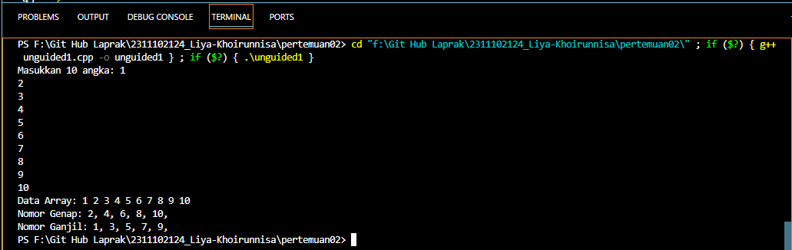
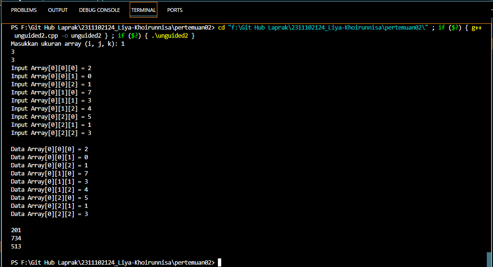
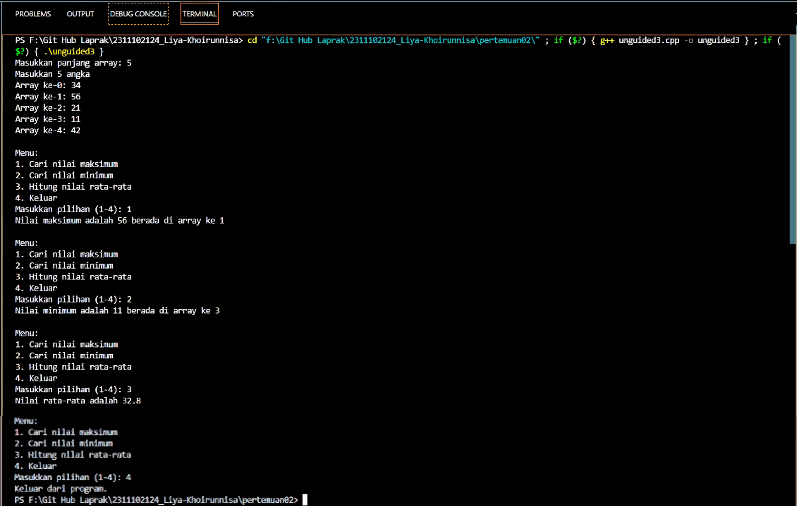

# <h1 align="center">Laporan Praktikum Modul Array</h1>
<p align="center">Liya Khoirunnisa - 2311102124</p>

## Dasar Teori

Array adalah suatu struktur yang terdiri dari sejumlah elemen yang memiliki  tipe data yang sama. Satu blok memori dialokasikan untuk menyimpan semua elemen dalam sebuah array yang dapat diakses dalam waktu yang cepat dengan menggunakan indeks elemen tertentu sebagai subskrip. Array lebih sederhana dan mudah digunakan
Array dibagi menjadi :
1.	Array satu dimensi<br/>
Array satu dimensi tidak lain adalah kumpulan elemen-elemen identik yang tersusun dalam satu baris, tetapi isi dari elemen tersebut boleh berbeda. Array satu dimensi ini dapat disebut juga vektor.<br/>
Deklarasi : Type_DataNama_Variabel[index];<br/>
Contoh : int B[10];<br/>
2.	Array dua dimensi<br/>
Array dua dimensi merupakan perluasan dari sebuah array satu dimensi yang terdiri dari beberapa baris dan beberapa kolom elemen yang bertipe data sama.<br/>
Deklarasi : Type_DataNama_Variabel[index1] [index2];<br/>
Contoh : int B[2][3];<br/>
3.	Array multidimensi<br/>
Array multidimensi pada dasarnya sama dengan array pada umumnya, hanya saja berbeda jumlah dimensinya. Array multidimensi tidak terlalu sering digunakan, namun biasanya digunakan untuk membuat matriks<br/>
Deklarasi : Type_Data Nama_Variabel [index1] [ndex2] [index3];<br/>
Contoh : int C [2][3][4];<br/>
4.	Array empat dimensi<br/>
Array empat dimensi adalah array yang terdiri dari empat dimensi. Setiap elemen dalam array memiliki empat dimensi yang berbeda.<br/>
Deklarasi : Type_Data Nama_Variabel [index1] [ndex2] [index3] [ndex4];<br/>
Contoh : int D [2][3][4][5];<br/>
5.	Array lima dimensi<br/>
Array lima dimensi adalah array yang terdiri dari lima dimensi. Setiap elemen dalam array memiliki lima dimensi yang berbeda.<br/>
Deklarasi : Type_Data Nama_Variabel [index1] [ndex2] [index3] [ndex4] [ndex5];<br/>
Contoh : int E [2][3][4][5][5];<br/>


## Guided 

### 1. Program Input Array Tiga Dimensi

```C++
#include <iostream>
using namespace std;

// PROGRAM INPUT ARRAY 3 DIMENSI Liya Khoirunnisa
int main()
{
    // Deklarasi array
    int arr[2][3][3];

    // Input elemen
    for (int x = 0; x < 2; x++)
    {
        for (int y = 0; y < 3; y++)
        {
            for (int z = 0; z < 3; z++)
            {
                cout << "Input Array[" << x << "][" << y << "][" << z << "] = ";
                cin >> arr[x][y][z];
            }
        }
        cout << endl;
    }

    // Output Array
    for (int x = 0; x < 2; x++)
    {
        for (int y = 0; y < 3; y++)
        {
            for (int z = 0; z < 3; z++)
            {
                cout << "Data Array[" << x << "][" << y << "][" << z << "] = " << arr[x][y][z] << endl;
            }
        }
    }
    cout << endl;
    
    // Tampilan array
    for (int x = 0; x < 2; x++)
    {
        for (int y = 0; y < 3; y++)
        {
            for (int z = 0; z < 3; z++)
            {
                cout << arr[x][y][z] << ends;
            }
            cout << endl;
        }
        cout << endl;
    }
}
```
Kode di atas digunakan untuk mencetak nilai-nilai array yang dimasukkan oleh pengguna. Array dideklarasikan dengan ukuran 2x3x3. Pengguna menginputkan elemen dengan menggunakan loop bersarang. Untuk menampilkan output juga digunakan loop bersarang. Serta untuk menampilkan nilai elemen yang bersih menggunakan loop bersarang.

### 2. Program Mencari Nilai Maksimal pada Array

```C++
#include <iostream>
using namespace std;

// PROGRAM MENCARI NILAI MAKSIMAL PADA ARRAY Liya Khoirunnisa
int main()
{
    // Deklarasi variabel
    int maks, a, i = 1, lokasi;

    // Input panjang array
    cout << "Masukkan panjang array: ";
    cin >> a;
    int array[a];

    // Input elemen array
    cout << "Masukkan " << a << " angka\n";
    for (i = 0; i < a; i++)
    {
        cout << "Array ke-" << (i) << ": ";
        cin >> array[i];
    }

    // Mencari nilai maksimum dalam array
    maks = array[0];
    for (i = 0; i < a; i++)
    {
        if (array[i] > maks)
        {
            maks = array[i];
            lokasi = i;
        }
    }
    cout << "Nilai maksimum adalah " << maks << " berada di Array ke " << lokasi << endl;
}
```
Kode di atas digunakan untuk mencari nilai maksimun dalam array yang dimasukkan oleh pengguna. Diawali dengan pengguna diminta untuk memasukkan panjang array. Selanjutnya pengguna diminta memasukkan elemen tiap indeks array. Elemen array yang telah dimasukkan akan dicari nilai maksimumnya. Dengan cara membandingkan tiap elemen array menggunakan perulangan for. Jika elemen array lebih besar dari maksimum maka nilai maksimum akan diperbarui.


## Unguided 

### 1. Buatlah program untuk menampilkan Output seperti berikut dengan data yang diinputkan oleh user!

```C++
/*oleh Liya Khoirunnisa - 2311102124*/
#include <iostream>

using namespace std;

// Program untuk mencari nomor genap dan ganjil berdasarkan data array yang diinputkan
int main() {

    // Deklarasi array untuk menyimpan 10 angka dari inputan pengguna
    int data_2124[10];

    // Meminta pengguna untuk memasukkan 10 angka dengan perulangan for
    cout << "Masukkan 10 angka: ";
    for(int i = 0; i < 10; i++) {
        cin >> data_2124[i];
    }

    // Menampilkan data array yang telah diinputkan pengguna dengan perulangan for
    cout << "Data Array: ";
    for(int i = 0; i < 10; i++) {
        cout << data_2124[i] << " "; // Menampilkan data array
    }
    cout << endl;

    // Menampilkan nomor genap dari data array yang telah diinputkan pengguna dengan perulangan for
    cout << "Nomor Genap: ";
    for(int i = 0; i < 10; i++) {
        if(data_2124[i] % 2 == 0) {
            cout << data_2124[i] << ", "; // menampilkan nomor genap

        }
    }
    cout << endl;

    // Menampilkan nomor ganjil dari data array yang telah diinputkan pengguna dengan perulangan for
    cout << "Nomor Ganjil: ";
    for(int i = 0; i < 10; i++) {
        if(data_2124[i] % 2 != 0) {
            cout << data_2124[i] << ", "; // Menampilkan nomor ganjil
        }
    }
    cout << endl;

    return 0;
}
```
#### Output:


Kode di atas digunakan untuk mencari nomor genap dan ganjil berdasarkan data array yang diinputkan pengguna. Elemen array yang telah diinputkan akan ditampilkan sebagai data array. Untuk mencari nomor genap dan ganjil pada data array menggunakan perulangan for. Setiap iterasi diperiksa dengan operasi modulo. Jika modulo 2 sama dengan "0" akan menampilkan nomor genap. Jika modulo 2 tidak sama dengan "0" akan menampilkan nomor ganjil.

### 2. Buatlah program Input array tiga dimensi (seperti pada guided) tetapi jumlah atau ukuran elemennya diinputkan oleh user!

```C++
/*oleh Liya Khoirunnisa - 2311102124*/
#include <iostream>

using namespace std;

// Program input array tiga dimensi
int main() {

    // Deklarasi ukuran array
    int sizeI_2124, sizeJ_2124, sizeK_2124;

    // Input ukuran array
    cout << "Masukkan ukuran array (i, j, k): ";
    cin >> sizeI_2124 >> sizeJ_2124 >> sizeK_2124;

    // Deklarasi array
    int array[sizeI_2124][sizeJ_2124][sizeK_2124];

    // Input elemen oleh pengguna dengan perulangan for
    for (int i = 0; i < sizeI_2124; i++) { 
        for (int j = 0; j < sizeJ_2124; j++) { 
            for (int k = 0; k < sizeK_2124; k++) { 
                cout << "Input Array[" << i << "][" << j << "][" << k << "] = "; // Meminta input elemen kepada pengguna
                cin >> array[i][j][k];
            }
        }
        cout << endl;
    }
    
    // Output Array berdasarkan inputan pengguna dengan perulangan for
    for (int i = 0; i < sizeI_2124; i++) {
        for (int j = 0; j < sizeJ_2124; j++) {
            for (int k = 0; k < sizeK_2124; k++) {
                cout << "Data Array[" << i << "][" << j << "][" << k << "] = " << array[i][j][k] << endl; // Menampilkan data array
            }
        }
    }
    cout << endl;

    // Tampilan array dengan perulangan for
    for (int i = 0; i < sizeI_2124; i++) {
        for (int j = 0; j < sizeJ_2124; j++) {
            for (int k = 0; k < sizeK_2124; k++) {
                cout << array[i][j][k] << ends; // Menampilkan array
            }
            cout << endl;
        }
        cout << endl;
    }
}
```
#### Output:


Kode di atas digunakan untuk mencetak nilai-nilai array yang elemen dan ukurannya diinputkan oleh pengguna. Diawali dengan pengguna diminta menginputkan ukuran array 3 dimensi. Selanjutnya, pengguna diminta menginputkan elemen dengan menggunakan loop bersarang. Untuk menampilkan output juga digunakan loop bersarang. Serta untuk menampilkan elemen yang bersih menggunakan loop bersarang.

### 3. Buatlah program menu untuk mencari nilai Maksimum, Minimum dan Nilai rata – rata dari suatu array dengan input yang dimasukan oleh user!

```C++
/*oleh Liya Khoirunnisa - 2311102124*/
#include <iostream>

using namespace std;

// Deklarasi variabel global
int pilihan_2124, lokasi_2124;

// Fungsi untuk menampilkan menu
void tampilanMenu_2124() {
    cout << "\nMenu:\n";
    cout << "1. Cari nilai maksimum\n";
    cout << "2. Cari nilai minimum\n";
    cout << "3. Hitung nilai rata-rata\n";
    cout << "4. Keluar\n";
    cout << "Masukkan pilihan (1-4): ";
    cin >> pilihan_2124;
}

// Fungsi untuk mencari nilai maksimum dalam array
void cariMaksimum_2124 (int array_2124[], int size_2124) {
    int maksimum_2124 = array_2124[0]; // Inisialisasi maksimum dengan nilai pertama dalam array
    for (int i = 0; i < size_2124; i++) {
        if (array_2124[i] > maksimum_2124) { // Memeriksa apakah nilai saat ini lebih besar dari maksimum
            maksimum_2124 = array_2124[i]; // Jika iya, perbarui nilai maksimum
            lokasi_2124 = i; // Simpan lokasi indeks nilai maksimum
        }
    }
    cout << "Nilai maksimum adalah " << maksimum_2124 << " berada di array ke " << lokasi_2124 << endl; // Menampilkan nilai maksimum dan indeks
}

// Fungsi untuk mencari nilai minimum dalam array
void cariMinimum_2124 (int array_2124[], int size_2124) {
    int minimum_2124 = array_2124[0]; // Inisialisasi minimum dengan nilai pertama dalam array
    for (int i = 0; i < size_2124; i++) { 
        if (array_2124[i] < minimum_2124) { // Memeriksa apakah nilai saat ini lebih kecil dari minimum
            minimum_2124 = array_2124[i]; // Jika iya, perbarui nilai minimum
            lokasi_2124 = i; // Simpan lokasi indeks nilai maksimum
        }
    }
    cout << "Nilai minimum adalah " << minimum_2124 << " berada di array ke " << lokasi_2124 << endl; // Menampilkan nilai minimum dan indeks
}

// Fungsi untuk menghitung rata rata nilai dalam array
void hitungRataRata_2124 (int array_2124[], int size_2124) {
    double total_2124 = 0; // Inisialisasi total dengan 0
    for (int i = 0; i < size_2124; i++) {
        total_2124 += array_2124[i]; // Tambahkan nilai saat ini menjadi total
    }
    double rata_2124 = total_2124/size_2124; // Menghitung rata-rata
    cout << "Nilai rata-rata adalah " << rata_2124 << endl; // Menampilkan nilai rata-rata
}

int main() {
    // Deklarasi variabel size
    int size_2124;
    
    // Meminta pengguna untuk memasukkan panjang array
    cout << "Masukkan panjang array: ";
    cin >> size_2124;

    // Deklarasi array dengan ukuran yang dimasukkan oleh pengguna
    int array_2124 [size_2124];

    // Meminta pengguna untuk memasukkan nilai array
    cout << "Masukkan " << size_2124 << " angka\n";
    for(int i = 0; i < size_2124; i++){
        cout << "Array ke-" << (i) << ": ";
        cin >> array_2124[i];
    }

    // Perulangan program utama
    do {
        tampilanMenu_2124(); // Memanggil fungsi untuk menampilkan menu
        
        // Switch case untuk menentukan tindakan yang dipilih pengguna pada menu 
        switch (pilihan_2124) {
            case 1:
                cariMaksimum_2124(array_2124, size_2124); // Memanggil fungsi untuk mencari nilai maksimum
                break;
            case 2: 
                cariMinimum_2124(array_2124, size_2124); // Memanggil fungsi untuk mencari nilai minimum
                break;
            case 3:
                hitungRataRata_2124(array_2124, size_2124); // Memanggil fungsi untuk menghitung rata-rata nilai
                break;
            case 4:
                cout << "Keluar dari program.\n"; // Keluar dari program
                break;
            default:
                cout << "Maaf, Pilihan Tidak Tersedia!\n"; // Pesan kesalahan jika pilihan yang dipilih tidak tersedia
        }
    } while (pilihan_2124 != 4); // Berhenti melakukan perulangan jika pengguna memilih 4

    return 0
}
```
#### Output:


Kode di atas digunakan untuk mencari nilai minimum, maksimum, dan nilai rata-rata dalam suatu array. Panjang array dan elemen array diinputkan oleh pengguna. Selanjutnya, pengguna akan ditampilkan menu untuk dipilih. Tampilan menu dan proses pencarian nilai minimum, nilai maksimum, serta nilai rata-rata menggunakan fungsi "void" agar tampilan program lebih rapih. Terdapat perulangan do-while untuk melakukan looping dari switch case pilhan menu. Untuk mencari nilai maksimum dengan cara membandingkan tiap elemen array menggunakan perulangan for. Jika elemen array lebih besar dari maksimum maka nilai maksimum akan diperbarui. Untuk mencari nilai miniimum dengan cara membandingkan tiap elemen array menggunakan perulangan for. Jika elemen array lebih kecil dari minimum maka nilai minimum akan diperbarui. Untuk menghitung nilai rata-rata menggunakan perulangan for yang berguna untuk menjumlahkan semua elemen array. Kemudian total penjumlahan tersebut dibagi dengan banyaknya panjang array.

## Kesimpulan
Array adalah suatu struktur yang terdiri dari sejumlah elemen yang memiliki  tipe data yang sama yang tersusun dalam satu blok memori dan dapat diakses menggunakan indeks elemen tertentu. Praktikum yang dilakukan membahas berbagai jenis array dan bagaimana cara mengakses dan memanipulasi elemen-elemen array. Jenis-jenis array terdiri dari array satu dimensi, array dua dimensi, array multidimensi, array empat dimensi, dan array lima dimensi.

## Referensi
[1] Pratama, M. A. (2020). STRUKTUR DATA ARRAY DUA DIMENSI PADA PEMROGRAMAN C++.<br/>
[2] Santoso, J. T. (2021). STRUKTUR DATA dan ALGORITMA (Bagian 1). Penerbit Yayasan Prima Agus Teknik, 1-333.<br/>
