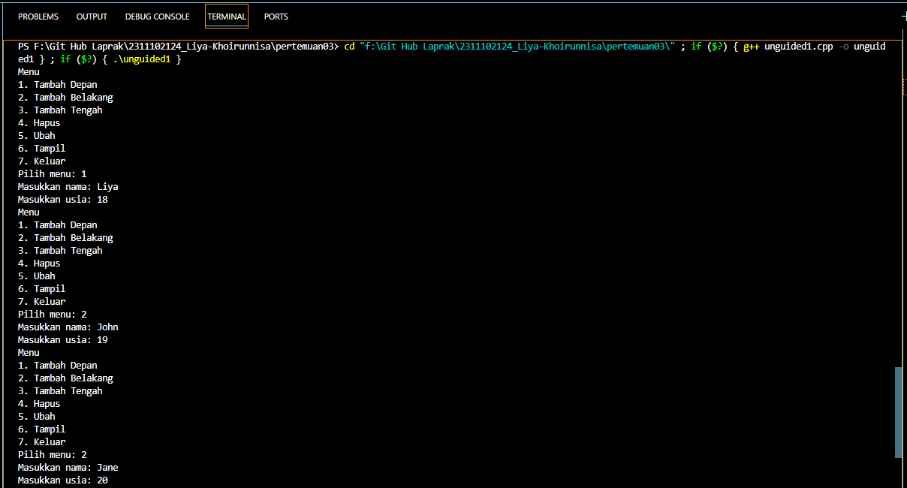
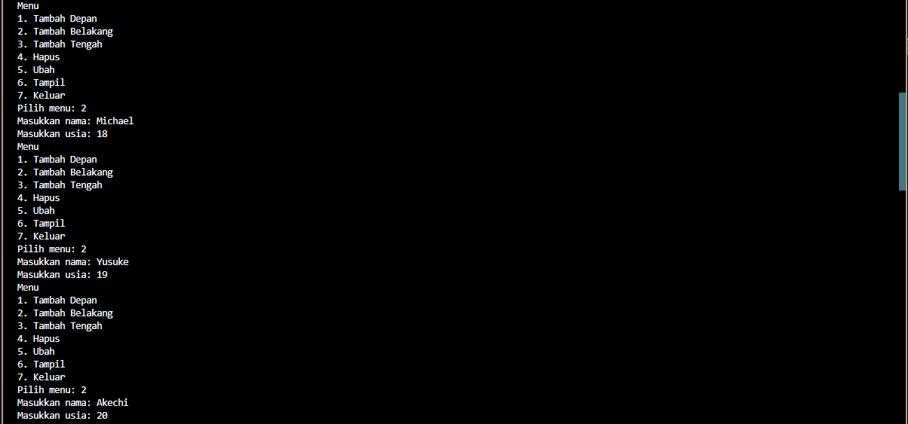
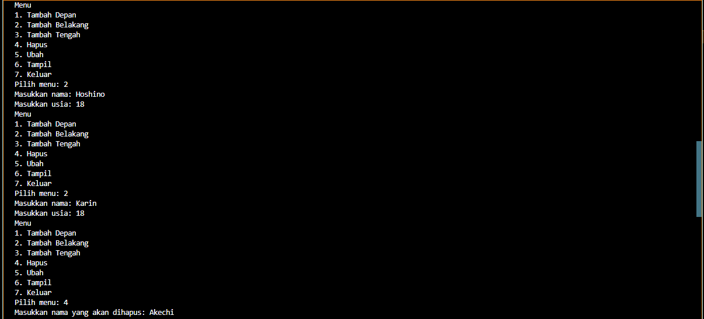
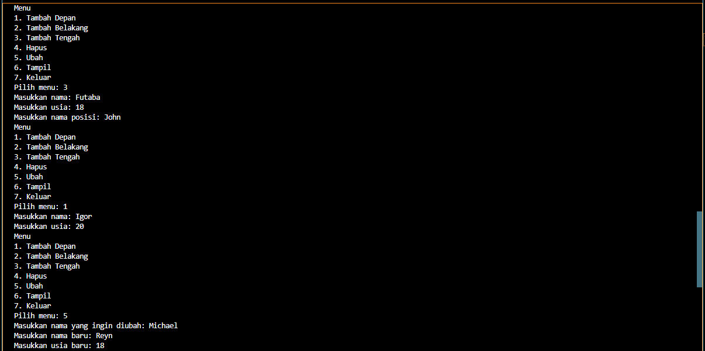
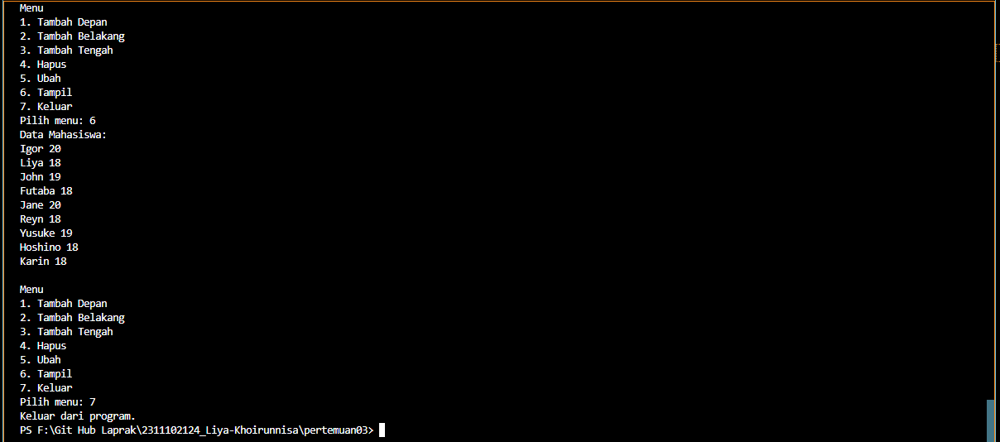
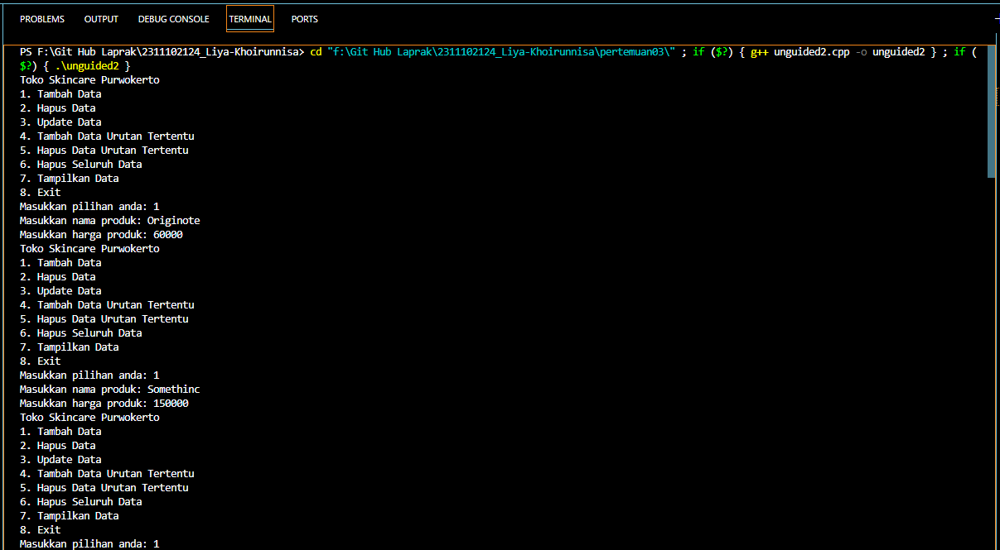
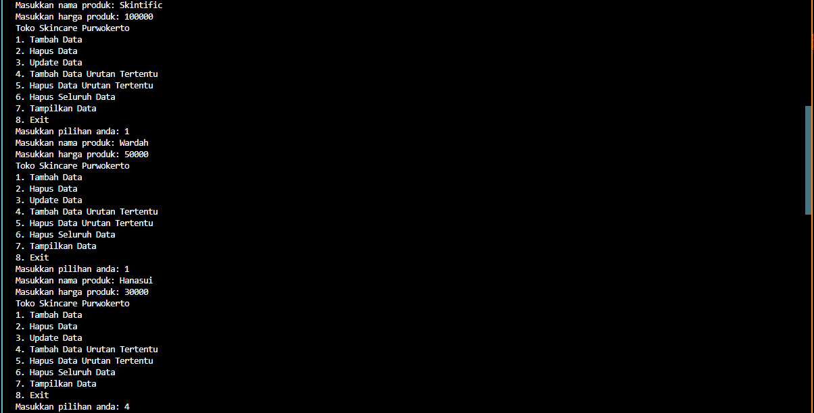
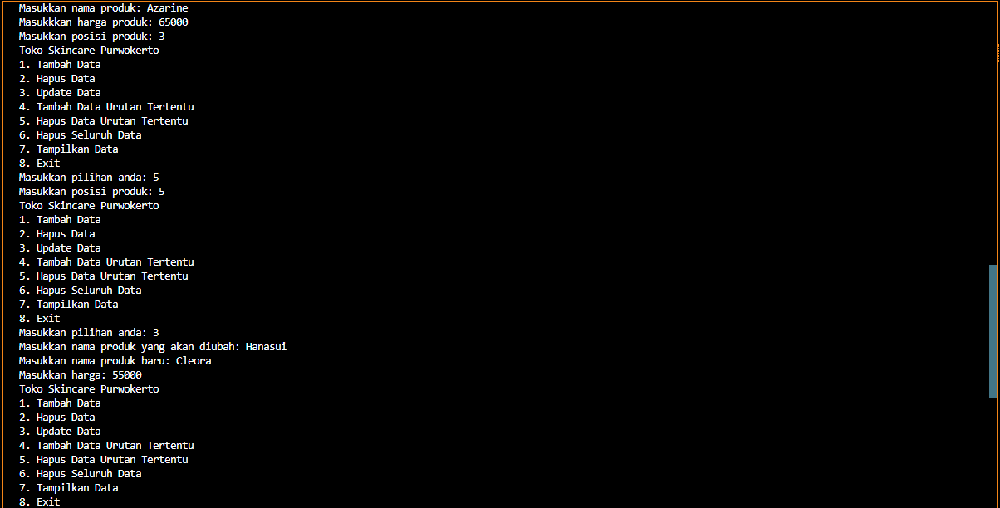
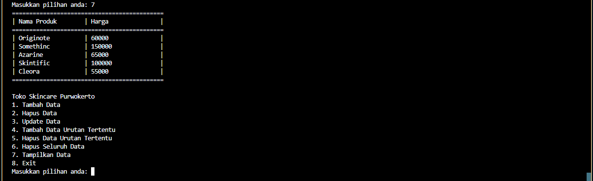
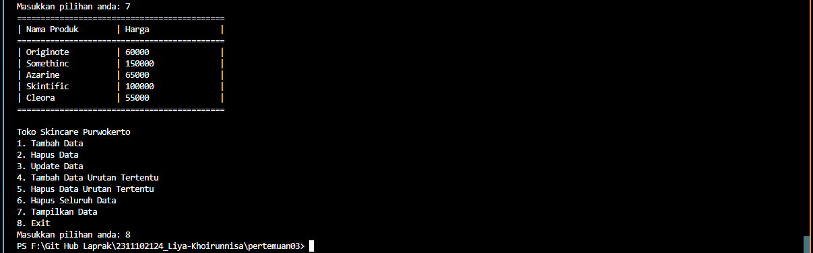

# <h1 align="center">Laporan Praktikum Modul Single and Double Linked List</h1>
<p align="center">Liya Khoirunnisa - 2311102124</p>

## Dasar Teori

Linked list adalah salah satu bentuk struktur data yang berisi kumpulan data yang tersusun secara sekuensial, saling bersambungan, dan dinamis. Linked list dikaitkan dengan sejumlah simpul yang dihubungkan secara linier dengan bantuan pointer. Setiap simpul akan berbentuk struct dan memiliki satu field bertipe struct yang sama. Operasi pada linked list berisi menambah simpul, menghapus simpul, mencetak simpul, dan mencari informasi pada suatu linked list. Pada linked list bagian pertama disebut medan informasi yang akan disimpan dan diolah. Sedangkan bagian kedua disebut medan penyambung yang berisi alamat node berikutnya.<br/>
1.	Single linked list adalah suatu linked list yang memiliki satu variabel pointer saja. Dimana pointer tersebut menunjuk ke node selanjutnya dan pointer pada tail menuju ke NULL. Singke linked list terdiri dari sejumlah node dimana setiap node memiliki penunjuk berikutnya ke node berikutnya. Pembuatan single linked list dapat dilakukan menggunakan dua jenis metode, yaitu last in first out (LIFO) pengaplikasiannya dengan stack (tumpukan) dan metode first in first out pengaplikasiannya adalah queue (antrean).<br/>
2.	Double linked list 
Double linked list menerapkan sebuah pointer prev dan next. Pointer prev menunjuk pada node sebelumnya. Ponter next untuk menunjuk pada simpul (node) setelahnya. Dengan keberadaan 2 pointer penunjuk menjadikan double linked list lebih fleksibel dibandingkan single linked list. Double linked list dibagi menjadi dua double linked list non circular  dan double linked list circular.<br/>

## Guided 

### 1. Program Single Linked List Non-Circular

```C++
#include <iostream>
using namespace std;
/// PROGRAM SINGLE LINKED LIST NON-CIRCULAR Liya Khoirunnisa

// Deklarasi Struct Node
struct Node {
    int data;
    Node *next;
};
Node *head;
Node *tail;

// Inisialisasi Node
void init() {
    head = NULL;
    tail = NULL;
}

// Pengecekan
bool isEmpty() {
    if (head == NULL)
        return true;
    else
        return false;
}

// Tambah Depan
void insertDepan(int nilai) {
    // Buat Node baru
    Node *baru = new Node;
    baru->data = nilai;
    baru->next = NULL;
    if (isEmpty() == true) {
        head = tail = baru;
        tail->next = NULL;
    } else {
        baru->next = head;
        head = baru;
    }
}

// Tambah Belakang
void insertBelakang(int nilai) {
    // Buat Node baru
    Node *baru = new Node;
    baru->data = nilai;
    baru->next = NULL;
    if (isEmpty() == true) {
        head = tail = baru;
        tail->next = NULL;
    } else {
        tail->next = baru;
        tail = baru;
    }
}

// Hitung Jumlah List
int hitungList() {
    Node *hitung;
    hitung = head;
    int jumlah = 0;
    while (hitung != NULL) {
        jumlah++;
        hitung = hitung->next;
    }
    return jumlah;
}

// Tambah Tengah
void insertTengah(int data, int posisi) {
    if (posisi < 1 || posisi > hitungList()) {
        cout << "Posisi diluar jangkauan" << endl;
    } else if (posisi == 1) {
        cout << "Posisi bukan posisi tengah" << endl;
    } else {
        Node *baru, *bantu;
        baru = new Node();
        baru->data = data;
        // tranversing
        bantu = head;
        int nomor = 1;
        while (nomor < posisi - 1) {
            bantu = bantu->next;
            nomor++;
        }
        baru->next = bantu->next;
        bantu->next = baru;
    }
}

// Hapus Depan
void hapusDepan() {
    Node *hapus;
    if (isEmpty() == false) {
        if (head->next != NULL) {
            hapus = head;
            head = head->next;
            delete hapus;
        } else {
            head = tail = NULL;
        }
    } else {
        cout << "List kosong!" << endl;
    }
}

// Hapus Belakang
void hapusBelakang() {
    Node *hapus;
    Node *bantu;
    if (isEmpty() == false) {
        if (head != tail) {
            hapus = tail;
            bantu = head;
            while (bantu->next != tail) {
                bantu = bantu->next;
            }
            tail = bantu;
            tail->next = NULL;
            delete hapus;
        } else {
            head = tail = NULL;
        }
    } else {
        cout << "List kosong!" << endl;
    }
}

// Hapus Tengah
void hapusTengah(int posisi) {
    Node *hapus, *bantu, *bantu2;
    if (posisi < 1 || posisi > hitungList()) {
        cout << "Posisi di luar jangkauan" << endl;
    } else if (posisi == 1) {
        cout << "Posisi bukan posisi tengah" << endl;
    } else {
        int nomor = 1;
        bantu = head;
        while (nomor <= posisi) {
            if (nomor == posisi - 1) {
                bantu2 = bantu;
            } if (nomor == posisi) {
                hapus = bantu;
            }
            bantu = bantu->next;
            nomor++;
        }
        bantu2->next = bantu;
        delete hapus;
    }
}

// Ubah Depan
void ubahDepan(int data) {
    if (isEmpty() == false) {
        head->data = data;
    } else {
        cout << "List masih kosong!" << endl;
    }
}

// Ubah Tengah
void ubahTengah(int data, int posisi) {
    Node *bantu;
    if (isEmpty() == false) {
        if (posisi < 1 || posisi > hitungList()) {
            cout << "Posisi di luar jangkauan" << endl;
        } else if (posisi == 1) {
            cout << "Posisi bukan posisi tengah" << endl;
        } else {
            bantu = head;
            int nomor = 1;
            while (nomor < posisi) {
                bantu = bantu->next;
                nomor++;
            }
            bantu->data = data;
        }
    } else {
        cout << "List masih kosong!" << endl;
    }
}

// Ubah Belakang
void ubahBelakang(int data) {
    if (isEmpty() == false) {
        tail->data = data;
    } else {
        cout << "List masih kosong!" << endl;
    }
}

// Hapus List
void clearList() {
    Node *bantu, *hapus;
    bantu = head;
    while (bantu != NULL) {
        hapus = bantu;
        bantu = bantu->next;
        delete hapus;
    }
    head = tail = NULL;
    cout << "List berhasil terhapus!" << endl;
}

// Tampilkan List
void tampil() {
    Node *bantu;
    bantu = head;
    if (isEmpty() == false) {
        while (bantu != NULL) {
            cout << bantu->data << ends;
            bantu = bantu->next;
        }
        cout << endl;
    } else {
        cout << "List masih kosong!" << endl;
    }
}

int main() {
    init();
    insertDepan(3);
    tampil();
    insertBelakang(5);
    tampil();
    insertDepan(2);
    tampil();
    insertDepan(1);
    tampil();
    hapusDepan();
    tampil();
    hapusBelakang();
    tampil();
    insertTengah(7, 2);
    tampil();
    hapusTengah(2);
    tampil();
    ubahDepan(1);
    tampil();
    ubahBelakang(8);
    tampil();
    ubahTengah(11, 2);
    tampil();
    return 0;
}
```
Kode di atas merupakan implementasi dalam penggunaan single linked list. Kode di atas digunakan untuk menciptakan linked list dan melakukan operasi seperti, menambah elemen (di depan, di tengah, atau di belakang), menghapus elemen (di depan, di tengah, atau di belakang), serta mengubah elemen (di depan, di tengah, atau di belakang). Kode di atas juga terdapat fungsi pengecekan list, menghitung jumlah elemen dalam linked list, membersihkan isi dari linked list, dan menampilkan elemen dalam linked list. Hasil dari operasi akan di tampilkan setiap kali operasi dilakukan. 

### 2. Program Double Linked List

```C++
#include <iostream>
using namespace std;
// PROGRAM DOUBLE LINKED LIST Liya Khoirunnisa

// Node class untuk merepresentasikan setiap elemen dalam list
class Node {
public:
    int data;
    Node *prev;
    Node *next;
};

// Doublylinkedlist class untuk mengelola linked list
class DoublyLinkedList {
public:
    Node *head;
    Node *tail;

    // Inisialisasi linked list
    DoublyLinkedList() {
        head = nullptr;
        tail = nullptr;
    }

    // Menambahkan data ke awal linked list 
    void push(int data) {
        Node *newNode = new Node;
        newNode->data = data;
        newNode->prev = nullptr;
        newNode->next = head;
        if (head != nullptr) {
            head->prev = newNode;
        }
        else {
            tail = newNode;
        }
        head = newNode;
    }

    // Menghapus data dari awal linked list
    void pop() {
        if (head == nullptr) {
            return;
        }
        Node *temp = head;
        head = head->next;
        if (head != nullptr) {
            head->prev = nullptr;
        }
        else {
            tail = nullptr;
        }
        delete temp;
    }

    // Mengupdate data dalam linked list
    bool update(int oldData, int newData) {
        Node *current = head;
        while (current != nullptr) {
            if (current->data == oldData) {
                current->data = newData;
                return true;
            }
            current = current->next;
        }
        return false;
    }

    // Menghapus semua data dari linked list
    void deleteAll() {
        Node *current = head;
        while (current != nullptr) {
            Node *temp = current;
            current = current->next;
            delete temp;
        }
        head = nullptr;
        tail = nullptr;
    }

    // Menampilkan semua data dalam linked list
    void display() {
        Node *current = head;
        while (current != nullptr) {
            cout << current->data << " ";
            current = current->next;
        }
        cout << endl;
    }
};

int main() {
    DoublyLinkedList list;

    // Looping untuk menampilkan menu dan menerima input pengguna
    while (true) {
        cout << "1. Add data" << endl;
        cout << "2. Delete data" << endl;
        cout << "3. Update data" << endl;
        cout << "4. Clear data" << endl;
        cout << "5. Display data" << endl;
        cout << "6. Exit" << endl;
        int choice;
        cout << "Enter your choice: ";
        cin >> choice;

        // Switch case untuk memproses pilihan pengguna
        switch (choice) {
            case 1:{
                int data;
                cout << "Enter data to add: ";
                cin >> data;
                list.push(data);
                break;
            }
            case 2: {
                list.pop();
                break;
            }
            case 3: {
                int oldData, newData;
                cout << "Enter old data: ";
                cin >> oldData;
                cout << "Enter new data: ";
                cin >> newData;
                bool updated = list.update(oldData, newData);
                if (!updated) {
                    cout << "Data not found" << endl;
                }
                break;
            }
            case 4: {
                list.deleteAll();
                break;
            }
            case 5: {
                list.display();
                break;
            }
            case 6: {
                return 0;
            }
            default: {
                cout << "Invalid choice" << endl;
                break;
            }
        }
    }
    return 0;
}
```
Kode di atas merupakan implementasi dalam penggunaan double linked list. Terdapat 6 menu operasi double linked list, yaitu menambah data, menghapus data, mengubah data, menghapus semua data, dan menampilkan data yang tersimpan dalam double linked list. Setiap pengguna memilih opsi menu, program akan mengeksekusi operasi dan menampilkan hasilnya. Program akan terus menerus berjalan hingga pengguna memilih opsi 6. 

## Unguided 

### 1. Buatlah program menu Single Linked List Non-Circular untuk menyimpan Nama dan usia mahasiswa, dengan menggunakan inputan dari user!

```C++
/*oleh Liya Khoirunnisa - 2311102124*/
#include <iostream>

using namespace std;

// Deklarasi Struct Node
struct Node {
    string nama_2124;
    int usia_2124;
    Node *next;
};
Node *head;
Node *tail;

// Inisialisasi Node
void init_2124() {
    head = NULL;
    tail = NULL;
}

// Pengecekan
bool isEmpty_2124() {
    if (head == NULL)
        return true;
    else
        return false;
}

// Tambah Depan
void insertDepan_2124(string nama_2124, int usia_2124) {
    // Buat Node baru
    Node *baru_2124 = new Node;
    baru_2124->nama_2124 = nama_2124;
    baru_2124->usia_2124 = usia_2124;
    baru_2124->next = NULL;
    if (isEmpty_2124() == true) {
        head = tail = baru_2124;
        tail->next = NULL;
    }
    else {
        baru_2124->next = head;
        head = baru_2124;
    }
}

// Tambah Belakang
void insertBelakang_2124(string nama_2124, int usia_2124) {
    // Buat Node baru
    Node *baru_2124 = new Node;
    baru_2124->nama_2124 = nama_2124;
    baru_2124->usia_2124 = usia_2124;
    baru_2124->next = NULL;
    if (isEmpty_2124() == true) {
        head = tail = baru_2124;
        tail->next = NULL;
    }
    else {
        tail->next = baru_2124;
        tail = baru_2124;
    }
}

// Tambah Tengah
void insertTengah_2124(string nama_2124, int usia_2124, string posisiNama_2124) {
    // Buat Node baru
    Node *baru_2124 = new Node;
    baru_2124->nama_2124 = nama_2124;
    baru_2124->usia_2124 = usia_2124;

    Node *temp_2124 = head;
    while (temp_2124 != NULL && temp_2124->nama_2124 != posisiNama_2124 ) {
        temp_2124 = temp_2124->next;
    }

    if (temp_2124 == NULL) {
        cout << "Node dengan nama " << posisiNama_2124 << " tidak ditemukan." << endl;
        return;
    }
        baru_2124->next = temp_2124->next;
        temp_2124->next = baru_2124;
}

// Menghapus node berdasarkan nama
void hapus_2124(string nama_2124) {
    Node *hapus_2124, *temp_2124;
    if (isEmpty_2124() == false) {
        hapus_2124 = head;
        temp_2124 = head;
        while (hapus_2124 != NULL && hapus_2124->nama_2124 != nama_2124) {
            temp_2124 = hapus_2124;
            hapus_2124 = hapus_2124->next;
        }
        if (hapus_2124 == NULL) {
            cout << "Data dengan nama " << nama_2124 << " tidak ditemukan." << endl;
        }
        else if (hapus_2124 == head) {
            head = head->next;
            delete hapus_2124;
        }
        else {
            temp_2124->next = hapus_2124->next;
            delete hapus_2124;
        }
    }
    else {
        cout << "List kosong!" << endl;
    }
}

// Mengubah nama dan usia baru
void ubah_2124(string nama_2124, string namaBaru_2124, int usiaBaru_2124) {
    Node *temp_2124 = head;
    while (temp_2124 != NULL && temp_2124->nama_2124 != nama_2124) {
        temp_2124 = temp_2124->next;
    }
    if (temp_2124 == NULL) {
        cout << "Data dengan nama " << nama_2124 << " tidak ditemukan." << endl;
    }
    else {
        temp_2124->nama_2124 = namaBaru_2124;
        temp_2124->usia_2124 = usiaBaru_2124;
    }
}

// Menampilkan seluruh data linked list
void tampil_2124() {
    Node *temp_2124;
    temp_2124 = head;
    if (isEmpty_2124() == false) {
        while (temp_2124 != NULL) {
            cout << temp_2124->nama_2124 << " " << temp_2124->usia_2124 << endl;
            temp_2124 = temp_2124->next;
        }
        cout << endl;
    }
    else {
        cout << "List masih kosong!" << endl;
    }
}

// Deklarasi variabel
int pilih_2124, usia_2124, usiaBaru_2124;
string nama_2124, namaBaru_2124, posisiNama_2124;

int main() {
    init_2124();

    // Perulangan untuk menampilkan menu 
     do {
        // Tampilkan menu
        cout << "Menu \n";
        cout << "1. Tambah Depan\n";
        cout << "2. Tambah Belakang\n";
        cout << "3. Tambah Tengah\n";
        cout << "4. Hapus\n";
        cout << "5. Ubah\n";
        cout << "6. Tampil\n";
        cout << "7. Keluar\n";
        cout << "Pilih menu: ";
        cin >> pilih_2124;

        // Switch case untuk memproses pilihan pengguna
        switch (pilih_2124) {
            case 1:
                // Menambah data baru di depan
                cout << "Masukkan nama: ";
                cin >> nama_2124;
                cout << "Masukkan usia: ";
                cin >> usia_2124;
                insertDepan_2124(nama_2124, usia_2124);
                break;
            case 2:
                // Menambah data baru di belakang
                cout << "Masukkan nama: ";
                cin >> nama_2124;
                cout << "Masukkan usia: ";
                cin >> usia_2124;
                insertBelakang_2124(nama_2124, usia_2124);
                break;
            case 3:
                // Menambah data baru di tengah
                cout << "Masukkan nama: ";
                cin >> nama_2124;
                cout << "Masukkan usia: ";
                cin >> usia_2124;
                cout << "Masukkan nama posisi: ";
                cin >> posisiNama_2124;
                insertTengah_2124(nama_2124, usia_2124, posisiNama_2124);
                break;
            case 4:
                // Menghapus node berdasarkan nama
                cout << "Masukkan nama yang akan dihapus: ";
                cin >> nama_2124;
                hapus_2124(nama_2124);
                break;
            case 5:
                // Mengubah nama dan usia baru
                cout << "Masukkan nama yang ingin diubah: ";
                cin >> nama_2124;
                cout << "Masukkan nama baru: ";
                cin >> namaBaru_2124;
                cout << "Masukkan usia baru: ";
                cin >> usiaBaru_2124;
                ubah_2124(nama_2124, namaBaru_2124, usiaBaru_2124);
                break;
            case 6:
                // Menampilkan isi list
                cout << "Data Mahasiswa: " << endl;
                tampil_2124();
                break;
            case 7:
                // Keluar dari program
                cout << "Keluar dari program." << endl;
                break;
            default:
                // Input yang dimasukkan tidak tersedia
                cout << "Maaf, pilihan tidak tersedia!" << endl;
        }
    } while (pilih_2124 != 7);
    
    return 0;
}
```
#### Output:






Kode di atas merupakan implementasi dalam penggunaan single linked list untuk mengelola data mahasiswa yang berisi nama dan usia. Program ini memungkinkan untuk melakukan operasi tambah depan, tambah belakang, tambah tengah, hapus data, ubah data, dan menampilkan data. Operasi tersebut menggunakan fungsi yang di dalamnya menggunakan metode single linked list. Pilihan operasi ditampilkan dengan menu agar memudahkan pengguna memilih operasi yang akan dilakukan. Menu yang ditampilkan menggunakan switch case dan untuk mengulang menu menggunakan do-while. Setiap pengguna memilih opsi menu dan program akan mengeksekusi operasinya. Operasi tersebut akan di panggil di int main. Hasil operasi yang dilakukan akan ditampilkan di layar jika pengguna memilih menu 6. Program akan terus berjalan hingga pengguna memilih opsi 7 yaitu keluar.

### 2. Modifikasi Guided Double Linked List dilakukan dengan penambahan operasi untuk menambah data, menghapus, dan update di tengah / diurutan tertentu yang diminta. Selain itu, buatlah agar tampilannya menampilkan Nama produk dan harga.

```C++
/*oleh Liya Khoirunnisa - 2311102124*/
#include <iostream>
#include <iomanip>

using namespace std;
// Program modifikasi Double Linked List Guided 2 untuk menampilkan nama produk dan harga

// Class node untuk menyimpan data produk
class Node {
public:
    string nama_2124;
    int harga_2124;
    Node *prev;
    Node *next;
};

// Class Doubly linked list untuk menyimpan daftar produk
class DoublyLinkedList_2124 {
public:
    Node *head;
    Node *tail;
    DoublyLinkedList_2124() {
        head = nullptr;
        tail = nullptr;
    }

    // Fungsi untuk menambahkan produk ke akhir daftar
    void push_2124(string nama_2124, int harga_2124) {
        Node *newNode = new Node;
        newNode->nama_2124 = nama_2124;
        newNode->harga_2124 = harga_2124;
        newNode->prev = tail;
        newNode->next = nullptr;
        if (head != nullptr) {
            tail->next = newNode;
        } else {
            head = newNode;
        }
        tail = newNode;
    }

    // Fungsi untuk menghapus produk dari awal daftar
    void pop_2124() {
        if (head == nullptr) {
            return;
        }
        Node *temp_2124 = head;
        head = head->next;
        if (head != nullptr) {
            head->prev = nullptr;
        } else {
            tail = nullptr;
        }
        delete temp_2124;
    }

    // Mengupdate data produk
    bool update(string namaLama_2124, string namaBaru_2124, int hargaBaru_2124) {
        Node *current_2124 = head;
        while (current_2124 != nullptr) {
            if (current_2124->nama_2124 == namaLama_2124) {
                current_2124->nama_2124 = namaBaru_2124;
                current_2124->harga_2124 = hargaBaru_2124;
                return true;
            }
            current_2124 = current_2124->next;
        }
        return false;
    }

    // Fungsi untuk menyisipkan data produk pada posisi tertentu
    void insertPosition(string nama_2124, int harga_2124, int posisi_2124) {
        Node *newNode = new Node;
        newNode->nama_2124 = nama_2124;
        newNode->harga_2124 = harga_2124;

        if (posisi_2124 == 1) {
            newNode->next = head;
            newNode->prev = nullptr;
            if (head != nullptr) {
                head->prev = newNode;
            } else {
                tail = newNode;
            }
            head = newNode;
            return;
        }

        Node *current_2124 = head;
        int count_2124 = 1;
        while (current_2124 != nullptr && count_2124 < posisi_2124 - 1){
            current_2124 = current_2124->next;
            count_2124++;
        }
        if (current_2124 == nullptr) {
            cout << "Posisi tidak ditemukan." << endl;
            tail->next = newNode;
            newNode->prev = tail;
            tail = newNode;
        } else {
            newNode->next = current_2124->next;
            newNode->prev = current_2124;
            if (current_2124->next != nullptr) {
            current_2124->next->prev = newNode;
            } else {
                tail = newNode;
            }
            current_2124->next = newNode;
        }
    }

    // Fungsi untuk menghapus data produk pada posisi tertentu
    void deletePosition(int posisi_2124) {
        if (head == nullptr || posisi_2124 <= 0) {
            return;
        }

        Node *current_2124 = head;
        for (int i = 1; current_2124 != nullptr && i < posisi_2124; i++) {
            current_2124 = current_2124->next;
        }

        if (current_2124 == nullptr) {
            return;
        }

        if (current_2124->prev != nullptr) {
            current_2124->prev->next = current_2124->next;
        }
        else {
            head = current_2124->next;
        }

        if (current_2124->next != nullptr) {
            current_2124->next->prev = current_2124->prev;
        }
        else {
            tail = current_2124->prev;
        }

        delete current_2124;
    }

    // Fugsi untuk menghapus semua data dari daftar
    void deleteAll() {
            Node *current_2124 = head;
            while (current_2124 != nullptr) {
                Node *temp_2124 = current_2124;
                current_2124 = current_2124->next;
                delete temp_2124;
            }
            head = nullptr;
            tail = nullptr;
        }

    // Fungsi untuk menampilkan semua produk dalam daftar
    void display() {
    cout << "============================================" << endl;
    cout << "| Nama Produk        | Harga               |" << endl;
    cout << "============================================" << endl;
    Node *current_2124 = head;
    while (current_2124 != nullptr) {
        cout << "| " << setw(19) << left << current_2124->nama_2124;
        cout << "| " << setw(19) << left << current_2124->harga_2124 << " |" << endl;
        current_2124 = current_2124->next;
    }
    cout << "============================================" << endl;
    cout << endl;
    }
};

// Deklarasi variabel
int pilih_2124, harga_2124, hargaBaru_2124, posisi_2124;
string nama_2124, namaBaru_2124;

int main() {
    DoublyLinkedList_2124 list;
    while (true) {
        // Menampilkan menu
        cout << "Toko Skincare Purwokerto" << endl;
        cout << "1. Tambah Data" << endl;
        cout << "2. Hapus Data" << endl;
        cout << "3. Update Data" << endl;
        cout << "4. Tambah Data Urutan Tertentu" << endl;
        cout << "5. Hapus Data Urutan Tertentu" << endl;
        cout << "6. Hapus Seluruh Data" << endl;
        cout << "7. Tampilkan Data" << endl;
        cout << "8. Exit" << endl;

        // Meminta inputan pilihan dari pengguna
        cout << "Masukkan pilihan anda: ";
        cin >> pilih_2124;
        switch (pilih_2124) {
        case 1:{
                // Menambah data baru
                cout << "Masukkan nama produk: ";
                cin.ignore();
                getline(cin, nama_2124);
                cout << "Masukkan harga produk: ";
                cin >> harga_2124;
                list.push_2124(nama_2124, harga_2124);
                break;
            }
            case 2: {
                // Menghapus data produk
                list.pop_2124();
                break;
            }
            case 3: {
                // Mengupdate data produk
                cout << "Masukkan nama produk yang akan diubah: ";
                cin.ignore();
                getline(cin, nama_2124);
                cout << "Masukkan nama produk baru: ";
                getline(cin, namaBaru_2124);
                cout << "Masukkan harga: ";
                cin >> hargaBaru_2124;
                bool updated = list.update(nama_2124, namaBaru_2124,hargaBaru_2124);
                if (!updated) {
                    cout << "Data tidak ditemukan" << endl;
                }
                break;
            }
            case 4: {
                // Menambahkan data produk pada posisi tertentu
                cout << "Masukkan nama produk: ";
                cin.ignore();
                getline(cin, nama_2124);
                cout << "Masukkkan harga produk: ";
                cin >> harga_2124;
                cout << "Masukkan posisi produk: ";
                cin >> posisi_2124;
                list.insertPosition(nama_2124, harga_2124, posisi_2124);
                break;
            }
            case 5: {
                // Menghapus data produk pada posisi tertentu
                cout << "Masukkan posisi produk: ";
                cin >> posisi_2124;
                list.deletePosition(posisi_2124);
                break;
            }
            case 6: {
                // Menghapus semua data dari daftar
                list.deleteAll();
                break;
            }
            case 7: {
                // Menampilkan semua produk dalam daftar
                list.display();
                break;
            }
            case 8: {
                // Keluar dari program
                return 0;
            }
            default: {
                // Piihan yang diinputkan pengguna tidak tersedia
                cout << "Maaf, pilihan tidak tersedia!" << endl;
                break;
            }
        }
    }
    return 0;
}

```
#### Output:






Kode di atas merupakan implementasi dalam penggunaan double linked list. Terdapat 8 menu yang berisi operasi double linked list, yaitu menambah data, menghapus data, mengubah data, menambahkan data produk pada posisi tertentu, menghapus data produk pada posisi tertentu, menghapus semua data, menampilkan data yang tersimpan dalam double linked list, dan menu yang terakhir adalah keluar dari program. Operasi tersebut menggunakan fungsi yang akan dipanggil dalam int main. Pengunaan fungsi bertujuan agar pembacaan kode lebih efiesien dan rapih. Setiap pengguna memilih opsi menu dan program akan mengeksekusi operasinya. Hasil operasi yang dilakukan akan ditampilkan di layar jika pengguna memilih menu 7. Program akan terus menerus berjalan hingga pengguna memilih opsi 8 yaitu keluar. Perulangan yang digunakan untuk menggulang menu menggunakan perulangan while, bertujuan agar program dapat terus berjalan dan menunggu inputan dari pengguna hingga memilih menu 8 keluar.

## Kesimpulan
Pada praktikum tersebut mempelajari implementasi struktur data single linked list  dan double linked list. Operasi single linked list dan double linked list  yang digunakan seperti tambah data, hapus data, ubah data, dan tampilkan data. Perbedaan single linked list dan double linked list terletak pada node. Single linked list memiliki pointer yang menunjuk ke node selanjutnya (next). Double linked list memiliki pointer yang menunjuk ke node sebelum (prev) dan selanjutnya (next).

## Referensi
[1] Mulyana, A. (2023). E-Books Cara Mudah Mempelajari Algoritma dan Struktur Data.<br/>
[2] Triase, T. (2020). Struktur Data: Diktat Edisi Revisi.<br/>
