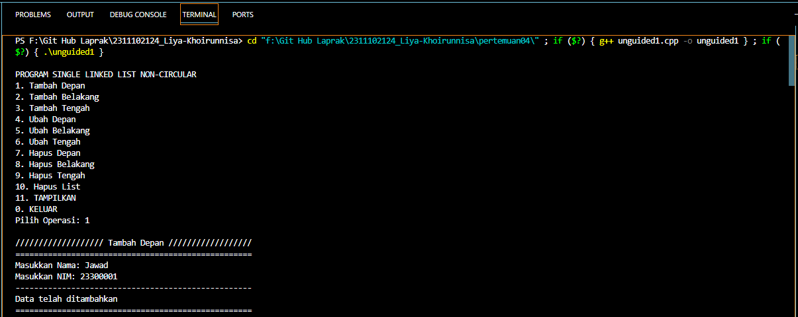
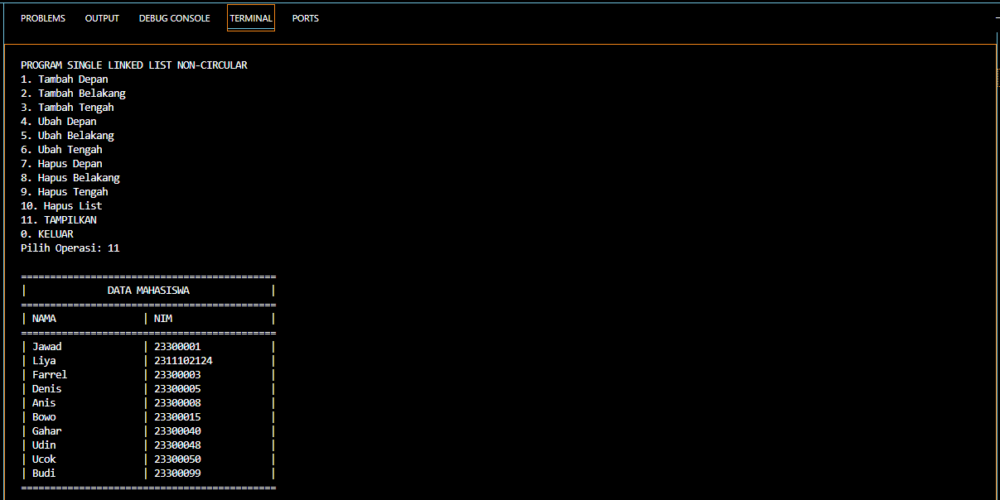
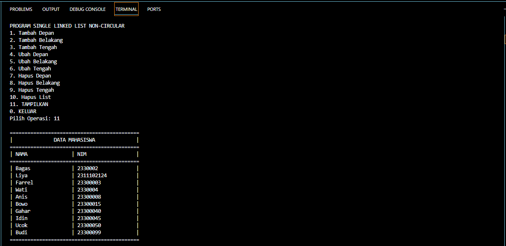

# <h1 align="center">Laporan Praktikum Modul Single and Double Linked List</h1>
<p align="center">Liya Khoirunnisa - 2311102124</p>

## Dasar Teori

Linked list adalah salah satu bentuk struktur data yang berisi kumpulan data yang tersusun secara sekuensial, saling bersambungan, dan dinamis. Linked list dikaitkan dengan sejumlah simpul yang dihubungkan secara linier dengan bantuan pointer. Setiap simpul akan berbentuk struct dan memiliki satu field bertipe struct yang sama. Operasi pada linked list berisi menambah simpul, menghapus simpul, mencetak simpul, dan mencari informasi pada suatu linked list. Pada linked list bagian pertama disebut medan informasi yang akan disimpan dan diolah. Sedangkan bagian kedua disebut medan penyambung yang berisi alamat node berikutnya.<br/>
Linked list dibagi menjadi dua:<br/>
1.	Linked list non circular<br/>
Linked list non circular adalah list struktur data yang berbentuk terdiri dari node yang saling terhubung secara linear dengan. List ini memiliki dua penunjuk utama, yaitu head/first sebagai penunjuk awal list dan akan diteruskan dengan objek yang saling berhubungan, diakhiri dengan tail/ last sebagai penunjuk akhir list, yang mana data . Data terakhir ini akan memiliki referensi NULL sebagai indikator akhir dalam list.<br/>
2.	Linked list circular<br/>
Linked list circular adalah list yang berbentuk circular dengan head/first sebagai penunjuk awal list dan akan diteruskan dengan obyek-obyek yang saling berhubungan, diakhiri dengan tail/ last sebagai penunjuk akhir list. Bedanya akhir list akan memiliki referensi yang akan menunjuk kembali ke awal list (head/first) dan atau head/first pun akan memiliki referensi yang menunjuk bahwa data sebelumnya adalah tail/last list. Linked list circular dapat digunakan untuk menyimpan data yang perlu diakses berulang-ulang.

## Guided 

### 1. Program Single Linked List Non-Circular

```C++
#include <iostream>
using namespace std;
/// PROGRAM SINGLE LINKED LIST NON-CIRCULAR Liya Khoirunnisa

// Deklarasi Struct Node
struct Node {
    int data;
    Node *next;
};
Node *head;
Node *tail;

// Inisialisasi Node
void init() {
    head = NULL;
    tail = NULL;
}

// Pengecekan
bool isEmpty() {
    if (head == NULL)
        return true;
    else
        return false;
}

// Tambah Depan
void insertDepan(int nilai) {
    // Buat Node baru
    Node *baru = new Node;
    baru->data = nilai;
    baru->next = NULL;
    if (isEmpty() == true) {
        head = tail = baru;
        tail->next = NULL;
    } else {
        baru->next = head;
        head = baru;
    }
}

// Tambah Belakang
void insertBelakang(int nilai) {
    // Buat Node baru
    Node *baru = new Node;
    baru->data = nilai;
    baru->next = NULL;
    if (isEmpty() == true) {
        head = tail = baru;
        tail->next = NULL;
    } else {
        tail->next = baru;
        tail = baru;
    }
}

// Hitung Jumlah List
int hitungList() {
    Node *hitung;
    hitung = head;
    int jumlah = 0;
    while (hitung != NULL) {
        jumlah++;
        hitung = hitung->next;
    }
    return jumlah;
}

// Tambah Tengah
void insertTengah(int data, int posisi) {
    if (posisi < 1 || posisi > hitungList()) {
        cout << "Posisi diluar jangkauan" << endl;
    } else if (posisi == 1) {
        cout << "Posisi bukan posisi tengah" << endl;
    } else {
        Node *baru, *bantu;
        baru = new Node();
        baru->data = data;
        // tranversing
        bantu = head;
        int nomor = 1;
        while (nomor < posisi - 1) {
            bantu = bantu->next;
            nomor++;
        }
        baru->next = bantu->next;
        bantu->next = baru;
    }
}

// Hapus Depan
void hapusDepan() {
    Node *hapus;
    if (isEmpty() == false) {
        if (head->next != NULL) {
            hapus = head;
            head = head->next;
            delete hapus;
        } else {
            head = tail = NULL;
        }
    } else {
        cout << "List kosong!" << endl;
    }
}

// Hapus Belakang
void hapusBelakang() {
    Node *hapus;
    Node *bantu;
    if (isEmpty() == false) {
        if (head != tail) {
            hapus = tail;
            bantu = head;
            while (bantu->next != tail) {
                bantu = bantu->next;
            }
            tail = bantu;
            tail->next = NULL;
            delete hapus;
        } else {
            head = tail = NULL;
        }
    } else {
        cout << "List kosong!" << endl;
    }
}

// Hapus Tengah
void hapusTengah(int posisi) {
    Node *bantu, *hapus, *sebelum;
    if (posisi < 1 || posisi > hitungList()) {
        cout << "Posisi di luar jangkauan" << endl;
    } else if (posisi == 1) {
        cout << "Posisi bukan posisi tengah" << endl;
    } else {
        int nomor = 1;
        bantu = head;
        while (nomor <= posisi) {
            if (nomor == posisi - 1) {
                sebelum = bantu;
            }
            if (nomor == posisi) {
                hapus = bantu;
            }
            bantu = bantu->next;
            nomor++;
        }
        sebelum->next = bantu;
        delete hapus;
    }
}

// Ubah Depan
void ubahDepan(int data) {
    if (isEmpty() == 0) {
        head->data = data;
    } else {
        cout << "List masih kosong!" << endl;
    }
}

// Ubah Tengah
void ubahTengah(int data, int posisi) {
    Node *bantu;
    if (isEmpty() == 0) {
        if (posisi < 1 || posisi > hitungList()) {
            cout << "Posisi di luar jangkauan" << endl;
        } else if (posisi == 1) {
        } else {
            cout << "Posisi bukan posisi tengah" << endl;
            bantu = head;
            int nomor = 1;
            while (nomor < posisi) {
                bantu = bantu->next;
                nomor++;
            }
            bantu->data = data;
        }
    } else {
        cout << "List masih kosong!" << endl;
    }
}

// Ubah Belakang
void ubahBelakang(int data) {
    if (isEmpty() == 0) {
        tail->data = data;
    } else {
        cout << "List masih kosong!" << endl;
    }
}

// Hapus List
void clearList() {
    Node *bantu, *hapus;
    bantu = head;
    while (bantu != NULL) {
        hapus = bantu;
        bantu = bantu->next;
        delete hapus;
    }
    head = tail = NULL;
    cout << "List berhasil terhapus!" << endl;
}

// Tampilkan List
void tampil() {
    Node *bantu;
    bantu = head;
    if (isEmpty() == false) {
        while (bantu != NULL) {
            cout << bantu->data << ends;
            bantu = bantu->next;
        }
        cout << endl;
    } else {
        cout << "List masih kosong!" << endl;
    }
}

int main() {
    init();
    insertDepan(3);
    tampil();
    insertBelakang(5);
    tampil();
    insertDepan(2);
    tampil();
    insertDepan(1);
    tampil();
    hapusDepan();
    tampil();
    hapusBelakang();
    tampil();
    insertTengah(7, 2);
    tampil();
    hapusTengah(2);
    tampil();
    ubahDepan(1);
    tampil();
    ubahBelakang(8);
    tampil();
    ubahTengah(11, 2);
    tampil();
    return 0;
}
```
Kode di atas merupakan implementasi dalam penggunaan single linked list non-circular. Kode di atas digunakan untuk menciptakan linked list dan melakukan operasi seperti, menambah elemen (di depan, di tengah, atau di belakang), menghapus elemen (di depan, di tengah, atau di belakang), serta mengubah elemen (di depan, di tengah, atau di belakang). Kode di atas juga terdapat fungsi pengecekan list, menghitung jumlah elemen dalam linked list, membersihkan isi dari linked list, dan menampilkan elemen dalam linked list. Hasil dari operasi akan di tampilkan setiap kali operasi dilakukan.

### 2. Program Single Linked List Circular

```C++
#include <iostream>
using namespace std;
/// PROGRAM SINGLE LINKED LIST CIRCULAR Liya Khoirunnisa

// Deklarasi Struct Node
struct Node {
    string data;
    Node* next;
};

Node* head, * tail, * baru, * bantu, * hapus;

void init() {
    head = NULL;
    tail = head;
}

// Pengecekan
int isEmpty() {
    if (head == NULL)
        return 1; // true
    else
        return 0; // false
}

// Buat Node Baru
void buatNode(string data) {
    baru = new Node;
    baru->data = data;
    baru->next = NULL;
}

// Hitung List
int hitungList() {
    bantu = head;
    int jumlah = 0;
    while (bantu != NULL) {
        jumlah++;
        bantu = bantu->next;
    }
    return jumlah;
}

// Tambah Depan
void insertDepan(string data) {
    // Buat Node baru
    buatNode(data);

    if (isEmpty() == 1) {
        head = baru;
        tail = head;
        baru->next = head;
    } else {
        while (tail->next != head) {
            tail = tail->next;
        }
        baru->next = head;
        head = baru;
        tail->next = head;
    }
}

// Tambah Belakang
void insertBelakang(string data) {
    // Buat Node baru
    buatNode(data);

    if (isEmpty() == 1) {
        head = baru;
        tail = head;
        baru->next = head;
    } else {
        while (tail->next != head) {
            tail = tail->next;
        }
        tail->next = baru;
        baru->next = head;
    }
}

// Tambah Tengah
void insertTengah(string data, int posisi) {
    if (isEmpty() == 1) {
        head = baru;
        tail = head;
        baru->next = head;
    } else {
        baru->data = data;
        // transversing
        int nomor = 1;
        bantu = head;
        while (nomor < posisi - 1) {
            bantu = bantu->next;
            nomor++;
        }
        baru->next = bantu->next;
        bantu->next = baru;
    }
}

// Hapus Depan
void hapusDepan() {
    if (isEmpty() == 0) {
        hapus = head;
        tail = head;
        if (hapus->next == head) {
            head = NULL;
            tail = NULL;
            delete hapus;
        } else {
            while (tail->next != hapus) {
                tail = tail->next;
            }
            head = head->next;
            tail->next = head;
            hapus->next = NULL;
            delete hapus;
        }
    } else {
        cout << "List masih kosong!" << endl;
    }
}

// Hapus Belakang
void hapusBelakang() {
    if (isEmpty() == 0) {
        hapus = head;
        tail = head;
        if (hapus->next == head) {
            head = NULL;
            tail = NULL;
            delete hapus;
        } else {
            while (hapus->next != head) {
                hapus = hapus->next;
            }
            while (tail->next != hapus) {
                tail = tail->next;
            }
            tail->next = head;
            hapus->next = NULL;
            delete hapus;
        }
    } else {
        cout << "List masih kosong!" << endl;
    }
}

// Hapus Tengah
void hapusTengah(int posisi) {
    if (isEmpty() == 0) {
        // transversing
        int nomor = 1;
        bantu = head;
        while (nomor < posisi - 1) {
            bantu = bantu->next;
            nomor++;
        }
        hapus = bantu->next;
        bantu->next = hapus->next;
        delete hapus;
    } else {
        cout << "List masih kosong!" << endl;
    }
}

// Hapus List
void clearList() {
    if (head != NULL) {
        hapus = head->next;
        while (hapus != head) {
            bantu = hapus->next;
            delete hapus;
            hapus = bantu;
        }
        delete head;
        head = NULL;
    }
    cout << "List berhasil terhapus!" << endl;
}

// Tampilkan List
void tampil() {
    if (isEmpty() == 0) {
        tail = head;
        do {
            cout << tail->data << ends;
            tail = tail->next;
        } while (tail != head);
        cout << endl;
    } else {
        cout << "List masih kosong!" << endl;
    }
}

int main() {
    init();
    insertDepan("Ayam");
    tampil();
    insertDepan("Bebek");
    tampil();
    insertBelakang("Cicak");
    tampil();
    insertBelakang("Domba");
    tampil();
    hapusBelakang();
    tampil();
    hapusDepan();
    tampil();
    insertTengah("Sapi", 2);
    tampil();
    hapusTengah(2);
    tampil();
    return 0;
}
```
Kode di atas merupakan implementasi dalam penggunaan single linked list circular. Kode di atas digunakan untuk menciptakan linked list dan melakukan operasi seperti, menambah elemen (di depan, di tengah, atau di belakang), menghapus elemen (di depan, di tengah, atau di belakang), serta mengubah elemen (di depan, di tengah, atau di belakang). Kode di atas juga terdapat fungsi pengecekan list, menghitung jumlah elemen dalam linked list, membersihkan isi dari linked list, dan menampilkan elemen dalam linked list. Hasil dari operasi akan di tampilkan setiap kali operasi dilakukan. Perbedaan program single linked list circular dan single linked list non-circular adalah pada elemen terakhir terhubung kembali dengan elemen pertama, sehingga tidak ada tindakan untuk menambah atau menghapus ujung linked list.

## Unguided 

### 1. Buatlah program menu Linked List Non Circular untuk menyimpan Nama dan NIM mahasiswa, dengan menggunakan input dari user! Terdapat menu untuk menambahkan, mengubah, menghapus, dan melihat Nama dan NIM mahasiswa.

```C++
/*oleh Liya Khoirunnisa - 2311102124*/
#include <iostream>
#include <iomanip>

using namespace std;
// Program single linked list non-circular untuk menampilkan nama mahasiswa dan NIM

// Deklarasi Struct Node
struct Node
{
    string nama_2124;
    string nim_2124;
    Node *next;
};
Node *head;
Node *tail;

// Inisialisasi Node
void init_2124()
{
    head = NULL;
    tail = NULL;
}

// Pengecekan
bool isEmpty_2124()
{
    if (head == NULL)
        return true;
    else
        return false;
}

// Tambah Depan
void insertDepan_2124(string nama_2124, string nim_2124)
{
    // Buat Node baru
    Node *baru = new Node;
    baru->nama_2124 = nama_2124;
    baru->nim_2124 = nim_2124;
    baru->next = NULL;
    if (isEmpty_2124() == true)
    {
        head = tail = baru;
        tail->next = NULL;
    }
    else
    {
        baru->next = head;
        head = baru;
    }
}

// Tambah Belakang
void insertBelakang_2124(string nama_2124, string nim_2124)
{
    // Buat Node baru
    Node *baru = new Node;
    baru->nama_2124 = nama_2124;
    baru->nim_2124 = nim_2124;
    baru->next = NULL;
    if (isEmpty_2124() == true)
    {
        head = tail = baru;
        tail->next = NULL;
    }
    else
    {
        tail->next = baru;
        tail = baru;
    }
}

int hitungList_2124()
{
    Node *hitung;
    hitung = head;
    int jumlah = 0;
    while (hitung != NULL)
    {
        jumlah++;
        hitung = hitung->next;
    }
    return jumlah;
}

// Tambah Tengah
void insertTengah_2124(string nama_2124, string nim_2124, int posisiNama_2124)
{
    if (posisiNama_2124 < 1 || posisiNama_2124 > hitungList_2124())
    {
        cout << "Posisi diluar jangkauan" << endl;
    }
    else if (posisiNama_2124 == 1)
    {
        cout << "Posisi bukan posisi tengah" << endl;
    }
    else
    {
        Node *baru, *bantu;
        baru = new Node();
        baru->nama_2124 = nama_2124;
        baru->nim_2124 = nim_2124;

        // traversal
        bantu = head;
        int nomor = 1;
        while (nomor < posisiNama_2124 - 1)
        {
            bantu = bantu->next;
            nomor++;
        }

        baru->next = bantu->next;
        bantu->next = baru;
    }
}

// Hapus depan
void hapusDepan_2124()
{
    Node *hapus;
    if (isEmpty_2124() == false)
    {
        if (head->next != NULL)
        {
            hapus = head;
            head = head->next;
            delete hapus;
        }
        else
        {
            head = tail = NULL;
        }
    }
    else
    {
        cout << "List masih kosong!" << endl;
    }
}

// Hapus Belakang
void hapusBelakang_2124()
{
    Node *hapus;
    Node *bantu;
    if (isEmpty_2124() == false)
    {
        if (head != tail)
        {
            hapus = tail;
            bantu = head;
            while (bantu->next != tail)
            {
                bantu = bantu->next;
            }
            tail = bantu;
            tail->next = NULL;
            delete hapus;
        }
        else
        {
            head = tail = NULL;
        }
    }
    else
    {
        cout << "List masih kosong!" << endl;
    }
}

// Hapus Tengah
void hapusTengah_2124(int posisi)
{
    Node *bantu, *hapus, *sebelum;
    if (posisi < 1 || posisi > hitungList_2124()) {
        cout << "Posisi di luar jangkauan" << endl;
    } else if (posisi == 1) {
        cout << "Posisi bukan posisi tengah" << endl;
    } else {
        int nomor = 1;
        bantu = head;
        while (nomor <= posisi) {
            if (nomor == posisi - 1) {
                sebelum = bantu;
            } 
            if (nomor == posisi) {
                hapus = bantu;
            }
            bantu = bantu->next;
            nomor++;
        }
        sebelum->next = bantu;
        delete hapus;
    }
}

/// Ubah Depan
void ubahDepan_2124(string nama_2124, string nim_2124)
{
    if (isEmpty_2124() == false)
    {
        head->nama_2124 = nama_2124;
        head->nim_2124 = nim_2124;
    }
    else
    {
        cout << "List masih kosong!" << endl;
    }
}

// Ubah Tengah
void ubahTengah_2124(string nama_2124, string nim_2124, int posisiNama_2124)
{
    Node *bantu;
    if (isEmpty_2124() == 0)
    {
        if (posisiNama_2124 < 1 || posisiNama_2124 > hitungList_2124())
        {
            cout << "Posisi di luar jangkauan" << endl;
        }
        else if (posisiNama_2124 == 1)
        {
            cout << "Posisi bukan posisi tengah" << endl;
        }
        else
        {
            bantu = head;
            int nomor_2124 = 1;
            while (nomor_2124 < posisiNama_2124)
            {
                bantu = bantu->next;
                nomor_2124++;
            }
            bantu->nama_2124 = nama_2124;
            bantu->nim_2124 = nim_2124;
        }
    }
    else
    {
        cout << "List masih kosong!" << endl;
    }
}

// Ubah Belakang
void ubahBelakang_2124(string nama_2124, string nim_2124)
{
    if (isEmpty_2124() == 0)
    {
        tail->nama_2124 = nama_2124;
        tail->nim_2124 = nim_2124;
    }
    else
    {
        cout << "List masih kosong!" << endl;
    }
}

void clearList_2124() {
    Node *bantu, *hapus;
    bantu = head;
    while (bantu != NULL) {
        hapus = bantu;
        bantu = bantu->next;
        delete hapus;
    }
    head = tail = NULL;
    cout << "List berhasil terhapus!" << endl;
}

// Menampilkan seluruh data linked list
void tampil_2124()
{
    Node *bantu;
    bantu = head;
    if (isEmpty_2124() == false)
    {
        cout << "============================================\n";
        cout << "|              DATA MAHASISWA              |\n";
        cout << "============================================\n";
        cout << "| NAMA               | NIM                 |\n";
        cout << "============================================\n";
        while (bantu != NULL)
        {
            cout << "| " << setw(19) << left << bantu->nama_2124;
            cout << "| " << setw(19) << left << bantu->nim_2124 << " |" << endl;
            bantu = bantu->next;
        }
        cout << "============================================\n";
        cout << endl;
    }
    else
    {
        cout << "List masih kosong!" << endl;
    }
}

// Deklarasi variabel
int pilih_2124, posisiNama_2124;
string nama_2124, nim_2124;

int main()
{
    init_2124();
    do
    {
        cout << "\nPROGRAM SINGLE LINKED LIST NON-CIRCULAR" << endl;
        cout << "1. Tambah Depan\n";
        cout << "2. Tambah Belakang\n";
        cout << "3. Tambah Tengah\n";
        cout << "4. Ubah Depan\n";
        cout << "5. Ubah Belakang\n";
        cout << "6. Ubah Tengah\n";
        cout << "7. Hapus Depan\n";
        cout << "8. Hapus Belakang\n";
        cout << "9. Hapus Tengah\n";
        cout << "10. Hapus List\n";
        cout << "11. TAMPILKAN\n";
        cout << "0. KELUAR\n";
        cout << "Pilih Operasi: ";
        cin >> pilih_2124;
        cout << endl;
        switch (pilih_2124)
        {
        case 1:
            cout << "/////////////////// Tambah Depan //////////////////\n";
            cout << "===================================================\n";
            cout << "Masukkan Nama: ";
            cin >> nama_2124;
            cout << "Masukkan NIM: ";
            cin >> nim_2124;
            insertDepan_2124(nama_2124, nim_2124);
            cout << "---------------------------------------------------\n";
            cout << "Data telah ditambahkan\n";
            cout << "===================================================\n";
            break;
        case 2:
            cout << "///////////////// Tambah Belakang /////////////////\n";
            cout << "===================================================\n";
            cout << "Masukkan Nama: ";
            cin >> nama_2124;
            cout << "Masukkan NIM: ";
            cin >> nim_2124;
            insertBelakang_2124(nama_2124, nim_2124);
            cout << "---------------------------------------------------\n";
            cout << "Data telah ditambahkan\n";
            cout << "===================================================\n";
            break;
        case 3:
            cout << "////////////////// Tambah Tengah ///////////////////\n";
            cout << "===================================================\n";
            cout << "Masukkan Nama: ";
            cin >> nama_2124;
            cout << "Masukkan NIM: ";
            cin >> nim_2124;
            int posisiNama_2124;
            cout << "Masukkan Posisi: ";
            cin >> posisiNama_2124;
            insertTengah_2124(nama_2124, nim_2124, posisiNama_2124);
            cout << "---------------------------------------------------\n";
            cout << "Data telah ditambahkan pada posisi ke-" << posisiNama_2124 << endl;
            cout << "===================================================\n";
            break;
        case 4:
            cout << "//////////////////// Ubah Depan ///////////////////\n";
            cout << "===================================================\n";
            cout << "Masukkan Nama: ";
            cin >> nama_2124;
            cout << "Masukkan NIM: ";
            cin >> nim_2124;
            ubahDepan_2124(nama_2124, nim_2124);
            cout << "---------------------------------------------------\n";
            cout << "Data telah diubah\n";
            cout << "===================================================\n";
            break;
        case 5:
            cout << "////////////////// Ubah Belakang //////////////////\n";
            cout << "===================================================\n";
            cout << "Masukkan nama: ";
            cin >> nama_2124;
            cout << "Masukkan NIM: ";
            cin >> nim_2124;
            ubahBelakang_2124(nama_2124, nim_2124);
            cout << "---------------------------------------------------\n";
            cout << "Data telah diubah\n";
            cout << "===================================================\n";
            break;
        case 6:
            cout << "/////////////////// Ubah Tengah ///////////////////\n";
            cout << "===================================================\n";
            cout << "Masukkan Nama: ";
            cin >> nama_2124;
            cout << "Masukkan NIM: ";
            cin >> nim_2124;
            cout << "Masukkan Posisi: ";
            cin >> posisiNama_2124;
            ubahTengah_2124(nama_2124, nim_2124, posisiNama_2124);
            cout << "---------------------------------------------------\n";
            cout << "Data telah diubah\n";
            cout << "===================================================\n";
            break;
        case 7:
            cout << "/////////////////// Hapus Depan ///////////////////\n";
            cout << "===================================================\n";
            hapusDepan_2124();
            cout << "---------------------------------------------------\n";
            cout << "Data berhasil dihapus\n";
            cout << "===================================================\n";
            break;
        case 8:
            cout << "////////////////// Hapus Belakang /////////////////\n";
            cout << "===================================================\n";
            hapusBelakang_2124();
            cout << "---------------------------------------------------\n";
            cout << "Data berhasil dihapus\n";
            cout << "===================================================\n";
            break;
        case 9:
            cout << "/////////////////// Hapus Tengah //////////////////\n";
            cout << "===================================================\n";
            cout << "Masukkan posisi: ";
            cin >> posisiNama_2124;
            hapusTengah_2124(posisiNama_2124);
            cout << "---------------------------------------------------\n";
            cout << "Data berhasil dihapus\n";
            cout << "===================================================\n";
            break;
        case 10:
            clearList_2124();
            break;
        case 11:
            tampil_2124();
            break;
        case 0:
            cout << "Terima kasih!\n";
            break;
        default:
            cout << "Maaf, pilihan tidak tersedia!\n";
        }
    } while (pilih_2124 != 0);

    return 0;
}
```
#### Output:


Kode di atas untuk mencetak data dan NIM mahasiswa dengan menggunakan single linked list non-circular. Kode di atas digunakan untuk menciptakan linked list dan melakukan operasi utama seperti, menambah elemen (di depan, di tengah, atau di belakang), menghapus elemen (di depan, di tengah, atau di belakang), mengubah elemen (di depan, di tengah, atau di belakang), dan menghapus seluruh data dalam list, dan menampilkan data. Serta terdapat operasi lain seperti deklarasi struct node, inisialisasi node, pengecekan, dan hitung list. Daftar operasi ditampilkan dalam bentuk menu, agar memudahkan pengguna memilih operasi. Dalam menampilkan menu berulang menggunakan perulangan do-while. Untuk operasi menambah data, menghapus data, atau mengubah data, maka pengguna akan diminta untuk menginputkan data sesuai operasi yang dipilih. Ketika pengguna diminta menginputkan data, terdapat tampilan dengan menampilkan bentuk seperti tabel tetapi bagian kiri dan kanan tidak tertutup. Hal ini bertujuan agar pengguna tidak bosan melihatnya.

### 2. Setelah membuat menu tersebut, masukkan data sesuai urutan berikut, lalu tampilkan data yang telah dimasukkan. (Gunakan insert depan, belakang atau tengah)!

```C++
/*oleh Liya Khoirunnisa - 2311102124*/
#include <iostream>
#include <iomanip>

using namespace std;
// Program single linked list non-circular untuk menampilkan nama mahasiswa dan NIM

// Deklarasi Struct Node
struct Node
{
    string nama_2124;
    string nim_2124;
    Node *next;
};
Node *head;
Node *tail;

// Inisialisasi Node
void init_2124()
{
    head = NULL;
    tail = NULL;
}

// Pengecekan
bool isEmpty_2124()
{
    if (head == NULL)
        return true;
    else
        return false;
}

// Tambah Depan
void insertDepan_2124(string nama_2124, string nim_2124)
{
    // Buat Node baru
    Node *baru = new Node;
    baru->nama_2124 = nama_2124;
    baru->nim_2124 = nim_2124;
    baru->next = NULL;
    if (isEmpty_2124() == true)
    {
        head = tail = baru;
        tail->next = NULL;
    }
    else
    {
        baru->next = head;
        head = baru;
    }
}

// Tambah Belakang
void insertBelakang_2124(string nama_2124, string nim_2124)
{
    // Buat Node baru
    Node *baru = new Node;
    baru->nama_2124 = nama_2124;
    baru->nim_2124 = nim_2124;
    baru->next = NULL;
    if (isEmpty_2124() == true)
    {
        head = tail = baru;
        tail->next = NULL;
    }
    else
    {
        tail->next = baru;
        tail = baru;
    }
}

int hitungList_2124()
{
    Node *hitung;
    hitung = head;
    int jumlah = 0;
    while (hitung != NULL)
    {
        jumlah++;
        hitung = hitung->next;
    }
    return jumlah;
}

// Tambah Tengah
void insertTengah_2124(string nama_2124, string nim_2124, int posisiNama_2124)
{
    if (posisiNama_2124 < 1 || posisiNama_2124 > hitungList_2124())
    {
        cout << "Posisi diluar jangkauan" << endl;
    }
    else if (posisiNama_2124 == 1)
    {
        cout << "Posisi bukan posisi tengah" << endl;
    }
    else
    {
        Node *baru, *bantu;
        baru = new Node();
        baru->nama_2124 = nama_2124;
        baru->nim_2124 = nim_2124;

        // traversal
        bantu = head;
        int nomor = 1;
        while (nomor < posisiNama_2124 - 1)
        {
            bantu = bantu->next;
            nomor++;
        }

        baru->next = bantu->next;
        bantu->next = baru;
    }
}

// Hapus depan
void hapusDepan_2124()
{
    Node *hapus;
    if (isEmpty_2124() == false)
    {
        if (head->next != NULL)
        {
            hapus = head;
            head = head->next;
            delete hapus;
        }
        else
        {
            head = tail = NULL;
        }
    }
    else
    {
        cout << "List masih kosong!" << endl;
    }
}

// Hapus Belakang
void hapusBelakang_2124()
{
    Node *hapus;
    Node *bantu;
    if (isEmpty_2124() == false)
    {
        if (head != tail)
        {
            hapus = tail;
            bantu = head;
            while (bantu->next != tail)
            {
                bantu = bantu->next;
            }
            tail = bantu;
            tail->next = NULL;
            delete hapus;
        }
        else
        {
            head = tail = NULL;
        }
    }
    else
    {
        cout << "List masih kosong!" << endl;
    }
}

// Hapus Tengah
void hapusTengah_2124(int posisi)
{
    Node *bantu, *hapus, *sebelum;
    if (posisi < 1 || posisi > hitungList_2124()) {
        cout << "Posisi di luar jangkauan" << endl;
    } else if (posisi == 1) {
        cout << "Posisi bukan posisi tengah" << endl;
    } else {
        int nomor = 1;
        bantu = head;
        while (nomor <= posisi) {
            if (nomor == posisi - 1) {
                sebelum = bantu;
            } 
            if (nomor == posisi) {
                hapus = bantu;
            }
            bantu = bantu->next;
            nomor++;
        }
        sebelum->next = bantu;
        delete hapus;
    }
}

/// Ubah Depan
void ubahDepan_2124(string nama_2124, string nim_2124)
{
    if (isEmpty_2124() == false)
    {
        head->nama_2124 = nama_2124;
        head->nim_2124 = nim_2124;
    }
    else
    {
        cout << "List masih kosong!" << endl;
    }
}

// Ubah Tengah
void ubahTengah_2124(string nama_2124, string nim_2124, int posisiNama_2124)
{
    Node *bantu;
    if (isEmpty_2124() == 0)
    {
        if (posisiNama_2124 < 1 || posisiNama_2124 > hitungList_2124())
        {
            cout << "Posisi di luar jangkauan" << endl;
        }
        else if (posisiNama_2124 == 1)
        {
            cout << "Posisi bukan posisi tengah" << endl;
        }
        else
        {
            bantu = head;
            int nomor_2124 = 1;
            while (nomor_2124 < posisiNama_2124)
            {
                bantu = bantu->next;
                nomor_2124++;
            }
            bantu->nama_2124 = nama_2124;
            bantu->nim_2124 = nim_2124;
        }
    }
    else
    {
        cout << "List masih kosong!" << endl;
    }
}

// Ubah Belakang
void ubahBelakang_2124(string nama_2124, string nim_2124)
{
    if (isEmpty_2124() == 0)
    {
        tail->nama_2124 = nama_2124;
        tail->nim_2124 = nim_2124;
    }
    else
    {
        cout << "List masih kosong!" << endl;
    }
}

void clearList_2124() {
    Node *bantu, *hapus;
    bantu = head;
    while (bantu != NULL) {
        hapus = bantu;
        bantu = bantu->next;
        delete hapus;
    }
    head = tail = NULL;
    cout << "List berhasil terhapus!" << endl;
}

// Menampilkan seluruh data linked list
void tampil_2124()
{
    Node *bantu;
    bantu = head;
    if (isEmpty_2124() == false)
    {
        cout << "============================================\n";
        cout << "|              DATA MAHASISWA              |\n";
        cout << "============================================\n";
        cout << "| NAMA               | NIM                 |\n";
        cout << "============================================\n";
        while (bantu != NULL)
        {
            cout << "| " << setw(19) << left << bantu->nama_2124;
            cout << "| " << setw(19) << left << bantu->nim_2124 << " |" << endl;
            bantu = bantu->next;
        }
        cout << "============================================\n";
        cout << endl;
    }
    else
    {
        cout << "List masih kosong!" << endl;
    }
}

// Deklarasi variabel
int pilih_2124, posisiNama_2124;
string nama_2124, nim_2124;

int main()
{
    init_2124();
    do
    {
        cout << "\nPROGRAM SINGLE LINKED LIST NON-CIRCULAR" << endl;
        cout << "1. Tambah Depan\n";
        cout << "2. Tambah Belakang\n";
        cout << "3. Tambah Tengah\n";
        cout << "4. Ubah Depan\n";
        cout << "5. Ubah Belakang\n";
        cout << "6. Ubah Tengah\n";
        cout << "7. Hapus Depan\n";
        cout << "8. Hapus Belakang\n";
        cout << "9. Hapus Tengah\n";
        cout << "10. Hapus List\n";
        cout << "11. TAMPILKAN\n";
        cout << "0. KELUAR\n";
        cout << "Pilih Operasi: ";
        cin >> pilih_2124;
        cout << endl;
        switch (pilih_2124)
        {
        case 1:
            cout << "/////////////////// Tambah Depan //////////////////\n";
            cout << "===================================================\n";
            cout << "Masukkan Nama: ";
            cin >> nama_2124;
            cout << "Masukkan NIM: ";
            cin >> nim_2124;
            insertDepan_2124(nama_2124, nim_2124);
            cout << "---------------------------------------------------\n";
            cout << "Data telah ditambahkan\n";
            cout << "===================================================\n";
            break;
        case 2:
            cout << "///////////////// Tambah Belakang /////////////////\n";
            cout << "===================================================\n";
            cout << "Masukkan Nama: ";
            cin >> nama_2124;
            cout << "Masukkan NIM: ";
            cin >> nim_2124;
            insertBelakang_2124(nama_2124, nim_2124);
            cout << "---------------------------------------------------\n";
            cout << "Data telah ditambahkan\n";
            cout << "===================================================\n";
            break;
        case 3:
            cout << "////////////////// Tambah Tengah ///////////////////\n";
            cout << "===================================================\n";
            cout << "Masukkan Nama: ";
            cin >> nama_2124;
            cout << "Masukkan NIM: ";
            cin >> nim_2124;
            int posisiNama_2124;
            cout << "Masukkan Posisi: ";
            cin >> posisiNama_2124;
            insertTengah_2124(nama_2124, nim_2124, posisiNama_2124);
            cout << "---------------------------------------------------\n";
            cout << "Data telah ditambahkan pada posisi ke-" << posisiNama_2124 << endl;
            cout << "===================================================\n";
            break;
        case 4:
            cout << "//////////////////// Ubah Depan ///////////////////\n";
            cout << "===================================================\n";
            cout << "Masukkan Nama: ";
            cin >> nama_2124;
            cout << "Masukkan NIM: ";
            cin >> nim_2124;
            ubahDepan_2124(nama_2124, nim_2124);
            cout << "---------------------------------------------------\n";
            cout << "Data telah diubah\n";
            cout << "===================================================\n";
            break;
        case 5:
            cout << "////////////////// Ubah Belakang //////////////////\n";
            cout << "===================================================\n";
            cout << "Masukkan nama: ";
            cin >> nama_2124;
            cout << "Masukkan NIM: ";
            cin >> nim_2124;
            ubahBelakang_2124(nama_2124, nim_2124);
            cout << "---------------------------------------------------\n";
            cout << "Data telah diubah\n";
            cout << "===================================================\n";
            break;
        case 6:
            cout << "/////////////////// Ubah Tengah ///////////////////\n";
            cout << "===================================================\n";
            cout << "Masukkan Nama: ";
            cin >> nama_2124;
            cout << "Masukkan NIM: ";
            cin >> nim_2124;
            cout << "Masukkan Posisi: ";
            cin >> posisiNama_2124;
            ubahTengah_2124(nama_2124, nim_2124, posisiNama_2124);
            cout << "---------------------------------------------------\n";
            cout << "Data telah diubah\n";
            cout << "===================================================\n";
            break;
        case 7:
            cout << "/////////////////// Hapus Depan ///////////////////\n";
            cout << "===================================================\n";
            hapusDepan_2124();
            cout << "---------------------------------------------------\n";
            cout << "Data berhasil dihapus\n";
            cout << "===================================================\n";
            break;
        case 8:
            cout << "////////////////// Hapus Belakang /////////////////\n";
            cout << "===================================================\n";
            hapusBelakang_2124();
            cout << "---------------------------------------------------\n";
            cout << "Data berhasil dihapus\n";
            cout << "===================================================\n";
            break;
        case 9:
            cout << "/////////////////// Hapus Tengah //////////////////\n";
            cout << "===================================================\n";
            cout << "Masukkan posisi: ";
            cin >> posisiNama_2124;
            hapusTengah_2124(posisiNama_2124);
            cout << "---------------------------------------------------\n";
            cout << "Data berhasil dihapus\n";
            cout << "===================================================\n";
            break;
        case 10:
            clearList_2124();
            break;
        case 11:
            tampil_2124();
            break;
        case 0:
            cout << "Terima kasih!\n";
            break;
        default:
            cout << "Maaf, pilihan tidak tersedia!\n";
        }
    } while (pilih_2124 != 0);

    return 0;
}
```
#### Output:


Kode di atas untuk mencetak data dan NIM mahasiswa dengan menggunakan single linked list non-circular. Kode di atas digunakan untuk menciptakan linked list dan melakukan operasi utama seperti, menambah elemen (di depan, di tengah, atau di belakang), menghapus elemen (di depan, di tengah, atau di belakang), mengubah elemen (di depan, di tengah, atau di belakang), dan menghapus seluruh data dalam list, dan menampilkan data. Serta terdapat operasi lain seperti deklarasi struct node, inisialisasi node, pengecekan, dan hitung list. Daftar operasi ditampilkan dalam bentuk menu, agar memudahkan pengguna memilih operasi. Dalam menampilkan menu berulang menggunakan perulangan do-while. Untuk operasi menambah data, menghapus data, atau mengubah data, maka pengguna akan diminta untuk menginputkan data sesuai operasi yang dipilih. Data mahasiswa yang ditampilkan dalam bentuk tabel.

### 3. Lakukan perintah menambah data tengah, menghapus data tengah, menambah data depan, menambah data belakang, mengubah data tengah, mengubah data belakang, menghapus data depan, dan mengubah data depan!

```C++
/*oleh Liya Khoirunnisa - 2311102124*/
#include <iostream>
#include <iomanip>

using namespace std;
// Program single linked list non-circular untuk menampilkan nama mahasiswa dan NIM

// Deklarasi Struct Node
struct Node
{
    string nama_2124;
    string nim_2124;
    Node *next;
};
Node *head;
Node *tail;

// Inisialisasi Node
void init_2124()
{
    head = NULL;
    tail = NULL;
}

// Pengecekan
bool isEmpty_2124()
{
    if (head == NULL)
        return true;
    else
        return false;
}

// Tambah Depan
void insertDepan_2124(string nama_2124, string nim_2124)
{
    // Buat Node baru
    Node *baru = new Node;
    baru->nama_2124 = nama_2124;
    baru->nim_2124 = nim_2124;
    baru->next = NULL;
    if (isEmpty_2124() == true)
    {
        head = tail = baru;
        tail->next = NULL;
    }
    else
    {
        baru->next = head;
        head = baru;
    }
}

// Tambah Belakang
void insertBelakang_2124(string nama_2124, string nim_2124)
{
    // Buat Node baru
    Node *baru = new Node;
    baru->nama_2124 = nama_2124;
    baru->nim_2124 = nim_2124;
    baru->next = NULL;
    if (isEmpty_2124() == true)
    {
        head = tail = baru;
        tail->next = NULL;
    }
    else
    {
        tail->next = baru;
        tail = baru;
    }
}

int hitungList_2124()
{
    Node *hitung;
    hitung = head;
    int jumlah = 0;
    while (hitung != NULL)
    {
        jumlah++;
        hitung = hitung->next;
    }
    return jumlah;
}

// Tambah Tengah
void insertTengah_2124(string nama_2124, string nim_2124, int posisiNama_2124)
{
    if (posisiNama_2124 < 1 || posisiNama_2124 > hitungList_2124())
    {
        cout << "Posisi diluar jangkauan" << endl;
    }
    else if (posisiNama_2124 == 1)
    {
        cout << "Posisi bukan posisi tengah" << endl;
    }
    else
    {
        Node *baru, *bantu;
        baru = new Node();
        baru->nama_2124 = nama_2124;
        baru->nim_2124 = nim_2124;

        // traversal
        bantu = head;
        int nomor = 1;
        while (nomor < posisiNama_2124 - 1)
        {
            bantu = bantu->next;
            nomor++;
        }

        baru->next = bantu->next;
        bantu->next = baru;
    }
}

// Hapus depan
void hapusDepan_2124()
{
    Node *hapus;
    if (isEmpty_2124() == false)
    {
        if (head->next != NULL)
        {
            hapus = head;
            head = head->next;
            delete hapus;
        }
        else
        {
            head = tail = NULL;
        }
    }
    else
    {
        cout << "List masih kosong!" << endl;
    }
}

// Hapus Belakang
void hapusBelakang_2124()
{
    Node *hapus;
    Node *bantu;
    if (isEmpty_2124() == false)
    {
        if (head != tail)
        {
            hapus = tail;
            bantu = head;
            while (bantu->next != tail)
            {
                bantu = bantu->next;
            }
            tail = bantu;
            tail->next = NULL;
            delete hapus;
        }
        else
        {
            head = tail = NULL;
        }
    }
    else
    {
        cout << "List masih kosong!" << endl;
    }
}

// Hapus Tengah
void hapusTengah_2124(int posisi)
{
    Node *bantu, *hapus, *sebelum;
    if (posisi < 1 || posisi > hitungList_2124()) {
        cout << "Posisi di luar jangkauan" << endl;
    } else if (posisi == 1) {
        cout << "Posisi bukan posisi tengah" << endl;
    } else {
        int nomor = 1;
        bantu = head;
        while (nomor <= posisi) {
            if (nomor == posisi - 1) {
                sebelum = bantu;
            } 
            if (nomor == posisi) {
                hapus = bantu;
            }
            bantu = bantu->next;
            nomor++;
        }
        sebelum->next = bantu;
        delete hapus;
    }
}

/// Ubah Depan
void ubahDepan_2124(string nama_2124, string nim_2124)
{
    if (isEmpty_2124() == false)
    {
        head->nama_2124 = nama_2124;
        head->nim_2124 = nim_2124;
    }
    else
    {
        cout << "List masih kosong!" << endl;
    }
}

// Ubah Tengah
void ubahTengah_2124(string nama_2124, string nim_2124, int posisiNama_2124)
{
    Node *bantu;
    if (isEmpty_2124() == 0)
    {
        if (posisiNama_2124 < 1 || posisiNama_2124 > hitungList_2124())
        {
            cout << "Posisi di luar jangkauan" << endl;
        }
        else if (posisiNama_2124 == 1)
        {
            cout << "Posisi bukan posisi tengah" << endl;
        }
        else
        {
            bantu = head;
            int nomor_2124 = 1;
            while (nomor_2124 < posisiNama_2124)
            {
                bantu = bantu->next;
                nomor_2124++;
            }
            bantu->nama_2124 = nama_2124;
            bantu->nim_2124 = nim_2124;
        }
    }
    else
    {
        cout << "List masih kosong!" << endl;
    }
}

// Ubah Belakang
void ubahBelakang_2124(string nama_2124, string nim_2124)
{
    if (isEmpty_2124() == 0)
    {
        tail->nama_2124 = nama_2124;
        tail->nim_2124 = nim_2124;
    }
    else
    {
        cout << "List masih kosong!" << endl;
    }
}

void clearList_2124() {
    Node *bantu, *hapus;
    bantu = head;
    while (bantu != NULL) {
        hapus = bantu;
        bantu = bantu->next;
        delete hapus;
    }
    head = tail = NULL;
    cout << "List berhasil terhapus!" << endl;
}

// Menampilkan seluruh data linked list
void tampil_2124()
{
    Node *bantu;
    bantu = head;
    if (isEmpty_2124() == false)
    {
        cout << "============================================\n";
        cout << "|              DATA MAHASISWA              |\n";
        cout << "============================================\n";
        cout << "| NAMA               | NIM                 |\n";
        cout << "============================================\n";
        while (bantu != NULL)
        {
            cout << "| " << setw(19) << left << bantu->nama_2124;
            cout << "| " << setw(19) << left << bantu->nim_2124 << " |" << endl;
            bantu = bantu->next;
        }
        cout << "============================================\n";
        cout << endl;
    }
    else
    {
        cout << "List masih kosong!" << endl;
    }
}

// Deklarasi variabel
int pilih_2124, posisiNama_2124;
string nama_2124, nim_2124;

int main()
{
    init_2124();
    do
    {
        cout << "\nPROGRAM SINGLE LINKED LIST NON-CIRCULAR" << endl;
        cout << "1. Tambah Depan\n";
        cout << "2. Tambah Belakang\n";
        cout << "3. Tambah Tengah\n";
        cout << "4. Ubah Depan\n";
        cout << "5. Ubah Belakang\n";
        cout << "6. Ubah Tengah\n";
        cout << "7. Hapus Depan\n";
        cout << "8. Hapus Belakang\n";
        cout << "9. Hapus Tengah\n";
        cout << "10. Hapus List\n";
        cout << "11. TAMPILKAN\n";
        cout << "0. KELUAR\n";
        cout << "Pilih Operasi: ";
        cin >> pilih_2124;
        cout << endl;
        switch (pilih_2124)
        {
        case 1:
            cout << "/////////////////// Tambah Depan //////////////////\n";
            cout << "===================================================\n";
            cout << "Masukkan Nama: ";
            cin >> nama_2124;
            cout << "Masukkan NIM: ";
            cin >> nim_2124;
            insertDepan_2124(nama_2124, nim_2124);
            cout << "---------------------------------------------------\n";
            cout << "Data telah ditambahkan\n";
            cout << "===================================================\n";
            break;
        case 2:
            cout << "///////////////// Tambah Belakang /////////////////\n";
            cout << "===================================================\n";
            cout << "Masukkan Nama: ";
            cin >> nama_2124;
            cout << "Masukkan NIM: ";
            cin >> nim_2124;
            insertBelakang_2124(nama_2124, nim_2124);
            cout << "---------------------------------------------------\n";
            cout << "Data telah ditambahkan\n";
            cout << "===================================================\n";
            break;
        case 3:
            cout << "////////////////// Tambah Tengah ///////////////////\n";
            cout << "===================================================\n";
            cout << "Masukkan Nama: ";
            cin >> nama_2124;
            cout << "Masukkan NIM: ";
            cin >> nim_2124;
            int posisiNama_2124;
            cout << "Masukkan Posisi: ";
            cin >> posisiNama_2124;
            insertTengah_2124(nama_2124, nim_2124, posisiNama_2124);
            cout << "---------------------------------------------------\n";
            cout << "Data telah ditambahkan pada posisi ke-" << posisiNama_2124 << endl;
            cout << "===================================================\n";
            break;
        case 4:
            cout << "//////////////////// Ubah Depan ///////////////////\n";
            cout << "===================================================\n";
            cout << "Masukkan Nama: ";
            cin >> nama_2124;
            cout << "Masukkan NIM: ";
            cin >> nim_2124;
            ubahDepan_2124(nama_2124, nim_2124);
            cout << "---------------------------------------------------\n";
            cout << "Data telah diubah\n";
            cout << "===================================================\n";
            break;
        case 5:
            cout << "////////////////// Ubah Belakang //////////////////\n";
            cout << "===================================================\n";
            cout << "Masukkan nama: ";
            cin >> nama_2124;
            cout << "Masukkan NIM: ";
            cin >> nim_2124;
            ubahBelakang_2124(nama_2124, nim_2124);
            cout << "---------------------------------------------------\n";
            cout << "Data telah diubah\n";
            cout << "===================================================\n";
            break;
        case 6:
            cout << "/////////////////// Ubah Tengah ///////////////////\n";
            cout << "===================================================\n";
            cout << "Masukkan Nama: ";
            cin >> nama_2124;
            cout << "Masukkan NIM: ";
            cin >> nim_2124;
            cout << "Masukkan Posisi: ";
            cin >> posisiNama_2124;
            ubahTengah_2124(nama_2124, nim_2124, posisiNama_2124);
            cout << "---------------------------------------------------\n";
            cout << "Data telah diubah\n";
            cout << "===================================================\n";
            break;
        case 7:
            cout << "/////////////////// Hapus Depan ///////////////////\n";
            cout << "===================================================\n";
            hapusDepan_2124();
            cout << "---------------------------------------------------\n";
            cout << "Data berhasil dihapus\n";
            cout << "===================================================\n";
            break;
        case 8:
            cout << "////////////////// Hapus Belakang /////////////////\n";
            cout << "===================================================\n";
            hapusBelakang_2124();
            cout << "---------------------------------------------------\n";
            cout << "Data berhasil dihapus\n";
            cout << "===================================================\n";
            break;
        case 9:
            cout << "/////////////////// Hapus Tengah //////////////////\n";
            cout << "===================================================\n";
            cout << "Masukkan posisi: ";
            cin >> posisiNama_2124;
            hapusTengah_2124(posisiNama_2124);
            cout << "---------------------------------------------------\n";
            cout << "Data berhasil dihapus\n";
            cout << "===================================================\n";
            break;
        case 10:
            clearList_2124();
            break;
        case 11:
            tampil_2124();
            break;
        case 0:
            cout << "Terima kasih!\n";
            break;
        default:
            cout << "Maaf, pilihan tidak tersedia!\n";
        }
    } while (pilih_2124 != 0);

    return 0;
}
```
#### Output:


Kode di atas untuk mencetak data dan NIM mahasiswa dengan menggunakan single linked list non-circular. Kode di atas digunakan untuk menciptakan linked list dan melakukan operasi utama seperti, menambah elemen (di depan, di tengah, atau di belakang), menghapus elemen (di depan, di tengah, atau di belakang), mengubah elemen (di depan, di tengah, atau di belakang), dan menghapus seluruh data dalam list, dan menampilkan data. Serta terdapat operasi lain seperti deklarasi struct node, inisialisasi node, pengecekan, dan hitung list. Daftar operasi ditampilkan dalam bentuk menu, agar memudahkan pengguna memilih operasi. Dalam menampilkan menu berulang menggunakan perulangan do-while. Untuk operasi menambah data, menghapus data, atau mengubah data, maka pengguna akan diminta untuk menginputkan data sesuai operasi yang dipilih. Data mahasiswa yang ditampilkan dalam bentuk tabel.

## Kesimpulan
Pada praktikum tersebut mempelajari implementasi struktur data single linked list non-circular dan single linked list circular . Operasi single linked list yang digunakan seperti tambah data, hapus data, ubah data, dan tampilkan data. Perbedaan single linked list non-circular dan single linked list circular terletak pada node terakhir. Pada single linked list non-circular akan berhenti ketika menacapai node terakhir yang menuju ke NULL. Pada single linked list circular node terakhir akan kembali ke node pertama.

## Referensi
[1] Mulyana, A. (2023). E-Books Cara Mudah Mempelajari Algoritma dan Struktur Data.<br/>
[2] Triase, T. (2020). Struktur Data: Diktat Edisi Revisi.<br/>
