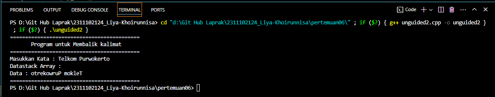

# <h1 align="center">Laporan Praktikum Modul Stack</h1>

<p align="center">Liya Khoirunnisa - 2311102124</p>

## Dasar Teori

Stack adalah struktur data yang memungkinkan melakukan penyisipan/penambahan dan penghapusan elemen data hanya pada satu tempat di ujung yang disebut puncak tumpukan. Elemen dalam stack disimpan berurutan dalam satu jalur linier. Metode untuk mengakses data di dalam stack adalah dengan metode Last In First Out (LIFO) yang dimana data terakhir kali yang masuk ke dalam stack adalah data yang pertama kali keluar. Konsep stack seringkali diilustrasikan dengan tumpukan piring, dimana piring baru diambil atau diletakkan di bagian atas tumpukan piring. Ciri stack lainnya adalah tidak memiliki nomor indeks untuk setiap elemen, oleh sebab itu elemen data yang berada pada posisi tengah tidak dapat diakses secara langsung. Stack dapat diaplikasikan untuk simulasi stack dalam dunia nyata, pemanggilan fungsi/procedure, rekursif, penanganan interupsi, evaluasi ekspresi, konversi notasi infiks ke notasi postfiks dan konversi bilangan basis 10 (desimal) ke basis 2 (biner).<br/>
Struktur data stack memiliki beberapa operasi:<br/>
• push : Untuk menambahkan elemen ke dalam stack.<br/>
• pop : Untuk mengambil data dari stack (data paling atas akan dikeluarkan dari stack).<br/>
• peek : Untuk melihat data pada posisi tertentu.<br/>
• isEmpty : Untuk mengidentifikasi apakah stack masih kosong.<br/>
• isFull : Untuk memeriksa apakah stack sudah penuh.<br/>
• count : Untuk menghitung data pada stack.<br/>
• change : Untuk mengubah data pada posisi tertentu.<br/>
• display : Untuk mencetak semua data pada stack.<br/>
• destroy : Untuk menghapus semua data pada stack.<br/>

## Guided

### 1. Program Stack Buku

```C++
#include <iostream>
using namespace std;
/// PROGRAM STACK Liya Khoirunnisa

// Inisialisasi array
string arrayBuku[5];
int maksimal = 5, top = 0;

// Fungsi untuk mengecek apakah stack penuh
bool isFull()
{
    return (top == maksimal);
}

// Fungsi untuk mengecek apakah stack kosong
bool isEmpty()
{
    return (top == 0);
}

// Fungsi untuk menambahkan data ke dalam stack
void pushArrayBuku(string data)
{
    if (isFull())
    {
        cout << "Data telah penuh" << endl;
    }
    else
    {
        arrayBuku[top] = data;
        top++;
    }
}

// Fungsi untuk menghapus data di stack
void popArrayBuku()
{
    if (isEmpty())
    {
        cout << "Tidak ada data yang dihapus" << endl;
    }
    else
    {
        arrayBuku[top - 1] = "";
        top--;
    }
}

// Fungsi untuk melihat data pada posisi tertentu
void peekArrayBuku(int posisi)
{
    if (isEmpty())
    {
        cout << "Tidak ada data yang bisa dilihat" << endl;
    }
    else
    {
        int index = top;
        for (int i = 1; i <= posisi; i++)
        {
            index--;
        }
        cout << "Posisi ke " << posisi << " adalah " << arrayBuku[index] << endl;
    }
}

// Fungsi untuk menghitung jumlah data
int countStack()
{
    return top;
}

// Fungsi untuk mengubah data pada posisi tertentu
void changeArrayBuku(int posisi, string data)
{
    if (posisi > top)
    {
        cout << "Posisi melebihi data yang ada" << endl;
    }
    else
    {
        int index = top;
        for (int i = 1; i <= posisi; i++)
        {
            index--;
        }
        arrayBuku[index] = data;
    }
}

// Fungsi untuk menghapus semua data pada stack
void destroyArraybuku()
{
    for (int i = top; i >= 0; i--)
    {
        arrayBuku[i] = "";
    }
    top = 0;
}

// Fungsi untuk mencetak data dalam stack
void cetakArrayBuku()
{
    if (isEmpty())
    {
        cout << "Tidak ada data yang dicetak" << endl;
    }
    else
    {
        for (int i = top - 1; i >= 0; i--)
        {
            cout << arrayBuku[i] << endl;
        }
    }
}

int main()
{
    // Menambahkan data ke dalam stack
    pushArrayBuku("Kalkulus");
    pushArrayBuku("Struktur Data");
    pushArrayBuku("Matematika Diskrit");
    pushArrayBuku("Dasar Multimedia");
    pushArrayBuku("Inggris");

    // Mencetak data stack
    cetakArrayBuku();
    cout << "\n";

    // Mengecek apakah stack penuh atau kosong
    cout << "Apakah data stack penuh? " << isFull() << endl;
    cout << "Apakah data stack kosong? " << isEmpty() << endl;

    // Melihat data pada posisi tertentu
    peekArrayBuku(2);

    // Menghapus data di stack
    popArrayBuku();

    // Menghitung jumlah data stack
    cout << "Banyaknya data = " << countStack() << endl;
    changeArrayBuku(2, "Bahasa Jerman");

    // Mencetak data dalam stack
    cetakArrayBuku();
    cout << "\n";

    // Menghapus semua data dalam stack
    destroyArraybuku();
    cout << "Jumlah data setelah dihapus: " << top << endl;

    // Mencetak data setelah stack kosong
    cetakArrayBuku();

    return 0;
}
```

Kode di atas digunakan untuk mencetak teks dalam stack. Ada beberapa operasi yang digunakan yaitu, isFull(), isEmpty(), pushArrayBuku(), popArrayBuku(), peekArrayBuku(), countStack(), changeArrayBuku(), dan destroyArrayBuku(). Untuk operasi isFull() dan isEmpty() menggunakan fungsi dengan tipe data boolean. Untuk operasi pushArrayBuku(), popArrayBuku(), peekArrayBuku(), changeArrayBuku(), dan destroyArrayBuku() menggunakan fungsi prosedur(void). Untuk operasi countStack() menggunakan fungsi dengan tipe data int. Program utama berjalan dengan memanggil fungsi pushArrayBuku() yang berfungsi untuk menambahkan data buku kalkulus, struktur data, matematika diskrit, dasar multimedia, dan inggris ke dalam stack. Data yang ditambahkan akan dicetak ke layar dengan memanggil fungsi cetakArrayBuku(). Setelah itu cek apakah stack penuh atau kosong dengan memanggil fungsi isFull() dan isEmpty(). Untuk mengintip atau melihat data stack pada posisi tertentu dapat memanggil peekArrayBuku(). Untuk menghapus data stack pada posisi tertentu dengan memanggil fungsi popArrayBuku(). Jumlah data stack dapat dihitung dengan memanggil fungsi countStack(). Jika ingin merubah data dapat memanggil fungsi changeArrayBuku(). Setelah beberapa operasi yang dilakukan, data stack dicetak lagi ke layar. Untuk menghapus seluruh data pada stack dapat memanggil fungsi destroyArrayBuku(). Kemudian data pada stack yang telah kosong dicetak ke layar.

## Unguided

### 1. Buatlah program untuk menentukan apakah kalimat tersebut yang diinputkan dalam program stack adalah palindrom/tidak. Palindrom kalimat yang dibaca dari depan dan belakang sama. Jelaskan bagaimana cara kerja programnya.

```C++
#include <iostream>
using namespace std;

/// PROGRAM STACK Liya Khoirunnisa

// Inisialisasi array
char isi_2124[10];
int maksimal_2124 = 5, top_2124 = -1;

// Fungsi untuk mengecek apakah stack penuh
bool isFull_2124()
{
    return (top_2124 == maksimal_2124 - 1);
}

// Fungsi untuk mengecek apakah stack kosong
bool isEmpty_2124()
{
    return (top_2124 == -1);
}

// Fungsi untuk menambahkan data ke dalam stack
void pushArrayKalimat_2124(char data_2124)
{
    if (isFull_2124())
    {
        cout << "Data telah penuh\n";
    }
    else
    {
        top_2124++;
        isi_2124[top_2124] = data_2124;
    }
}

// Fungsi untuk menghapus data di stack
void popArrayKalimat_2124()
{
    if (isEmpty_2124())
    {
        cout << "Tidak ada data yang dihapus\n";
    }
    else
    {
        top_2124--;
    }
}

int main()
{
    // Deklarasi variabel
    string kalimat_2124;
    int j;
    bool palindrom = true;

    // Menampilkan judul program
    cout << "===========================================\n";
    cout << "Program Mengecek Kata dan Kalimat Palindrom\n";
    cout << "===========================================\n";

    // Input Kalimat
    cout << "Masukkan Kalimat : ";
    cin >> kalimat_2124;
    j = kalimat_2124.length();

    // Menambahkan kalimat ke dalam stack
    for (int i = 0; i < j; i++)
    {
        pushArrayKalimat_2124(kalimat_2124[i]);
    }

    // Cek Palindrom
    for (int i = 0; i < j; i++)
    {
        if (kalimat_2124[i] != isi_2124[top_2124])
        {
            palindrom = false;
            break;
        }
        popArrayKalimat_2124();
    }

    if (palindrom == true)
    {
        cout << "Kalimat tersebut adalah : Palindrom\n";
    }
    else
    {
        cout << "Kalimat tersebut adalah : Bukan Palindrom\n";
    }
    cout << "===========================================\n\n";
    return 0;
}
```

#### Output:


Kode di atas digunakan untuk memeriksa apakah sebuah kata atau kalimat yang dimasukkan pengguna merupakan palindrom atau bukan. Palindrom adalah kata atau kalimat yang serupa jika dibaca dengan urutan terbalik. Ada beberapa operasi yang digunakan yaitu, isFull_2124(), isEmpty_2124(), pushArrayKalimat_2124(), dan popArrayKalimat_2124(). Untuk operasi isFull_2124() dan isEmpty_2124() menggunakan fungsi dengan tipe data boolean. Untuk operasi pushArrayKalimat_2124() dan popArrayKalimat_2124() menggunakan fungsi prosedur(void). Program utama berjalan dengan diawali menampilkan judul program. Lalu pengguna diminta untuk memasukkan sebuah kalimat. Setiap karakter dari kalimat dimasukkan ke dalam stack dengan memanggil fungsi pushArrayKalimat_2124() dan melakukan perulangan. Selanjutnya melakukan pengecekan pada kalimat tersebut apakah kalimat tersebut adalah palindrom atau bukan dengan cara membandingkan karakter awal kalimat dengan karakter akhir kalimat. Jika tidak ditemukan kesamaan karakter maka kalimat tersebut bukan palindrom. Namun jika ditemukan kesamaan karakter maka kalimat tersebut adalah palindrom. Hasil dari pengecekan tersebut akan dicetak ke layar.

### 2. Buatlah program untuk melakukan pembalikan terhadap kalimat menggunakan stack dengan minimal 3 kata. Jelaskan output program dan source codenya beserta operasi/fungsi yang dibuat?

```C++
/*oleh Liya Khoirunnisa - 2311102124*/
#include <iostream>

using namespace std;
/// PROGRAM STACK Liya Khoirunnisa

// Inisialisasi array
char isi_2124[50];
int maksimal_2124 = 50, top_2124 = 0;

// Fungsi untuk mengecek apakah stack penuh
bool isFull_2124()
{
    return (top_2124 == maksimal_2124);
}

// Fungsi untuk mengecek apakah stack kosong
bool isEmpty_2124()
{
    return (top_2124 == 0);
}

// Fungsi untuk menambahkan data ke dalam stack
void pushArrayKalimat_2124(char data_2124)
{
    if (top_2124 == maksimal_2124)
    {
        cout << "Data telah penuh";
    }
    else
    {
        top_2124 = top_2124 + 1;
        isi_2124[top_2124] = data_2124;
    }
}

// Fungsi untuk menghapus data di stack
char popArrayKalimat_2124()
{
    char hasil_2124;
    if (top_2124 == 0)
    {
        cout << "Tidak ada data yang dihapus";
        hasil_2124 = ' ';
    }
    else
    {
        hasil_2124 = isi_2124[top_2124];
        top_2124 = top_2124 - 1;
    }
    return hasil_2124;
}

// program utama
int main()
{
    // Deklarasi variabel
    string kalimat_2124;
    int j;
    cout << "===========================================\n";
    cout << "       Program untuk Membalik kalimat      \n";
    cout << "===========================================\n";

    // Inputkan kalimat yang akan dibalik
    cout << "Masukkan Kata : ";
    getline(cin, kalimat_2124);
    j = kalimat_2124.length();

    // Menambahkan data ke dalam stack
    for (int i = 0; i < j; i++)
    {
        pushArrayKalimat_2124(kalimat_2124[i]);
    }

    // Mencetak data
    cout << "Datastack Array : ";
    cout << "\nData : ";

    // Menghapus data di stack
    for (int i = 0; i < j; i++)
    {
        cout << popArrayKalimat_2124();
    }
    cout << "\n===========================================\n";
    return 0;
}
```

#### Output:



Kode di atas digunakan untuk membuat program yang dapat membalik kalimat. Ada beberapa operasi yang digunakan yaitu, isFull_2124(), isEmpty_2124(), pushArrayKalimat_2124(), dan popArrayKalimat_2124(). Untuk operasi isFull_2124() dan isEmpty_2124() menggunakan fungsi dengan tipe data boolean. Untuk operasi pushArrayKalimat_2124() menggunakan fungsi prosedur(void). Untuk operasi popArrayKalimat_2124() menggunakan fungsi dengan tipe data char. Program utama berjalan dengan diawali menampilkan judul program. Lalu pengguna diminta untuk memasukkan sebuah kalimat. Setiap karakter dari kalimat dimasukkan ke dalam stack dengan memanggil fungsi pushArrayKalimat_2124() dan melakukan perulangan. Data yang sudah dimasukkan akan dicetak secara terbalik dengan menghapus dan mencetak setiap karakakter dari stack dengan memanggil fungsi popArrayKalimat_2124().

## Kesimpulan

Pada praktikum tersebut mempelajari implementasi struktur data stack. Operasi pada struktur data stack diantaranya, yaitu push, pop, peek, isEmpty, isFull, count, change, display, dan destroy. Pentingnya penggunaan stack dalam menyelesaikan berbagai masalah, seperti memeriksa kata atau kalimat palindrom, membalik kata atau kalimat, dan masalah lain yang mengharuskan penggunaan tumpukan dengan pola Last In First Out (LIFO). Dengan memahami konsep stack dapat memudahkan dalam menyelesaikan berbagai masalah yang perlu menggunakan stack.

## Referensi

[1] Erkamim, E., Abdurrohim, I., Yuliyanti, S., Karim, R., Rahman, A., Admira, T. M. A., & Ridwan, A. (2024). Buku Ajar Algoritma dan Struktur Data. PT. Sonpedia Publishing Indonesia.<br/>
[2] Hidayah, A. K., Alam, R. G., & Prihandoko, P. (2023). STRUKTUR DATA DENGAN PYTHON. PT. Sonpedia Publishing Indonesia.
