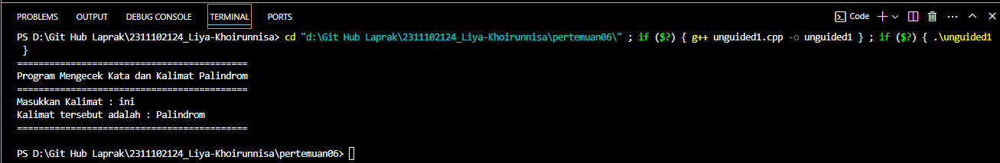

# <h1 align="center">Laporan Praktikum Modul Stack</h1>

<p align="center">Liya Khoirunnisa - 2311102124</p>

## Dasar Teori

Stack adalah struktur data yang memungkinkan melakukan penyisipan/penambahan dan penghapusan elemen data hanya pada satu tempat di ujung yang disebut puncak tumpukan. Elemen dalam stack disimpan berurutan dalam satu jalur linier. Metode untuk mengakses data di dalam stack adalah dengan metode Last In First Out (LIFO) yang dimana data terakhir kali yang masuk ke dalam stack adalah data yang pertama kali keluar. Konsep stack seringkali diilustrasikan dengan tumpukan piring, dimana piring baru diambil atau diletakkan di bagian atas tumpukan piring. Ciri stack lainnya adalah tidak memiliki nomor indeks untuk setiap elemen, oleh sebab itu elemen data yang berada pada posisi tengah tidak dapat diakses secara langsung. Stack dapat diaplikasikan untuk simulasi stack dalam dunia nyata, pemanggilan fungsi/procedure, rekursif, penanganan interupsi, evaluasi ekspresi, konversi notasi infiks ke notasi postfiks dan konversi bilangan basis 10 (desimal) ke basis 2 (biner).
Struktur data stack memiliki beberapa operasi:
• push : Untuk menambahkan elemen ke dalam stack
• pop : Untuk mengambil data dari stack (data paling atas akan dikeluarkan dari stack).
• peek : Untuk melihat data pada posisi tertentu.
• isEmpty : Untuk mengidentifikasi apakah stack masih kosong.
• isFull : Untuk memeriksa apakah stack sudah penuh.
• count : Untuk menghitung data pada stack.
• change : Untuk mengubah data pada posisi tertentu.
• display : Untuk mencetak semua data pada stack.
• destroy : Untuk menghapus semua data pada stack.
• size(): Untuk mengetahui jumlah item (elemen) dalam sebuah stack

## Guided

### 1. Program Stack

```C++
#include <iostream>
using namespace std;
/// PROGRAM STACK Liya Khoirunnisa

// Inisialisasi array
string arrayBuku[5];
int maksimal = 5, top = 0;

// Fungsi untuk mengecek apakah stack penuh
bool isFull()
{
    return (top == maksimal);
}

// Fungsi untuk mengecek apakah stack kosong
bool isEmpty()
{
    return (top == 0);
}

// Fungsi untuk menambahkan data ke dalam stack
void pushArrayBuku(string data)
{
    if (isFull())
    {
        cout << "Data telah penuh" << endl;
    }
    else
    {
        arrayBuku[top] = data;
        top++;
    }
}

// Fungsi untuk menghapus data di stack
void popArrayBuku()
{
    if (isEmpty())
    {
        cout << "Tidak ada data yang dihapus" << endl;
    }
    else
    {
        arrayBuku[top - 1] = "";
        top--;
    }
}

// Fungsi untuk melihat data pada posisi tertentu
void peekArrayBuku(int posisi)
{
    if (isEmpty())
    {
        cout << "Tidak ada data yang bisa dilihat" << endl;
    }
    else
    {
        int index = top;
        for (int i = 1; i <= posisi; i++)
        {
            index--;
        }
        cout << "Posisi ke " << posisi << " adalah " << arrayBuku[index] << endl;
    }
}

// Fungsi untuk menghitung jumlah data
int countStack()
{
    return top;
}

// Fungsi untuk mengubah data pada posisi tertentu
void changeArrayBuku(int posisi, string data)
{
    if (posisi > top)
    {
        cout << "Posisi melebihi data yang ada" << endl;
    }
    else
    {
        int index = top;
        for (int i = 1; i <= posisi; i++)
        {
            index--;
        }
        arrayBuku[index] = data;
    }
}

// Fungsi untuk menghapus semua data pada stack
void destroyArraybuku()
{
    for (int i = top; i >= 0; i--)
    {
        arrayBuku[i] = "";
    }
    top = 0;
}

// Fungsi untuk mencetak data dalam stack
void cetakArrayBuku()
{
    if (isEmpty())
    {
        cout << "Tidak ada data yang dicetak" << endl;
    }
    else
    {
        for (int i = top - 1; i >= 0; i--)
        {
            cout << arrayBuku[i] << endl;
        }
    }
}

int main()
{
    // Menambahkan data ke dalam stack
    pushArrayBuku("Kalkulus");
    pushArrayBuku("Struktur Data");
    pushArrayBuku("Matematika Diskrit");
    pushArrayBuku("Dasar Multimedia");
    pushArrayBuku("Inggris");

    // Mencetak data stack
    cetakArrayBuku();
    cout << "\n";

    // Mengecek apakah stack penuh atau kosong
    cout << "Apakah data stack penuh? " << isFull() << endl;
    cout << "Apakah data stack kosong? " << isEmpty() << endl;

    // Melihat data pada posisi tertentu
    peekArrayBuku(2);

    // Menghapus data di stack
    popArrayBuku();

    // Menghitung jumlah data stack
    cout << "Banyaknya data = " << countStack() << endl;
    changeArrayBuku(2, "Bahasa Jerman");

    // Mencetak data dalam stack
    cetakArrayBuku();
    cout << "\n";

    // Menghapus semua data dalam stack
    destroyArraybuku();
    cout << "Jumlah data setelah dihapus: " << top << endl;

    // Mencetak data setelah stack kosong
    cetakArrayBuku();

    return 0;
}
```

Kode di atas digunakan untuk mencetak teks "ini adalah file code guided praktikan" ke layar menggunakan function cout untuk mengeksekusi nya.

## Unguided

### 1. Buatlah program untuk menentukan apakah kalimat tersebut yang diinputkan dalam program stack adalah palindrom/tidak. Palindrom kalimat yang dibaca dari depan dan belakang sama. Jelaskan bagaimana cara kerja programnya.

```C++
#include <iostream>
using namespace std;

int main() {
    cout << "ini adalah file code unguided praktikan" << endl;
    return 0;
}
```

#### Output:



Kode di atas digunakan untuk mencetak teks "ini adalah file code guided praktikan" ke layar menggunakan function cout untuk mengeksekusi nya.

### 2. Buatlah program untuk melakukan pembalikan terhadap kalimat menggunakan stack dengan minimal 3 kata. Jelaskan output program dan source codenya beserta operasi/fungsi yang dibuat?

```C++
#include <iostream>
using namespace std;

int main() {
    cout << "ini adalah file code unguided praktikan" << endl;
    return 0;
}
```

#### Output:


Kode di atas digunakan untuk mencetak teks "ini adalah file code guided praktikan" ke layar menggunakan function cout untuk mengeksekusi nya.

## Kesimpulan

Ringkasan dan interpretasi pandangan kalia dari hasil praktikum dan pembelajaran yang didapat[1].

## Referensi

[1] Erkamim, E., Abdurrohim, I., Yuliyanti, S., Karim, R., Rahman, A., Admira, T. M. A., & Ridwan, A. (2024). Buku Ajar Algoritma dan Struktur Data. PT. Sonpedia Publishing Indonesia.<br/>
[2] Hidayah, A. K., Alam, R. G., & Prihandoko, P. (2023). STRUKTUR DATA DENGAN PYTHON. PT. Sonpedia Publishing Indonesia.
