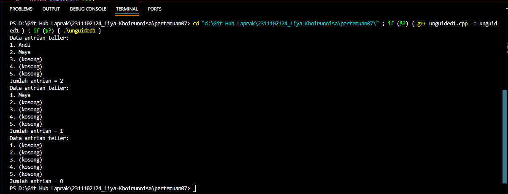
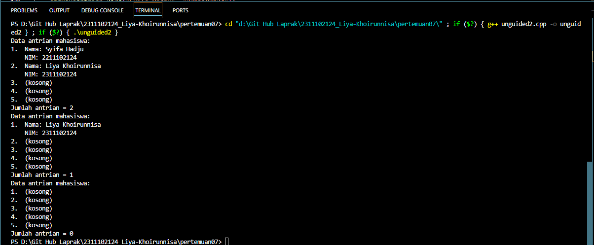

# <h1 align="center">Laporan Praktikum Modul Queue</h1>

<p align="center">Liya Khoirunnisa - 2311102124</p>

## Dasar Teori

Queue atau antrian merupakan struktur data yang terdiri dari kumpulan elemen dengan penyisipan dan penghapusan elemen yang dilakukan dari sisi yang berbeda. Penyisipan dilakukan dari gerbang belakang (rear) dan penghapusan dilakukan dari gerbang depan (front). Queue mempunyai sifat FIFO (First In First Out) yaitu elemen yang pertama masuk akan menjadi elemen yang pertama keluar. Teknik antrian FIFO mengacu pada prinsip elemen atau data yang pertama datang akan diproses terlebih dahulu dan dimasukkan ke dalam antrian, kemudian dikeluarkan berdasarkan urutan kedatangannya. Dalam pembuat queue dapat dilakukan dengan dua cara, yaitu array dan linked list.<br/>
Contoh sederhana dalam kehidupan nyata queue dapat diilustrasikan seperti antrian di saat membayar dikasir. Setiap orang yang pertama kali datang menempati antrian akan berada pada posisi depan lalu diikuti oleh yang lainnya pada posisi belakang. Elemen baru hanya diizinkan untuk masuk ke dalam antrian dari posisi belakang antrian. Setiap sebuah elemen meninggalkan atau dikeluarkan dalam antrian maka elemen selanjutnya harus bergeser satu posisi ke arah depan antrian.<br/><br/>
Beberapa operasi dalam queue:<br/>

- enqueue(item): Menambahkan elemen ke dalam queue, penambahan elemen selalu dilakukan dari bagian belakang (rear).<br/>
- dequeue(): Menghapus data pertama pada antrian, selalu dilakukan dari bagian depan (front).<br/>
- isEmpty(): Memeriksa apakah queue dalam keadaaan kosong atau tidak.<br/>
- isFull(): Memeriksa apakah queue dalam keadaaan penuh atau tidak.<br/>
- count(): Menghitung banyak data pada queue.<br/>
- display/view(): Mencetak semua data pada queue.<br/>
- destroy/clear: Mengahapus semua data pada queue.<br/>
- size(): Untuk mengidentifikasi jumlah data yang ada didalam queue.

## Guided

### 1. Program Queue menggunakan array

```C++
#include <iostream>
using namespace std;
/// PROGRAM QUEUE Liya Khoirunnisa

const int maksimalQueue = 5; // Maksimal antrian
int front = 0;               // Penanda antrian
int back = 0;                // Penanda
string queueTeller[5];       // Fungsi pengecekan

bool isFull()
{ // Pengecekan antrian penuh atau tidak
    if (back == maksimalQueue)
    {
        return true; // =1
    }
    else
    {
        return false;
    }
}

bool isEmpty()
{ // Antriannya kosong atau tidak
    if (back == 0)
    {
        return true;
    }
    else
    {
        return false;
    }
}

void enqueueAntrian(string data)
{ // Fungsi menambahkan antrian
    if (isFull())
    {
        cout << "Antrian penuh" << endl;
    }
    else
    {
        if (isEmpty())
        { // Kondisi ketika queue kosong
            queueTeller[0] = data;
            front++;
            back++;
        }
        else
        { // Antrianya ada isi
            queueTeller[back] = data;
            back++;
        }
    }
}

void dequeueAntrian()
{ // Fungsi mengurangi antrian
    if (isEmpty())
    {
        cout << "Antrian kosong" << endl;
    }
    else
    {
        for (int i = 0; i < back; i++)
        {
            queueTeller[i] = queueTeller[i + 1];
        }
        back--;
    }
}

int countQueue()
{ // Fungsi menghitung banyak antrian
    return back;
}

void clearQueue()
{ // Fungsi menghapus semua antrian
    if (isEmpty())
    {
        cout << "Antrian kosong" << endl;
    }
    else
    {
        for (int i = 0; i < back; i++)
        {
            queueTeller[i] = "";
        }
        back = 0;
        front = 0;
    }
}

void viewQueue()
{ // Fungsi melihat antrian
    cout << "Data antrian teller:" << endl;
    for (int i = 0; i < maksimalQueue; i++)
    {
        if (queueTeller[i] != "")
        {
            cout << i + 1 << ". " << queueTeller[i] << endl;
        }
        else
        {
            cout << i + 1 << ". (kosong)" << endl;
        }
    }
}

int main()
{
    enqueueAntrian("Andi");
    enqueueAntrian("Maya");
    viewQueue();
    cout << "Jumlah antrian = " << countQueue() << endl;
    dequeueAntrian();
    viewQueue();
    cout << "Jumlah antrian = " << countQueue() << endl;
    clearQueue();
    viewQueue();
    cout << "Jumlah antrian = " << countQueue() << endl;
    return 0;
}
```

Kode di atas digunakan untuk mencetak data antrian dengan menggunakan array. Ada beberapa operasi fungsi yang digunakan yaitu, isFull(), isEmpty(), enqueueAntrian(string data), dequeueAntrian(), countQueue(), clearQueue(), dan viewQueue(). Program utama berjalan dengan memanggil fungsi enqueueAntrian(string data), yang berfungsi untuk menambahkan data Andi dan Maya ke dalam Queue. Antrian yang tersedia ada 5, namun hanya menambahkan 2 data saja. Data yang ditambahkan akan dicetak ke layar dengan memanggil fungsi viewQueue(). Setelah itu menghitung jumlah antrian pada queue dengan memanggil fungsi countQueue() dan jumlah tersebut dicetak ke layar. Data pertama akan dihapus dan dikeluarkan dengan memanggil fungsi dequeueAntrian() dan data terbaru akan dicetak ke layar. Setelah semua data sudah dikeluarkan, maka data dihapus dengan memanggil fungsi clearQueue() lalu data yang sudah kosong dicetak ke layar. Jumlah antrian dihitung kembali dan dicetak ke layar

## Unguided

### 1. Ubahlah penerapan konsep queue pada bagian guided dari array menjadi linked list

```C++
/*oleh Liya Khoirunnisa - 2311102124*/
#include <iostream>

using namespace std;
// Program Queue mengubah array pada guided menjadi linked list

// Struktur node untuk linked list
struct Node
{
    string data_2124;
    Node *next;
};

// Batas maksimal queue
int maksimalNode_2124 = 5;

// Variabel global untuk front dan rear
Node *front = NULL;
Node *rear = NULL;

// Fungsi menghitung jumlah elemen dalam queue
int countQueue_2124()
{
    int count_2124 = 0;
    Node *temp = front;
    while (temp != NULL)
    {
        count_2124++;
        temp = temp->next;
    }
    return count_2124;
}

// Fungsi mengecek apakah queue penuh
bool isFull_2124()
{
    if (countQueue_2124() == maksimalNode_2124)
    {
        return true;
    }
    else
    {
        return false;
    }
}

// Fungsi mengecek apakah queue kosong
bool isEmpty_2124()
{
    return front == NULL;
}

// Fungsi menambahkan elemen ke belakang queue
void enqueueAntrian_2124(string data_2124)
{
    if (isFull_2124())
    {
        cout << "Antrian penuh" << endl;
    }
    Node *newNode = new Node;
    newNode->data_2124 = data_2124;
    newNode->next = NULL;
    if (front == NULL)
    {
        front = newNode;
        rear = newNode;
    }
    else
    {
        rear->next = newNode;
        rear = newNode;
    }
}

// Fungsi menghapus elemen dari depan queue
void dequeueAntrian_2124()
{
    if (front == NULL)
    {
        cout << "Antrian kosong" << endl;
    }
    else
    {
        Node *temp = front;
        front = front->next;
        delete temp;
    }
}

// Fungsi menampilkan seluruh data queue
void viewQueue_2124()
{
    cout << "Data antrian teller:" << endl;
    Node *temp = front;
    for (int i = 0; i < 5; i++)
    {
        if (temp != NULL)
        {
            cout << i + 1 << ". " << temp->data_2124 << endl;
            temp = temp->next;
        }
        else
        {
            cout << i + 1 << ". (kosong)" << endl;
        }
    }
}

// Fungsi menghapus semua elemen dalam queue
void clearQueue_2124()
{
    while (front != NULL)
    {
        Node *temp = front;
        front = front->next;
        delete temp;
    }
    rear = NULL;
}

int main()
{
    enqueueAntrian_2124("Andi");
    enqueueAntrian_2124("Maya");
    viewQueue_2124();
    cout << "Jumlah antrian = " << countQueue_2124() << endl;
    dequeueAntrian_2124();
    viewQueue_2124();
    cout << "Jumlah antrian = " << countQueue_2124() << endl;
    clearQueue_2124();
    viewQueue_2124();
    cout << "Jumlah antrian = " << countQueue_2124() << endl;
    return 0;
}

```

#### Output:



Kode di atas digunakan untuk mencetak data antrian dengan menggunakan linked list. Terdapat struct Node yang menyimpan string data_2124 dan pointer next. Pointer front sebagai penunjuk node pertama sedangkan pointer rear sebagai penunjuk node terakhir. Ada beberapa operasi yang digunakan yaitu, countQueue_2124(), isFull_2124(), isEmpty_2124(), enqueueAntrian_2124(string data), dequeueAntrian_2124(), viewQueue_2124(), dan clearQueue_2124(). Perbedaan program queue yang menggunakan array dengan yang menggunakan linked list terletak pada metode penyimpanan dan manipulasi data antrian .

### 2. Dari nomor 1 buatlah konsep antri dengan atribut Nama mahasiswa dan NIM Mahasiswa

```C++
/*oleh Liya Khoirunnisa - 2311102124*/
#include <iostream>

using namespace std;
// Program Queue dengan linked list untuk antrian mahasiswa

// Struktur node untuk linked list
struct Node
{
    string nama_2124;
    string nim_2124;
    Node *next;
};

// Batas maksimal queue
int maksimalNode_2124 = 5;

// Variabel global untuk front dan rear
Node *front = NULL;
Node *rear = NULL;

// Fungsi menghitung jumlah elemen dalam queue
int countQueue_2124()
{
    int count_2124 = 0;
    Node *temp = front;
    while (temp != NULL)
    {
        count_2124++;
        temp = temp->next;
    }
    return count_2124;
}

// Fungsi mengecek apakah queue penuh
bool isFull_2124()
{
    if (countQueue_2124() == maksimalNode_2124)
    {
        return true;
    }
    else
    {
        return false;
    }
}

// Fungsi mengecek apakah queue kosong
bool isEmpty_2124()
{
    return front == NULL;
}

// Fungsi menambahkan elemen ke belakang queue
void enqueueAntrian_2124(string nama_2124, string nim_2124)
{
    if (isFull_2124())
    {
        cout << "Antrian penuh" << endl;
    }
    Node *newNode = new Node;
    newNode->nama_2124 = nama_2124;
    newNode->nim_2124 = nim_2124;
    newNode->next = NULL;
    if (front == NULL)
    {
        front = newNode;
        rear = newNode;
    }
    else
    {
        rear->next = newNode;
        rear = newNode;
    }
}

// Fungsi menghapus elemen dari depan queue
void dequeueAntrian_2124()
{
    if (front == NULL)
    {
        cout << "Antrian kosong" << endl;
    }
    else
    {
        Node *temp = front;
        front = front->next;
        delete temp;
    }
}

// Fungsi menampilkan seluruh queue
void viewQueue_2124()
{
    cout << "Data antrian mahasiswa:" << endl;
    Node *temp = front;
    for (int i = 0; i < 5; i++)
    {
        if (temp != NULL)
        {
            cout << i + 1 << ".  Nama: " << temp->nama_2124 << endl;
            cout << "    NIM: " << temp->nim_2124 << endl;
            temp = temp->next;
        }
        else
        {
            cout << i + 1 << ".  (kosong)" << endl;
        }
    }
}

// Fungsi menghapus semua elemen dalam queue
void clearQueue_2124()
{
    while (front != NULL)
    {
        Node *temp = front;
        front = front->next;
        delete temp;
    }
    rear = NULL;
}

int main()
{
    enqueueAntrian_2124("Syifa Hadju", "2211102124");
    enqueueAntrian_2124("Liya Khoirunnisa", "2311102124");
    viewQueue_2124();
    cout << "Jumlah antrian = " << countQueue_2124() << endl;
    dequeueAntrian_2124();
    viewQueue_2124();
    cout << "Jumlah antrian = " << countQueue_2124() << endl;
    clearQueue_2124();
    viewQueue_2124();
    cout << "Jumlah antrian = " << countQueue_2124() << endl;
    return 0;
}

```

#### Output:



Kode di atas digunakan untuk mencetak data antrian dengan menggunakan linked list. Terdapat struct Node yang menyimpan string data_2124 dan pointer next. Pointer front sebagai penunjuk node pertama sedangkan pointer rear sebagai penunjuk node terakhir. Ada beberapa operasi yang digunakan yaitu, countQueue_2124(), isFull_2124(), isEmpty_2124(), enqueueAntrian_2124(string data), dequeueAntrian_2124(), viewQueue_2124(), dan clearQueue_2124(). Program utama berjalan dengan memanggil fungsi enqueueAntrian_2124(string data) yang berfungsi untuk menambahkan data nama dan nim ke dalam Queue. Antrian yang tersedia ada 5, namun hanya menambahkan 2 data saja. Data yang ditambahkan akan dicetak ke layar dengan memanggil fungsi viewQueue_2124(). Setelah itu menghitung jumlah antrian pada queue dengan memanggil fungsi countQueue_2124() dan jumlah tersebut dicetak ke layar. Data pertama akan dihapus dan dikeluarkan dengan memanggil fungsi dequeueAntrian_2124() dan data terbaru akan dicetak ke layar. Setelah semua data sudah dikeluarkan, maka data dihapus dengan memanggil fungsi clearQueue_2124() lalu data yang sudah kosong dicetak ke layar.

## Kesimpulan

Pada praktikum tersebut mempelajari implementasi struktur data queue dengan menggunakan konsep array dan linked list. Operasi pada struktur data queue diantaranya, enqueue, dequeue, isEmpty, isFull, count, display/view, destroy/clear, dan size. Perbedaan program queue yang menggunakan array dengan yang menggunakan linked list terletak pada metode penyimpanan dan manipulasi data antrian. Penggunaan cara linked list lebih cocok digunakan untuk program yang memerlukan penambahan dan penghapusan elemen yang lebih sering, sedangkan penggunaan array lebih cocok digunakan untuk program yang memerlukan akses yang cepat pada antrian. Dengan memahami konsep queue dapat memudahkan dalam menyelesaikan berbagai masalah yang perlu menggunakan queue.

## Referensi

[1] Hidayah, A. K., Alam, R. G., & Prihandoko, P. (2023). STRUKTUR DATA DENGAN PYTHON. PT. Sonpedia Publishing Indonesia.
