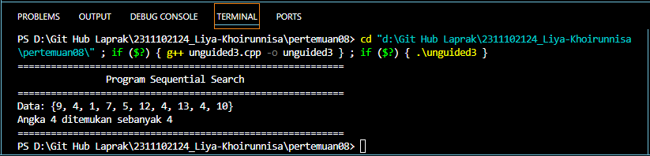

# <h1 align="center">Laporan Praktikum Modul Algoritma Searching</h1>

<p align="center">Liya Khoirunnisa - 2311102124</p>

## Dasar Teori

Algoritma adalah sistematika yang sifatnya berurutan secara logis untuk menyelesaikan suatu permasalahan melalui perintah-perintah yang dibuat secara jelas. Sementara searching adalah proses mendapatkan informasi berdasarkan kunci tertentu dari sejumlah informasi yang telah disimpan. Algoritma Searching adalah urutan langkah-langkah yang digunakan untuk menemukan data tertentu dalam kumpulan data. Kumpulan data ini dapat berupa array, daftar, tabel, atau yang lainnya. Tujuan algoritma searching yaitu untuk menemukan elemen secera efisien berdasarkan kunci atau karakteristik lain. Cara kerja algoritma searching yaitu dengan membandingkan data yang dicari dengan setiap data dalam kumpulan data. Perbandingan ini dilakukan secara berulang hingga data yang dicari ditemukan atau semua data telah diperiksa. Ada 2 macam teknik pencarian yaitu Sequential Search dan Binary Search.<br/>

1. Sequential search<br/>
   Sequential search adalah sebuah algoritma pencarian data paling sederhana, dengan mencari data secara urut dari depan kebelakang atau dari awal sampai akhir, tanpa perlu mengurutkan data terlebih dahulu. Pencarian ini dilakukan dengan membandingkan data satu per satu dari kumpulan data yang telah ditentukan hingga data tersebut selesai ditemukan ataupun tidak ditemukan. Pada sequential search jika menemukan kunci yang dicari maka fungsi akan mengembalikan posisi indeks dari kunci tersebut pada array. Sedangkan jika program tidak menemukan kunci maka program akan mengembalikan nilai -1. Pencarian data dengan menggunakan perncarian Sequential akan memakan waktu yang lama jika jumlah data sangat banyak.
   Kelebihan dari sequential search yaitu jika data yang dicari terletak didepan, maka data akan ditemukan dengan cepat. Kekurangan dari sequential search jika data yang dicari terletak dibelakang atau paling akhir, maka akan membutuhkan waktu yang lama dalam proses pencariannya dan beban komputer akan semakin bertambah jika jumlah data dalam array sangat banyak.<br/>

2. Binary Search <br/>
   Binary Search merupakan sebuah algoritma pencarian dengan cara membagi data menjadi dua bagian setiap kali terjadi proses pencarian untuk menemukan nilai tertentu dalam sebuah array. Sebuah pencarian biner mencari nilai tengah (median), melakukan sebuah pembandingan untuk menentukan apakah nilai yang dicari ada sebelum atau sesudahnya, kemudian mencari setengah sisanya dengan cara yang sama. Binary search melibatkan pencarian data dalam suatu array yang telah diurutkan. Data yang dicari dibandingkan dengan data tengah pada bagian pertama. Ada 3 kemungkin yang dapat terjadi. Petama, jika data yang dicari sama dengan elemen tengah pada bagian pertama dalm larik, maka data yang dicari ditemukan. Kedua, jika data yang dicari bernilai kurang dari nilai elemen tengah pada bagian pertama dalam larik, maka pencarian diteruskan pada bagian pertama. Ketiga, jika data yang dicari bernilai lebih dari nilai elemen tengah pada bagian pertama dalam larik, maka pencarian diteruskan pada bagian kedua. Pencarian ini lebih efisien daripada sequential search di mana setiap elemen dalam array diuji satu per satu sampai elemen yang dicari ditemukan. Binary Search dapat mengurangi jumlah perbandingan yang perlu dilakukan antara data yang dicari dan data dalam array, terutama saat jumlah data besar. Kelebihan Binary search yaitu mengurangi beban komputer karena pencarian dilakukan dari bagian depan, belakang, dan tengah, serta mengaplikasikan proses berulang hingga data ditemukan atau pencarian tidak dapat lagi dibagi. Pencarian Biner (Binary search) menggunakan pencarian secara berurutan dan data yang ada sudah berurutan dan apabila belum makan pencarian tidak bisa dilakukan.

## Guided

### 1. Buatlah sebuah project dengan menggunakan sequential search sederhana untuk melakukan pencarian data.

```C++
#include <iostream>
using namespace std;
/// PROGRAM SQUENTIAL SEARCH Liya Khoirunnisa

int main()
{
    // Deklarasi variabel
    int n = 10;                                      // Jumlah elemen array
    int data[n] = {9, 4, 1, 7, 5, 12, 4, 13, 4, 10}; // Inisialisasi array
    int cari = 10;                                   // Nilai yang akan dicari dalam array
    bool ketemu = false;                             // Variabel boleean
    int i;                                           // Variabel iterasi

    // Algoritma Sequential Search
    for (i = 0; i < n; i++)
    {
        if (data[i] == cari)
        {
            ketemu = true;
            break;
        }
    }

    // Menampilkan data
    cout << "\tProgram Sequential Search Sederhana\n " << endl;
    cout << "data: {9, 4, 1, 7, 5, 12, 4, 13, 4, 10}" << endl;

    // Mengecek data
    if (ketemu)
    {
        cout << "\nAngka " << cari << " ditemukan pada indeks ke-" << i << endl;
    }
    else
    {
        cout << cari << " tidak dapat ditemukan pada data." << endl;
    }
    return 0;
}
```

Kode di atas digunakan untuk mencari angka 10 pada data. Data array berisi 10 angka, yaitu 9, 4, 1, 7, 5, 12, 4, 13, 4, 10. Program di atas menggunakan sequential search. Di dalam fungsi sequential search terdapat perulangan for untuk memeriksa setiap elemen dalam array. Jika elemen yang dicari ditemukan, maka menjadi true. Data yang sudah ada akan dicetak ke layar. Jika angka yang dicari ditemukan pada data, maka akan ditampilkan angka yang dicari ditemukan pada index ke berapa. Namun jika angka yang dicari tidak ditemukan pada data, maka akan ditampilkan bahwa angka yang dicari tidak dapat ditemukan pada data.

### 2. Buatlah sebuah project untuk melakukan pencarian data dengan menggunakan Binary Search.

```C++
#include <iostream>
#include <conio.h>
#include <iomanip>

using namespace std;
/// PROGRAM BINARY SEARCH Liya Khoirunnisa

// Inisialisasi data array
int dataArray[7] = {1, 8, 2, 5, 4, 9, 7};
int cari;

// Fungsi untuk mengurutkan data array
void selection_sort()
{
    int temp, min, i, j;
    for (i = 0; i < 7; i++)
    {
        min = i;
        for (j = i + 1; j < 7; j++)
        {
            if (dataArray[j] < dataArray[min])
            {
                min = j;
            }
        }
        temp = dataArray[i];
        dataArray[i] = dataArray[min];
        dataArray[min] = temp;
    }
}

// Fungsi untuk melakukan pencarian biner
void binarysearch()
{
    int awal, akhir, tengah;
    bool b_flag = false;
    awal = 0;
    akhir = 6; // Corrected to 6 to match array bounds
    while (!b_flag && awal <= akhir)
    {
        tengah = (awal + akhir) / 2;
        if (dataArray[tengah] == cari)
        {
            b_flag = true;
        }
        else if (dataArray[tengah] < cari)
        {
            awal = tengah + 1;
        }
        else
        {
            akhir = tengah - 1;
        }
    }
    if (b_flag)
    {
        cout << "\nData ditemukan pada index ke- " << tengah << endl;
    }
    else
    {
        cout << "\nData tidak ditemukan\n";
    }
}

int main()
{
    cout << "\tBINARY SEARCH" << endl;
    cout << "\nData: ";

    // Tampilkan data awal
    for (int x = 0; x < 7; x++)
    {
        cout << setw(3) << dataArray[x];
    }
    cout << endl;

    // Input data yang dicari
    cout << "\nMasukkan data yang ingin Anda cari: ";
    cin >> cari;

    cout << "\nData diurutkan: ";
    // Urutkan data dengan selection sort
    selection_sort();

    // Tampilkan data setelah diurutkan
    for (int x = 0; x < 7; x++)
    {
        cout << setw(3) << dataArray[x];
    }
    cout << endl;

    binarysearch();

    _getche();
    return 0;
}
```

Kode di atas digunakan untuk mencari angka pada data. Data array berisi 7 angka, yaitu 1, 8, 2, 5, 4, 9, 7. Program di atas menggunakan Binary search. Terdapat dua fungsi, yaitu selection_sort() dan binarysearch(). Pada fungsi selection_sort() digunakan untuk mengurutkan elemen dalam array dari yang terkecil hingga terbesar. Pada fungsi binarysearch() digunakan untuk mencari angka pada data array yang sudah diurutkan. Jika angka yang dicari ditemukan pada data, maka akan ditampilkan letak index. Namun jika angka yang dicari tidak ditemukan pada data, maka akan ditampilkan pesan bahwa data tidak ditemukan. Program utama berjalan dengan diawali menampilkan data awal yang belum diurutkan dengan menggunakan perulangan for. Lalu pengguna menginputkan angka yang ingin dicari. Data yang sudah diurutkan ditampilkan ke layar. Kemudian memanggil fungsi binarysearch() untuk menampilkan angka yang ditemukan beserta indexnya.

## Unguided

### 1. Buatlah sebuah program untuk mencari sebuah huruf pada sebuah kalimat yang sudah di input dengan menggunakan Binary Search!

```C++
/*oleh Liya Khoirunnisa - 2311102124*/
#include <iostream>
#include <conio.h>
#include <iomanip>
#include <cstring>

using namespace std;
/// Program Binary Search mencari huruf pada sebuah kalimat

// Fungsi untuk melakukan pengurutan pada data
void selectionSort_2124(char dataArray_2124[], int length_2124)
{
    int min_2124;
    char temp;

    // Perulangan untuk setiap elemen array kecuali yang terakhir
    for (int i = 0; i < length_2124 - 1; i++)
    {
        min_2124 = i;

        // Perulangan untuk menemukan elemen terkecil yang belum diurutkan
        for (int j = i + 1; j < length_2124; j++)
        {

            // Jika elemen saat ini lebih kecil dari elemen minimum, maka elemen tersebut sebagai minimum
            if (dataArray_2124[j] < dataArray_2124[min_2124])
            {
                min_2124 = j;
            }
        }

        // Menukar elemen terkecil dengan lemen pertama
        temp = dataArray_2124[i];
        dataArray_2124[i] = dataArray_2124[min_2124];
        dataArray_2124[min_2124] = temp;
    }
}

// Fungsi binary search untuk melakukan pencarian pada data array
void binarySearch_2124(char dataArray_2124[], int length_2124, char cari_2124)
{
    int awal_2124, akhir_2124, tengah_2124;
    awal_2124 = 0;
    akhir_2124 = length_2124 - 1;
    bool ketemu_2124 = false;

    // Perulangan untuk melakukan binary search
    while (!ketemu_2124 && awal_2124 <= akhir_2124)
    {
        tengah_2124 = (awal_2124 + akhir_2124) / 2;
        if (dataArray_2124[tengah_2124] == cari_2124)
        {
            ketemu_2124 = true;
        }
        else if (dataArray_2124[tengah_2124] < cari_2124)
        {
            awal_2124 = tengah_2124 + 1;
        }
        else
        {
            akhir_2124 = tengah_2124 - 1;
        }
    }

    // Menampilkan hasil pencarian
    if (ketemu_2124)
    {
        cout << "Data ditemukan pada index ke- " << tengah_2124 << endl;
    }
    else
    {
        cout << "Data tidak ditemukan\n";
    }
}

int main()
{
    // Deklarasi variabel
    char kalimat_2124[100], cari_2124;

    // Menampilkan judul progra,
    cout << "===================================================================\n";
    cout << "\t\tProgram Mencari Huruf Pada Kalimat\n";
    cout << "===================================================================\n";

    // Meminta input kalimat dari pengguna
    cout << "Masukkan kalimat: ";
    cin.getline(kalimat_2124, 100);

    // Menentukan panjang kalimat
    int length_2124 = strlen(kalimat_2124);

    // Input huruf yang ingin dicari
    cout << "Cari huruf: ";
    cin >> cari_2124;

    // Menampilkan kalimat asli sebelum diurutkan
    cout << "Kalimat asli: " << kalimat_2124 << endl;

    // Mengurutkan kalimat
    selectionSort_2124(kalimat_2124, length_2124);

    // Menampilkand kalimat yang sudah diurutkan
    cout << "Setelah diurutkan: ";
    for (int x = 0; x < length_2124; x++)
    {
        cout << setw(2) << kalimat_2124[x];
    }
    cout << endl;

    // Melakukan pencarian pada kalimat yang sudah diurutkan
    binarySearch_2124(kalimat_2124, length_2124, cari_2124);

    cout << "===================================================================\n";

    _getche();

    return 0;
}
```

#### Output:


Kode di atas digunakan untuk mencari huruf pada sebuah kalimat. Program di atas menggunakan Binary search. Terdapat dua fungsi, yaitu selection_sort() dan binarysearch(). Pada fungsi selection_sort() digunakan untuk mengurutkan elemen dalam array dari huruf A hingga Z. Pada fungsi binarysearch() digunakan untuk mencari huruf pada data array yang sudah diurutkan. Jika huruf yang dicari ditemukan pada kalimat, maka akan ditampilkan letak index. Namun jika huruf yang dicari tidak ditemukan pada kalimat, maka akan ditampilkan pesan bahwa data tidak ditemukan. Program utama berjalan dengan diawali meminta inputan dari pengguna untuk memasukkan sebuah kalimat. Lalu pengguna menginputkan huruf yang ingin dicari. Data sebelum diurutkand dicetak ke layar. Jika sudah diurutkan data ditampilkan ke layar dengan menggunakan perulangan for. Kemudian memanggil fungsi binarysearch() untuk menampilkan huruf yang ditemukan beserta indexnya.

### 2. Buatlah sebuah program yang dapat menghitung banyaknya huruf vocal dalam sebuah kalimat!

```C++
/*oleh Liya Khoirunnisa - 2311102124*/
#include <iostream>
#include <string>
#include <iomanip>

using namespace std;
/// Program Sequential Search untuk menghitung banyak huruf vokal pada sebuah kalimat

// Fungsi untuk mengecek apakah sebuah karakter adalah huruf vokal
bool cekVokal_2124(char huruf_2124)
{
    return (huruf_2124 == 'a' || huruf_2124 == 'A' || huruf_2124 == 'e' || huruf_2124 == 'E' || huruf_2124 == 'i' || huruf_2124 == 'I' || huruf_2124 == 'o' || huruf_2124 == 'O' || huruf_2124 == 'u' || huruf_2124 == 'U');
}

// Fungsi sequential search untuk mencari keberadaan huruf dalam kalimat
bool sequentialSearch_2124(string kalimat_2124, char huruf_2124)
{
    for (char vokal_2124 : kalimat_2124)
    {
        if (vokal_2124 == huruf_2124)
        {
            return true; // Huruf ditemukan
        }
    }
    return false; // Huruf tidak ditemukan
}

// Fungsi untuk menghitung jumlah huruf vokal di dalam kalimat
int hitungVokal_2124(string &kalimat_2124, string &hurufVokal_2124)
{
    int jmlVokal_2124 = 0;
    for (char huruf_2124 : kalimat_2124)
    {
        if (cekVokal_2124(huruf_2124))
        {
            jmlVokal_2124 += sequentialSearch_2124(kalimat_2124, huruf_2124);
            hurufVokal_2124 += huruf_2124;
        }
    }
    return jmlVokal_2124;
}

int main()
{
    // Deklarasi kalimat
    string kalimat_2124, hurufVokal_2124;

    // Tampilan judul program
    cout << "===========================================================\n";
    cout << "\t\tProgram Mencari Huruf Vokal\n";
    cout << "===========================================================\n";

    // Input kalimat
    cout << "Masukkan kalimat: ";
    getline(cin, kalimat_2124);

    // Hitung jumlah vokal dalam kalimat
    int jmlVokal_2124 = hitungVokal_2124(kalimat_2124, hurufVokal_2124);

    // Tampilkan huruf vokal yang terdapat dari kalimat
    cout << "Huruf vokal dalam kalimat:";
    for (char huruf : hurufVokal_2124)
    {
        cout << setw(2) << huruf;
    }
    cout << endl;

    // Tampilkan jumlah huruf vokal yang terdapat di kalimat
    cout << "Jumlah huruf vokal dalam kalimat: " << jmlVokal_2124 << endl;
    cout << "===========================================================\n";
    return 0;
}
```

#### Output:


Kode di atas digunakan untuk menghitung banyak huruf vokal dalam sebuah kalimat. Program di atas menggunakan sequential search. Terdapat tiga fungsi, yaitu fungsi cekVokal_2124, sequentialSearch_2124, dan hitungVokal_2124. Pada fungsi cekVokal_2124 untuk mengecek apakah huruf_2124 adalah huruf vokal kecil atau huruf vokal besar. Pada fungsi sequentialSearch_2124 digunakan untuk melakukan pencarian apakah huruf_2124 terdapat dalam kalimat_2124. Fungsi hitungVokal_2124 digunakan untuk menghitung jumlah huruf vokal yang terdapat dalam kalimat_2124. Program utama berjalan dengan diawali meminta inputan dari pengguna untuk memasukkan sebuah kalimat. Lalu menghitung jumlah vokal yang terdapat dalam kalimat. Huruf vokal yang ditemukan akan dicetak ke layar. Dan juga jumlah huruf vokal yang ditemukan pada kalimat dicetak ke layar.

### 3. Diketahui data = 9, 4, 1, 4, 7, 10, 5, 4, 12, 4. Hitunglah berapa banyak angka 4 dengan menggunakan algoritma Sequential Search!

```C++
/*oleh Liya Khoirunnisa - 2311102124*/
#include <iostream>

using namespace std;
/// Program Sequential Search untuk menghitung banyak angka 4 pada

int main()
{
    // Deklarasi variabel
    int n = 10;                                     // Jumlah elemen array
    int data[n] = {9, 4, 1, 4, 7, 10, 5, 4, 12, 4}; // Insialisasi array
    int cari = 4;                                   // Nilai yang akan dicari dalam array
    bool ketemu = false;                            // Variabel boleean
    int hitung = 0;                                 // Variabel untuk menghitung kemunculan nilai

    // Algoritma Sequential Search
    for (int i = 0; i < n; i++)
    {
        if (data[i] == cari)
        {
            ketemu = true;
            hitung++;
        }
    }

    // Menampilkan data
    cout << "===========================================================\n";
    cout << "\t\tProgram Sequential Search\n";
    cout << "===========================================================\n";
    cout << "Data: {9, 4, 1, 7, 5, 12, 4, 13, 4, 10}" << endl;

    // Mengecek data
    if (ketemu)
    {
        cout << "Angka " << cari << " ditemukan sebanyak " << hitung << endl;
    }
    else
    {
        cout << "Angka " << cari << " tidak ditemukan pada data." << endl;
    }
    cout << "===========================================================\n";
    return 0;
}
```

#### Output:



Kode di atas digunakan untuk menghitung banyak angka 4 pada data. Data array berisi 10 angka, yaitu 9, 4, 1, 4, 7, 10, 5, 4, 12, 4. Program di atas menggunakan sequential search. Di dalam fungsi sequential search terdapat perulangan for untuk memeriksa setiap elemen dalam array. Jika elemen yang dicari ditemukan, maka menjadi true dan dihitung. Data yang sudah ada akan dicetak ke layar. Jika angka yang dicari ditemukan pada data, maka akan ditampilkan berapa banyak angka yang ditemukan. Namun jika angka yang dicari tidak ditemukan pada data, maka akan ditampilkan bahwa angka yang dicari tidak ditemukan pada data.

## Kesimpulan

Pada praktikum tersebut mempelajari implementasi algoritma searching, yaitu sequential search dan binary search. Sequential search adalah sebuah algoritma pencarian data paling sederhana, dengan mencari data secara urut dari depan kebelakang atau dari awal sampai akhir, tanpa perlu mengurutkan data terlebih dahulu. Sedangkan Binary Search merupakan sebuah algoritma pencarian dengan cara membagi data menjadi dua bagian setiap kali terjadi proses pencarian untuk menemukan nilai tertentu dalam sebuah array. Kelebihan dari sequential search yaitu jika data yang dicari terletak didepan, maka data akan ditemukan dengan cepat. Sedangkan kelebihan Binary search yaitu mengurangi beban komputer karena pencarian dilakukan dari bagian depan, belakang, dan tengah, serta mengaplikasikan proses berulang hingga data ditemukan atau pencarian tidak dapat lagi dibagi. Pengunaan algoritma searching tersebut disesuaikan dengan kebutuhan pada program. Praktikum ini mempelajari implementasi sequential search dan algoritma binary search dalam konteks mencari huruf dalam sebuah kalimat, menghitung jumlah huruf vokal, dan menghitung angka dalam sebuah data. Dengan memahami konsep dan cara implementasi algoritma searching khususnya sequential search dan binary search dapat memudahkan dalam melakukan pencarian pada sebuah data.

## Referensi

[1] Aminnur, M., Pakpahan, R. S., Alfarizi, D. G., Apriana, D., Rahmat, S. M., Fauzi, A., & Rosyani, P. (2023). Implementasi Metode Sequential Search Untuk Pengelolaan Data Barang Pada Sistem Aplikasi Sikilat Cargo. Logic: Jurnal Ilmu Komputer dan Pendidikan, 1(2), 283-287 <br/>
[2] Nasution, A., & Siddik, M. (2023). Implementasi Algoritma Binary Search Pada Aplikasi Kamus Indonesia-Inggris Berbasis Android. Journal Of Science And Social Research, 6(3), 711-716.
