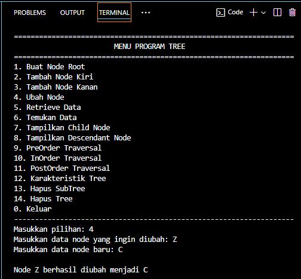

# <h1 align="center">Laporan Praktikum Modul Graph dan Tree</h1>

<p align="center">Liya Khoirunnisa - 2311102124</p>

## Dasar Teori

**GRAPH**<br/>
Graf merupakan representasi dari suatu permasalahan dengan menggunakan objek-objek berupa titik, dimana setiap lingkaran tersebut dapat terhubung satu sama lain dengan menggunakan sekumpulan titik. Graf terdiri dari pasangan terurut himpunan (𝑉,𝐸) yang dinotasikan dengan G = (V, E). V adalah himpunan tidak kosong dari simpul-simpul (vertex) dan E adalah himpunan sisi (edges) yang menghubungkan dua simpul dalam graf. Beberapa contoh pengaplikasian teori graf yaitu penyusunan struktur organisasi, pengambilan mata kuliah yang divisualisasikan dalam bentuk bagan alir, maps, rangkaian jaringan listrik, dan lain lain. <br/>

**Jenis-jenis Graph:**<br/>

1. **Graph berarah (directed graph):** Memungkinkan kita memodelkan situasi dengan mementingkan arah hubungan. Karakteristik graf berarah yaitu setiap sisi memiliki arah dari satu simpul ke simpul lain dan terdapat dua jenis derajat, yaitu derajat masuk dan derajat keluar. Dimana derajat masuk yaitu menghitung jumlah busur yang masuk ke simpul. Sementara derajat keluar yaitu menghitung jumlah busur yang keluar dari simpul. Contohnya dalam manajemen proyek, beberapa tugas perlu diselesaikan sebelum memulai tugas lain.<br>
2. **Graph tak berarah (undirected graph):** Memungkinkan kita memodelkan situasi dengan tidak memiliki arah hubungan khusus. Karakteristik graf tak berarah yaitu hubungan antar simpul dua arah dan hanya memiliki satu jenis derajat yang terhubung ke simpul. Contohnya dalam jaringan komunikasi peer to peer, setiap node berkomunikasi langsung tanpa mementingkan arah.<br>
3. **Weight Graph:** Graph yang mempunyai nilai pada tiap edgenya. Karakteristik weight graph yaitu setiap sisi memiliki bobot dan menggunakan algoritma khusus untuk untuk menemukan jalur terpendek dalam graf berbobot. Cocok digunakan dalam aplikasi yang memerlukan pengukuran jarak terpendek, biaya terendah , dan lain sebagainya.<br/>

**Representasi Graf:**<br/>

1. **Representasi dengan Matriks**<br/>
   - **Berarah** <br/>
     Cara menyatakan graf berarah dalam matriks tidak jauh berbeda dengan cara menyatakan graf tak berarah dalam suatu matriks. Perbedaanya hanya terletak pada keikutsertaan informasi tentang arah garis yang terdapat dalam graf berarah. Berikut langkah-langkah representasi graf kedalam matriks: <br/>
     - Jarak titik Vi jika ada garis yang menghubungkan titik vi dan vj <br/>
     - ∞ jika tidak ada garis yang menghubungkan titik vi dan vj<br/>
     - 0 jika I = j jika berhubungan dengan dirinya sendiri<br/>
   - **Tak berarah**<br/>
     Cara menyatakan graf tak berarah dalam matriks yaitu dengan menghubungkan antar simpul dua arah dan simetris. Berikut langkah-langkah representasi graf tak berarah: <br/>
     - Jarak titik Vi ke Vj dimasukkan ke dalam elemen matriks<br/>
     - ∞ jika tidak ada garis yang menghubungkan titik vi dan vj, nilai tak terhingga digunakan<br/>
     - 0 jika I = j jika berhubungan dengan dirinya sendiri<br/>
2. **Representasi dengan Linked List**<br/>
   Representasi graf dengan linked list adalah cara yang efisien untuk menyimpan graf, terutama graf yang jarang, dimana sebagian besar simpul tidak saling terhubung langsung. Representasi ini perlu membedakan antara vertex dan edge. Struktur keduanya bisa sama, bisa juga tidak sama, tergantung kebutuhan. <br/><br>

**TREE**<br/>
Teori tree adalah teori yang digunakan untuk menyelesaikan permasalahan dengan menggunakan analogi permasalahan ke dalam bentuk pohon yang kemudian mencari solusi permasalahannya. Teori tree digunakan dalam penerapan konsep graf yang tidak berarah dan terhubung. Tree merupakan sekumpulan simpul yang saling terhubung membentuk struktur sebuah pohon. Setiap simpul yang terhubung, tidak memiliki simpul anak dan satu simpul ayah. Simpul yang tidak mempunyai simpul ayah disebut simpul akar. Tree termasuk struktur data non linear. Dalam struktur tree, hanya terdapat satu jalur yang menghubungkan satu simpul ke simpul yang lain. Struktur tree merupakan struktur yang mengharuskan kita mengorganisasikan informasi berdasarkan struktur logis, mengakses suatu elemen dengan khusus, dan menggambarkan data yang memiliki struktur yang hirarkis. Penerapan struktur data penting dalam proses pembuatan progam komputer untuk meningkatkan kinerja program. Sebagai contoh, seorang direktur di perusahaan membawahi wakil direktur. Setiap orang membuat model data pohon sendiri beserta komponen pengelolaan datanya. Selain itu, struktur pohon yang dikelola pada struktur data eksternal tidak sering dibahas.<br/>

**Operasi pada Tree**<br/>

- Create: Untuk membuat binary tree baru yang masih kosong. <br/>
- Clear: Untuk mengosongkan binary tree yang ada atau menghapus semua node pada binary tree. <br/>
- isEmpty: Untuk memeriksa apakah binary tree masih kosong atau tidak. <br/>
- Insert: Untuk menambahkan node ke dalam tree. <br/>
- Find: Untuk mencari root, parent, left child, atau right child dari suatu node. <br/>
- Update: Untuk mengubah isi dari node yang ditunjuk oleh pointer current. <br/>
- Retrive: Untuk mengetahui isi dari node yang ditunjuk pointer current. <br/>
- Delete Sub: Untuk menghapus subtree yang ditunjuk pointer current. <br/>
- Characteristic: Untuk mengetahui karakteristik dari suatu tree. <br/>
- Traverse: Untuk mengunjungi semua node pada tree dengan cara traversal. Terdapat 3 metode traversal, yakni Pre-Order, In-Order, dan Post-Order. <br/>

**Metode Traversal:**<br/>

1. **Pre-Order:** Diawali dengan mengunjungi node akar terlebih dahulu kemudian mengunjungi semua anak dari yang paling kiri ke yang paling kanan. Proses ini dilakukan berulang terus menerus.
2. **In-Order:** Diawali dengan mengunjungi subtree kiri terlebih dahulu, selanjutnya mengunjungi node akar, dan yang terakhir mengunjungi subtree kanan. Metode ini berguna untuk pohon pencarian biner karena mengunjungi node dengan urutan menaik.
3. **Post Order:** Diawali dengan mengunjungi semua anak dari yang paling kiri ke yang paling kanan terlebih dahulu, kemudian mengunjungi node akar. Metode ini berguna untuk menghapus atau membebaskan node dalam pohon

## Guided

### 1. Program menampilkan graf kota dengan matriks

```C++
#include <iostream>
#include <iomanip>

using namespace std;
/// PROGRAM MENAMPILKAN GRAF KOTA DENGAN MATRIKS Liya Khoirunnisa

// Daftar simpul kota
string simpul[7] = {"Ciamis", "Bandung", "Bekasi", "Tasikmalaya", "Cianjur", "Purwokerto", "Yogyakarta"};

// Matriks busur
int busur[7][7] = {
    {0, 7, 8, 0, 0, 0, 0},
    {0, 0, 5, 0, 0, 15, 0},
    {0, 6, 0, 0, 5, 0, 0},
    {0, 5, 0, 0, 2, 4, 0},
    {23, 0, 0, 10, 0, 0, 8},
    {0, 0, 0, 0, 7, 0, 3},
    {0, 0, 0, 0, 9, 4, 0},
};

// Fungsi menampilkan graf
void tampilGraph()
{
    // Perulangan setiap baris matriks busur
    for (int baris = 0; baris < 7; baris++)
    {
        // Menampilkan nama kota
        cout << " " << setiosflags(ios::left) << setw(15) << simpul[baris] << " : ";
        // perulangan setiap kolom matriks busur
        for (int kolom = 0; kolom < 7; kolom++)
        {
            if (busur[baris][kolom] != 0)
            {
                // Menampilkan nama kota tujuan dan bobot busur
                cout << " " << simpul[kolom] << "(" << busur[baris][kolom] << ")";
            }
        }
        cout << endl;
    }
}

int main()
{
    // Memanggil fungsi untuk menampilkan graf
    tampilGraph();
    return 0;
}
```

Kode di atas digunakan untuk menampilkan graf kota. Array simpul terdiri dari 7 indeks, yaitu Ciamis, Bandung, Bekasi, Tasikmalaya, Cianjur, Purwokerto, Yogyakarta. Terdapat matriks busur dengan indeks baris 7 dan indeks kolom 7. Terdapat juga fungsi tampilGraph() untuk menampilkan graf. Di dalam fungsi tampilGraph() melakukan perulangan setiap baris dan kolom matriks. Pada program utama berjalan dengan memanggil fungsi tampilGraph() untuk mencetak graf kota. Output yang ditampilkan pada masing masing kota menampilkan jalur yang menghubungkan antarkota beserta bobot (jarak) masing-masing.

### 2. Program menampilkan dam memanipulasi tree

```C++
#include <iostream>
#include <iomanip>
using namespace std;
/// PROGRAM MENAMPILKAN DAN MEMANIPULASI TREE Liya Khoirunnisa

// Struct pohom
struct Pohon
{
    char data;
    Pohon *left, *right, *parent;
};

// Deklarasi root dan node baru
Pohon *root, *baru;

// Fungsi untuk inisialisasi  pohon
void init()
{
    root = NULL;
}

// Fungsi untuk memeriksan apakah pohon kosong
bool isEmpty()
{
    return root == NULL;
}

// Fungsi untuk memuat node root
void buatNode(char data)
{
    if (isEmpty())
    {
        root = new Pohon();
        root->data = data;
        root->left = NULL;
        root->right = NULL;
        root->parent = NULL;
        cout << "\n Node " << data << " berhasil dibuat sebagai root." << endl;
    }
    else
    {
        cout << "\n Tree sudah ada!" << endl;
    }
}

// Fungsi untuk menambahkan node kiri
Pohon *insertLeft(char data, Pohon *node)
{
    if (isEmpty())
    {
        cout << "\n Buat tree terlebih dahulu!" << endl;
        return NULL;
    }
    else
    {
        if (node->left != NULL)
        {
            cout << "\n Node " << node->data << " sudah ada child kiri !" << endl;
            return NULL;
        }
        else
        {
            Pohon *baru = new Pohon();
            baru->data = data;
            baru->left = NULL;
            baru->right = NULL;
            baru->parent = node;
            node->left = baru;
            cout << "\n Node " << data << " berhasil ditambahkan ke child kiri " << baru->parent->data << endl;
            return baru;
        }
    }
}

// Fungsi untuk menambahkan node kanan
Pohon *insertRight(char data, Pohon *node)
{
    if (isEmpty())
    {
        cout << "\n Buat tree terlebih dahulu!" << endl;
        return NULL;
    }
    else
    {
        if (node->right != NULL)
        {
            cout << "\n Node " << node->data << " sudah ada child  kanan !" << endl;
            return NULL;
        }
        else
        {
            Pohon *baru = new Pohon();
            baru->data = data;
            baru->left = NULL;
            baru->right = NULL;
            baru->parent = node;
            node->right = baru;
            cout << "\n Node " << data << " berhasil ditambahkan ke child kanan " << baru->parent->data << endl;
            return baru;
        }
    }
}

// Fungsi untuk mengubah data node
void update(char data, Pohon *node)
{
    if (isEmpty())
    {
        cout << "\n Buat tree terlebih dahulu!" << endl;
    }
    else
    {
        if (!node)
        {
            cout << "\n Node yang ingin diganti tidak ada!!" << endl;
        }
        else
        {
            char temp = node->data;
            node->data = data;
            cout << "\n Node " << temp << " berhasil diubah menjadi " << data << endl;
        }
    }
}

// Fungsi untuk mengambil data node
void retrieve(Pohon *node)
{
    if (isEmpty())
    {
        cout << "\n Buat tree terlebih dahulu!" << endl;
    }
    else
    {
        if (!node)
        {
            cout << "\n Node yang ditunjuk tidak ada!" << endl;
        }
        else
        {
            cout << "\n Data node : " << node->data << endl;
        }
    }
}

// Fungsi untuk menemukan data
void find(Pohon *node)
{
    if (isEmpty())
    {
        cout << "\n Buat tree terlebih dahulu!" << endl;
    }
    else
    {
        if (!node)
        {
            cout << "\n Node yang ditunjuk tidak ada!" << endl;
        }
        else
        {
            cout << "\n Data Node : " << node->data << endl;
            cout << " Root : " << root->data << endl;
            if (!node->parent)
                cout << " Parent : (tidak punya parent)" << endl;
            else
                cout << " Parent : " << node->parent->data << endl;
            if (node->parent != NULL && node->parent->left != node &&
                node->parent->right == node)
                cout << " Sibling : " << node->parent->left->data << endl;
            else if (node->parent != NULL && node->parent->right != node && node->parent->left == node)
                cout << " Sibling : " << node->parent->right->data << endl;
            else
                cout << " Sibling : (tidak punya sibling)" << endl;
            if (!node->left)
                cout << " Child Kiri : (tidak punya Child kiri)" << endl;
            else
                cout << " Child Kiri : " << node->left->data << endl;
            if (!node->right)
                cout << " Child Kanan : (tidak punya Child kanan)" << endl;
            else
                cout << " Child Kanan : " << node->right->data << endl;
        }
    }
}

// Penelusuran (Traversal)
// Fungsi preOrder
void preOrder(Pohon *node = root)
{
    if (isEmpty())
    {
        cout << "\n Buat tree terlebih dahulu!" << endl;
    }
    else
    {
        if (node != NULL)
        {
            cout << " " << node->data << ", ";
            preOrder(node->left);
            preOrder(node->right);
        }
    }
}

// Fungsi inOrder
void inOrder(Pohon *node = root)
{
    if (isEmpty())
    {
        cout << "\n Buat tree terlebih dahulu!" << endl;
    }
    else
    {
        if (node != NULL)
        {
            inOrder(node->left);
            cout << " " << node->data << ", ";
            inOrder(node->right);
        }
    }
}

// Fungsi postOrder
void postOrder(Pohon *node = root)
{
    if (isEmpty())
    {
        cout << "\n Buat tree terlebih dahulu!" << endl;
    }
    else
    {
        if (node != NULL)
        {
            postOrder(node->left);
            postOrder(node->right);
            cout << " " << node->data << ", ";
        }
    }
}

// Hapus Node Tree
void deleteTree(Pohon *node)
{
    if (isEmpty())
    {
        cout << "\n Buat tree terlebih dahulu!" << endl;
    }
    else
    {
        if (node != NULL)
        {
            if (node != root)
            {
                node->parent->left = NULL;
                node->parent->right = NULL;
            }
            deleteTree(node->left);
            deleteTree(node->right);
            if (node == root)
            {
                delete root;
                root = NULL;
            }
            else
            {
                delete node;
            }
        }
    }
}

// Hapus SubTree
void deleteSub(Pohon *node)
{
    if (isEmpty())
    {
        cout << "\n Buat tree terlebih dahulu!" << endl;
    }
    else
    {
        deleteTree(node->left);
        deleteTree(node->right);
        cout << "\n Node subtree " << node->data << " berhasil dihapus." << endl;
    }
}

// Hapus Tree
void clear()
{
    if (isEmpty())
    {
        cout << "\n Buat tree terlebih dahulu!!" << endl;
    }
    else
    {
        deleteTree(root);
        cout << "\n Pohon berhasil dihapus." << endl;
    }
}

// Cek Size Tree
int size(Pohon *node = root)
{
    if (isEmpty())
    {
        cout << "\n Buat tree terlebih dahulu!!" << endl;
        return 0;
    }
    else
    {
        if (!node)
        {
            return 0;
        }
        else
        {
            return 1 + size(node->left) + size(node->right);
        }
    }
}

// Cek Height Level Tree
int height(Pohon *node = root)
{
    if (isEmpty())
    {
        cout << "\n Buat tree terlebih dahulu!" << endl;
        return 0;
    }
    else
    {
        if (!node)
        {
            return 0;
        }
        else
        {
            int heightKiri = height(node->left);
            int heightKanan = height(node->right);
            if (heightKiri >= heightKanan)
            {
                return heightKiri + 1;
            }
            else
            {
                return heightKanan + 1;
            }
        }
    }
}

// Karakteristik Tree
void characteristic()
{
    cout << "\n Size Tree : " << size() << endl;
    cout << " Height Tree : " << height() << endl;
    cout << " Average Node of Tree : " << size() / height() << endl;
}

int main()
{
    // Membuat node root
    buatNode('A');
    Pohon *nodeB, *nodeC, *nodeD, *nodeE, *nodeF, *nodeG, *nodeH, *nodeI, *nodeJ;

    // Menambahkan node ke tree
    nodeB = insertLeft('B', root);
    nodeC = insertRight('C', root);
    nodeD = insertLeft('D', nodeB);
    nodeE = insertRight('E', nodeB);
    nodeF = insertLeft('F', nodeC);
    nodeG = insertLeft('G', nodeE);
    nodeH = insertRight('H', nodeE);
    nodeI = insertLeft('I', nodeG);
    nodeJ = insertRight('J', nodeG);

    // Update nilai node
    update('Z', nodeC);
    update('C', nodeC);
    retrieve(nodeC);
    find(nodeC);

    // Menampilkan isi tree secara PreOrder
    cout << "\n PreOrder :" << endl;
    preOrder(root);
    cout << "\n"
         << endl;

    // Menampilkan isi tree secara InOrder
    cout << " InOrder :" << endl;
    inOrder(root);
    cout << "\n"
         << endl;

    // Menampilkan isi tree secara PostOrder
    cout << " PostOrder :" << endl;
    postOrder(root);
    cout << "\n"
         << endl;
}
```

Kode di atas digunakan untuk menampilkan dan memanipulasi tree. Terdapat satu struct pohon utnuk mendefinisikan node pada pohon biner. Terdapat 11 fungsi prosedur (void) yaitu init(), buatNode(), update(), retrieve() , find,() , preOrder(), inOrder(), postOrder(), deleteTree(), deleteSub(), clear(). Dan juga terdapat fungsi biasa bool isEmpty(), int size(), dan int height(). Program utama berjalan dengan membuat root terlebih dahulu, lalu menambahkan node ke tree dengan insertLeft dan insertRight. Untuk mengubah nilai node dapat memanggil fungsi update(). Untuk menampilkan isi tree seacara PreOrder dapat memanggil fungsi preOrder(). Untuk menampilkan isi tree seacara InOrder dapat memanggil fungsi inOrder(). Untuk menampilkan isi tree seacara PostOrder dapat memanggil fungsi postOrder().

## Unguided

### 1. Buatlah program graph dengan menggunakan inputan user untuk menghitung jarak dari sebuah kota ke kota lainnya.

```C++
/* oleh Liya Khoirunnisa - 2311102124 */
#include <iostream>
#include <iomanip>
#include <string>

using namespace std;

/// Program Graph untuk menghitung jarak dari sebuah kota ke kota lainnya.

// Fungsi input nama setiap simpul
void inputNamaSimpul(string simpul_2124[], int jmlSimpul_2124)
{
    for (int i = 0; i < jmlSimpul_2124; ++i)
    {
        cout << "Simpul " << i + 1 << " : ";
        cin >> simpul_2124[i];
    }
}

// Fungsi input bobot antar simpul
void inputBobot(int bobot_2124[][10], string simpul_2124[], int jmlSimpul_2124)
{
    for (int i = 0; i < jmlSimpul_2124; ++i)
    {
        for (int j = 0; j < jmlSimpul_2124; ++j)
        {
            cout << simpul_2124[i] << "--> " << simpul_2124[j] << " = ";
            cin >> bobot_2124[i][j];
        }
    }
}

// Fungsi untuk menampilkan matriks bobot
void tampilGraph(int bobot_2124[][10], string simpul_2124[], int jmlSimpul_2124)
{
    cout << setw(3) << " ";
    for (int i = 0; i < jmlSimpul_2124; ++i)
    {
        cout << setw(10) << simpul_2124[i];
    }
    cout << endl;

    for (int i = 0; i < jmlSimpul_2124; ++i)
    {
        cout << setw(6) << simpul_2124[i];
        for (int j = 0; j < jmlSimpul_2124; ++j)
        {
            cout << setw(7) << bobot_2124[i][j];
        }
        cout << endl;
    }
}

int main()
{
    // Deklarasi variabel
    int jmlSimpul_2124;

    // Input jumlah simpul
    cout << "Silakan masukkan jumlah simpul : ";
    cin >> jmlSimpul_2124;

    // Array untuk menyimpan nama simpul
    string simpul_2124[jmlSimpul_2124];
    int bobot_2124[10][10];

    // Menampilkan nama simpul
    cout << "Silakan masukkan nama simpul" << endl;
    inputNamaSimpul(simpul_2124, jmlSimpul_2124); // Memanggil fungsi input nama simpul

    // Input bobot
    cout << "Silakan masukkan bobot antar simpul" << endl;
    inputBobot(bobot_2124, simpul_2124, jmlSimpul_2124); // Memanggil fungsi input bobot
    cout << endl;

    // Menampilkan graph
    tampilGraph(bobot_2124, simpul_2124, jmlSimpul_2124);
    cout << endl;

    return 0;
}
```

#### Output:


Kode di atas digunakan untuk menghitung jarak dari sebuah kota ke kota lainnya. Terdapat 3 fungsi, yaitu fungsi inputNamaSimpul(simpul_2124, jmlSimpul_2124), inputBobot(bobot_2124, simpul_2124, jmlSimpul_2124), dan tampilGraph(bobot_2124, simpul_2124, jmlSimpul_2124). Fungsi inputNamaSimpul(simpul_2124, jmlSimpul_2124) digunakan untuk mengisi array simpul_2124 berdasarkan inputan pengguna. Fungsi inputBobot(bobot_2124, simpul_2124, jmlSimpul_2124) digunakan untuk mengisi matriks bobot_2124 dengan bobot antar simpul berdasarkan inputan pengguna. Fungsi tampilGraph(bobot_2124, simpul_2124, jmlSimpul_2124) digunakan untuk menampilkan matriks bobot. Program utama berjalan dengan di awali meminta inputan jumlah simpul, nama simpul, dan bobot dari pengguna. Dan juga memanggil fungsi sesuai kebutuhan. Kemudian graph ditampilkan dnegan memanggil fungsi tampilGraph(bobot_2124, simpul_2124, jmlSimpul_2124).

### 2. Modifikasi guided tree diatas dengan program menu menggunakan input data tree dari user dan berikan fungsi tambahan untuk menampilkan node child dan descendant dari node yang diinput kan!

```C++
/* oleh Liya Khoirunnisa - 2311102124 */
#include <iostream>
#include <iomanip>
#include <queue>

using namespace std;
/// PROGRAM MENU TREE

// Struct pohon
struct Pohon
{
    char data_2124;
    Pohon *left, *right, *parent;
};

// Deklarasi root dan node baru
Pohon *root, *baru;

// Fungsi untuk inisialisasi pohon
void init()
{
    root = NULL;
}

// Fungsi untuk memeriksa apakah pohon kosong
bool isEmpty()
{
    return root == NULL;
}

// Fungsi untuk membuat node root
void buatNode(char data_2124)
{
    if (isEmpty())
    {
        root = new Pohon();
        root->data_2124 = data_2124;
        root->left = NULL;
        root->right = NULL;
        root->parent = NULL;
        cout << "\nNode " << data_2124 << " berhasil dibuat sebagai root." << endl;
    }
    else
    {
        cout << "\nTree sudah ada!" << endl;
    }
}

// Fungsi untuk mencari node berdasarkan data
Pohon *cariNode(char data_2124, Pohon *node = root)
{
    if (!node)
        return NULL;
    if (node->data_2124 == data_2124)
        return node;
    Pohon *leftResult = cariNode(data_2124, node->left);
    if (leftResult)
        return leftResult;
    return cariNode(data_2124, node->right);
}

// Fungsi untuk menambahkan node kiri
Pohon *insertLeft(char data, Pohon *node)
{
    if (isEmpty())
    {
        cout << "\nBuat tree terlebih dahulu!" << endl;
        return NULL;
    }
    else
    {
        if (node->left != NULL)
        {
            cout << "\nNode " << node->data_2124 << " sudah ada child kiri!" << endl;
            return NULL;
        }
        else
        {
            Pohon *baru = new Pohon();
            baru->data_2124 = data;
            baru->left = NULL;
            baru->right = NULL;
            baru->parent = node;
            node->left = baru;
            cout << "\nNode " << data << " berhasil ditambahkan ke child kiri " << node->data_2124 << endl;
            return baru;
        }
    }
}

// Fungsi untuk menambahkan node kanan
Pohon *insertRight(char data_2124, Pohon *node)
{
    if (isEmpty())
    {
        cout << "\nBuat tree terlebih dahulu!" << endl;
        return NULL;
    }
    else
    {
        if (node->right != NULL)
        {
            cout << "\nNode " << node->data_2124 << " sudah ada child kanan!" << endl;
            return NULL;
        }
        else
        {
            Pohon *baru = new Pohon();
            baru->data_2124 = data_2124;
            baru->left = NULL;
            baru->right = NULL;
            baru->parent = node;
            node->right = baru;
            cout << "\nNode " << data_2124 << " berhasil ditambahkan ke child kanan " << node->data_2124 << endl;
            return baru;
        }
    }
}

// Fungsi untuk mengubah data node
void update(char data_2124, Pohon *node)
{
    if (isEmpty())
    {
        cout << "\nBuat tree terlebih dahulu!" << endl;
    }
    else
    {
        if (!node)
        {
            cout << "\nTidak ada node yang ingin diganti!" << endl;
        }
        else
        {
            char temp_2124 = node->data_2124;
            node->data_2124 = data_2124;
            cout << "\nNode " << temp_2124 << " berhasil diubah menjadi " << data_2124 << endl;
        }
    }
}

// Fungsi untuk mengambil data node
void retrieve(Pohon *node)
{
    if (isEmpty())
    {
        cout << "\nBuat tree terlebih dahulu!" << endl;
    }
    else
    {
        if (!node)
        {
            cout << "\nNode yang ditunjuk tidak ada!" << endl;
        }
        else
        {
            cout << "\nData node: " << node->data_2124 << endl;
        }
    }
}

// Fungsi untuk menemukan data
void find(Pohon *node)
{
    if (isEmpty())
    {
        cout << "\nBuat tree terlebih dahulu!" << endl;
    }
    else
    {
        if (!node)
        {
            cout << "\nNode yang ditunjuk tidak ada!" << endl;
        }
        else
        {
            cout << "\nData Node: " << node->data_2124 << endl;
            cout << "Root: " << root->data_2124 << endl;
            if (!node->parent)
                cout << "Parent: (tidak memiliki parent)" << endl;
            else
                cout << "Parent: " << node->parent->data_2124 << endl;
            if (node->parent != NULL && node->parent->left != node &&
                node->parent->right == node)
                cout << "Sibling: " << node->parent->left->data_2124 << endl;
            else if (node->parent != NULL && node->parent->right != node && node->parent->left == node)
                cout << "Sibling: " << node->parent->right->data_2124 << endl;
            else
                cout << "Sibling: (tidak memiliki sibling)" << endl;
            if (!node->left)
                cout << "Child Kiri: (tidak memiliki Child kiri)" << endl;
            else
                cout << "Child Kiri: " << node->left->data_2124 << endl;
            if (!node->right)
                cout << "Child Kanan: (tidak memiliki Child kanan)" << endl;
            else
                cout << "Child Kanan: " << node->right->data_2124 << endl;
        }
    }
}

// Fungsi untuk menampilkan anak-anak dari node
void tampilChild(Pohon *node)
{
    if (isEmpty())
    {
        cout << "\nBuat tree terlebih dahulu!" << endl;
    }
    else
    {
        if (!node)
        {
            cout << "\nNode yang ditunjuk tidak ada!" << endl;
        }
        else
        {
            cout << "\nNode: " << node->data_2124 << endl;
            if (!node->left)
                cout << "Child Kiri: (tidak memiliki Child kiri)" << endl;
            else
                cout << "Child Kiri: " << node->left->data_2124 << endl;
            if (!node->right)
                cout << "Child Kanan: (tidak memiliki Child kanan)" << endl;
            else
                cout << "Child Kanan: " << node->right->data_2124 << endl;
        }
    }
}

// Fungsi untuk menampilkan semua turunan dari node tertentu
void tampilDescendant(Pohon *node)
{
    if (!node)
    {
        cout << "Node yang ditunjuk tidak ada!" << endl;
        return;
    }

    cout << "Turunan dari node " << node->data_2124 << ": ";

    queue<Pohon *> q;
    q.push(node);

    while (!q.empty())
    {
        Pohon *current = q.front();
        q.pop();

        if (current != node)
            cout << current->data_2124 << " ";

        if (current->left)
            q.push(current->left);

        if (current->right)
            q.push(current->right);
    }

    cout << endl;
}

// Penelusuran (Traversal)
// Fungsi preOrder
void preOrder(Pohon *node = root)
{
    if (isEmpty())
    {
        cout << "\nBuat tree terlebih dahulu!" << endl;
    }
    else
    {
        if (node != NULL)
        {
            cout << " " << node->data_2124 << ", ";
            preOrder(node->left);
            preOrder(node->right);
        }
    }
}

// Fungsi inOrder
void inOrder(Pohon *node = root)
{
    if (isEmpty())
    {
        cout << "\nBuat tree terlebih dahulu!" << endl;
    }
    else
    {
        if (node != NULL)
        {
            inOrder(node->left);
            cout << " " << node->data_2124 << ", ";
            inOrder(node->right);
        }
    }
}

// Fungsi postOrder
void postOrder(Pohon *node = root)
{
    if (isEmpty())
    {
        cout << "\nBuat tree terlebih dahulu!" << endl;
    }
    else
    {
        if (node != NULL)
        {
            postOrder(node->left);
            postOrder(node->right);
            cout << " " << node->data_2124 << ", ";
        }
    }
}

// Hapus Node Tree
void deleteTree(Pohon *node)
{
    if (isEmpty())
    {
        cout << "\nBuat tree terlebih dahulu!" << endl;
    }
    else
    {
        if (node != NULL)
        {
            if (node != root)
            {
                if (node->parent->left == node)
                {
                    node->parent->left = NULL;
                }
                else if (node->parent->right == node)
                {
                    node->parent->right = NULL;
                }
            }
            deleteTree(node->left);
            deleteTree(node->right);
            if (node == root)
            {
                delete root;
                root = NULL;
            }
            else
            {
                delete node;
            }
        }
    }
}

// Hapus SubTree
void deleteSub(Pohon *node)
{
    if (isEmpty())
    {
        cout << "\nBuat tree terlebih dahulu!" << endl;
    }
    else
    {
        deleteTree(node->left);
        deleteTree(node->right);
        cout << "\nNode subtree " << node->data_2124 << " berhasil dihapus." << endl;
    }
}

// Hapus Tree
void clear()
{
    if (isEmpty())
    {
        cout << "\nBuat tree terlebih dahulu!!" << endl;
    }
    else
    {
        deleteTree(root);
        cout << "\nPohon berhasil dihapus." << endl;
    }
}

// Cek Size Tree
int size(Pohon *node = root)
{
    if (isEmpty())
    {
        cout << "\nBuat tree terlebih dahulu!!" << endl;
        return 0;
    }
    else
    {
        if (!node)
        {
            return 0;
        }
        else
        {
            return 1 + size(node->left) + size(node->right);
        }
    }
}

// Cek Height Level Tree
int height(Pohon *node = root)
{
    if (isEmpty())
    {
        cout << "\nBuat tree terlebih dahulu!" << endl;
        return 0;
    }
    else
    {
        if (!node)
        {
            return 0;
        }
        else
        {
            int heightKiri = height(node->left);
            int heightKanan = height(node->right);
            if (heightKiri >= heightKanan)
            {
                return heightKiri + 1;
            }
            else
            {
                return heightKanan + 1;
            }
        }
    }
}

// Karakteristik Tree
void characteristic()
{
    cout << "\nSize Tree: " << size() << endl;
    cout << "Height Tree: " << height() << endl;
    cout << "Average Node of Tree: " << (height() != 0 ? size() / height() : 0) << endl;
}

// Menu interaktif
void menu()
{
    int pilihan_2124;
    char data_2124, dataParent_2124;
    Pohon *node = nullptr;

    do
    {
        cout << "\n===================================================================\n";
        cout << "\t\t\tMENU PROGRAM TREE\n";
        cout << "===================================================================\n";
        cout << "1. Buat Node Root\n";
        cout << "2. Tambah Node Kiri\n";
        cout << "3. Tambah Node Kanan\n";
        cout << "4. Ubah Node\n";
        cout << "5. Retrieve Data\n";
        cout << "6. Temukan Data\n";
        cout << "7. Tampilkan Child Node\n";
        cout << "8. Tampilkan Descendant Node\n";
        cout << "9. PreOrder Traversal\n";
        cout << "10. InOrder Traversal\n";
        cout << "11. PostOrder Traversal\n";
        cout << "12. Karakteristik Tree\n";
        cout << "13. Hapus SubTree\n";
        cout << "14. Hapus Tree\n";
        cout << "0. Keluar\n";
        cout << "-------------------------------------------------------------------\n";
        cout << "Masukkan pilihan: ";
        cin >> pilihan_2124;

        switch (pilihan_2124)
        {
        case 1:
            cout << "Masukkan data untuk root: ";
            cin >> data_2124;
            buatNode(data_2124);
            break;
        case 2:
            cout << "Masukkan data untuk node kiri: ";
            cin >> data_2124;
            cout << "Masukkan data parent: ";
            cin >> dataParent_2124;
            node = cariNode(dataParent_2124);
            if (node)
                insertLeft(data_2124, node);
            break;
        case 3:
            cout << "Masukkan data untuk node kanan: ";
            cin >> data_2124;
            cout << "Masukkan data parent: ";
            cin >> dataParent_2124;
            node = cariNode(dataParent_2124);
            if (node)
                insertRight(data_2124, node);
            break;
        case 4:
            cout << "Masukkan data node yang ingin diubah: ";
            cin >> dataParent_2124;
            cout << "Masukkan data node baru: ";
            cin >> data_2124;
            node = cariNode(dataParent_2124);
            if (node)
                update(data_2124, node);
            break;
        case 5:
            cout << "Masukkan data node yang ingin diretrieve: ";
            cin >> dataParent_2124;
            node = cariNode(dataParent_2124);
            retrieve(node);
            break;
        case 6:
            cout << "Masukkan data node yang ingin ditemukan: ";
            cin >> dataParent_2124;
            node = cariNode(dataParent_2124);
            find(node);
            break;
        case 7:
            cout << "Masukkan data node yang ingin ditampilkan anak-anaknya: ";
            cin >> dataParent_2124;
            node = cariNode(dataParent_2124);
            tampilChild(node);
            break;
        case 8:
            cout << "Masukkan data node yang ingin ditampilkan keturunannya: ";
            cin >> dataParent_2124;
            node = cariNode(dataParent_2124);
            tampilDescendant(node);
            break;
        case 9:
            cout << "\nPreOrder Traversal: ";
            preOrder();
            cout << endl;
            break;
        case 10:
            cout << "\nInOrder Traversal: ";
            inOrder();
            cout << endl;
            break;
        case 11:
            cout << "\nPostOrder Traversal: ";
            postOrder();
            cout << endl;
            break;
        case 12:
            characteristic();
            break;
        case 13:
            cout << "Masukkan data node yang ingin dihapus subtreenya: ";
            cin >> dataParent_2124;
            node = cariNode(dataParent_2124);
            deleteSub(node);
            break;
        case 14:
            clear();
            break;
        case 0:
            cout << "Keluar." << endl;
            break;
        default:
            cout << "Pilihan tidak tersedia!" << endl;
            break;
        }
    } while (pilihan_2124 != 0);
}

int main()
{
    menu();
    return 0;
}
```

#### Output:





Kode di atas digunakan untuk menampilkan program menu tree. Terdapat . Terdapat satu struct pohon utnuk mendefinisikan node pada tree. Terdapat 15 fungsi prosedur (void) yaitu init(), buatNode(), update(), retrieve() , find,(), tampilChild(), tampilDescendant(),preOrder(), inOrder(), postOrder(), deleteTree(), deleteSub(), clear(), characteristic(), menu(). Dan juga terdapat fungsi biasa bool isEmpty(), int size(), dan int height(). Program berjalan dengan memanggil fungsi menu() untuk menampilkan daftar menu program tree. Terdapat 14 menu yang ditampilkan, yaitu buat nood root, tambah node kiri, tambah node kanan, ubah node, retrieve data, temukan data, tampilkan child node, tampilkan descendant node, pre order traversal, inorder traversal, post order traversal, karakteristik tree, hapus subtree, hapus tree, dan keluar. Pengguna bebas memilih menu untuk menjalankan program.

## Kesimpulan

Pada praktikum tersebut mempelajari implementasi graph dan tree. Graf merupakan representasi dari suatu permasalahan dengan menggunakan objek-objek berupa titik, dimana setiap lingkaran tersebut dapat terhubung satu sama lain dengan menggunakan sekumpulan titik. Tree merupakan sekumpulan simpul yang saling terhubung membentuk struktur sebuah pohon. Praktikum ini mempelajari implementasi graph dalam menampilkan jalur yang menghubungkan antar kota dan menghitung jarak dari kota ke kota lain. Serta mempelajari implementasi tree dengan menggunakan beberapa operasi yang disajikan dalam program menu. Dengan memahami konsep dan cara implementasi graph dan tree dapat meningkatkan kinerja program dalam pengorganisasian dan pengaksesan data dengan efisien.

## Referensi

[1] Agustin, S., Permana, A. Y., Fazri, H. N., Robi, M., & Firmansyah, R. (2022). IMPLEMENTASI STRUKTUR DATA TREE PADA WEB BLOG SEBAGAI MEDIA PEMBELAJARAN. Jurnal Informatika Dan Tekonologi Komputer (JITEK), 2(2), 206-212.<br/>
[2] Laisouw, R., & Burhanudin, H. (2020). Analisis Representasi Graf Berarah dalam Matriks. JURNAL BIOSAINSTEK, 2(01), 70-74.<br/>
[3]Nurhadi, N., Jatmiko, A. R., Legito, L., Saputra, E. A., Surianto, D. F., Komalasari, R., ... & Zain, N. N. L. E. (2023). BUKU AJAR LOGIKA & ALGORITMA. PT. Sonpedia Publishing Indonesia.<br/>
[4]Yusuf, R., Dewi, F. P., & Mujib, A. (2022). Generalisasi Bilangan Kromatik Pada Beberapa Kelas Graf Korona. Jurnal Derivat: Jurnal Matematika dan Pendidikan Matematika, 9(2), 192-201.<br/>
